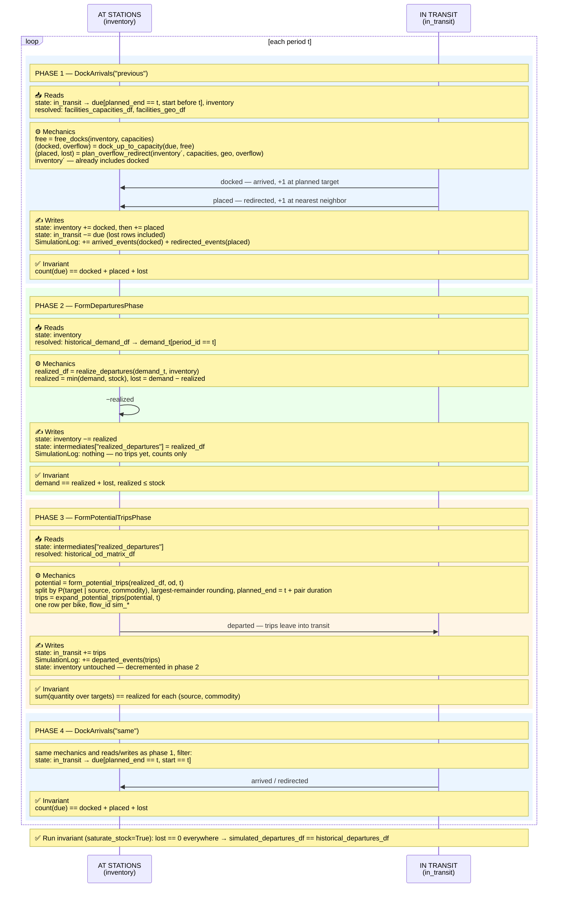

# Reference output: canonical four phases

The approved diagram for
`[DockArrivals("previous"), FormDeparturesPhase(), FormPotentialTripsPhase(), DockArrivals("same")]`
(the `phases_canonical` list from `notebooks/test_pipeline.ipynb`). New
diagrams must match this format.

## Verification nuances that accompanied this diagram

The post-diagram findings the user expects (real ones, checked against code):

- `plan_overflow_redirect` receives the inventory *already updated* with the
  docked flows of the same phase, and keeps its own running copy inside.
- `in_transit` drops ALL `due` rows, including `lost` — lost bikes vanish
  without a journal event.
- `form_potential_trips` drops rows with `probability.isna()`: a source absent
  from the OD matrix silently loses its realized departures, so the phase-3
  invariant has a hidden precondition (every demand source must be present in
  the OD matrix; true in the base replay by construction).
