# gbp — Generalized Framework for Graph-Based Problems

A platform for problems on flow graphs — networks where commodities move
between facilities. Today it implements exactly one domain, end to end: the
Citi Bike bike-sharing system in New York City. The platform is built to grow
by adding domains later; everything below is about this first domain.

## What this is

Many systems are flow graphs once you name the parts:

- logistics: goods move between warehouses and customers, carried by trucks;
- an electrical circuit: current moves between the nodes, along the wires;
- the internet: packets move between network nodes, along the links.

This project models such a system with four entities and one event log, and
builds tools on top of them: a simulator, a rebalancer, a demand forecast,
and a web interface for reading the results.

The central idea: a demand forecast is judged by the **operational cost** it
causes, not only by forecast error. The simulator replays a month of the
system on actual demand and on each model's forecast, with the same physical
state, and compares the outcomes — lost trips, redirects, rebalancing cost.
A model can win on MAE and still be the more expensive one to operate; this
is the comparison the whole project exists to make. The research notebook
[notebooks/research_demand_forecast.ipynb](notebooks/research_demand_forecast.ipynb)
tells this story end to end: the data, the censored-demand problem, four
model families, the backtest, and the two-level comparison that picked the
champion.

## Architecture

```mermaid
flowchart LR
    csv["raw trip CSVs<br/>data/raw/"]
    loaders["loaders<br/>gbp/loaders/"]
    sim["simulator<br/>gbp/consumers/simulator/"]
    builder["artifact builder<br/>gbp/artifacts.py"]
    runs[("run artifacts<br/>data/runs/, one folder per run")]
    ui["web interface<br/>app/main.py + app/views/"]
    api["run-artifact API<br/>app/api.py"]
    ml["demand forecasting<br/>gbp/ml/"]
    forecasts[("forecast artifacts<br/>data/ml/forecasts/")]

    csv -->|"historical trips"| loaders
    csv -->|"past months, as the training table"| ml
    ml -->|"forecast demand table"| forecasts
    forecasts -.->|"in a forecast run, takes the place<br/>of the historical demand"| loaders
    loaders -->|"scenario inputs"| sim
    sim -->|"flow journal"| builder
    builder -->|"saved tables + meta.json"| runs
    runs -->|"saved tables"| ui
    runs -->|"saved tables"| api
    api -.->|"the same tables over HTTP"| ui
```



The whole system is one path: raw trips become scenario inputs, the simulator
replays them into a flow journal, the journal is frozen into a run artifact,
and the web interface and the API only read those artifacts. Demand
forecasting sits beside the path and enters it at one point: a forecast
demand table takes the place of the historical one, and the same simulator
runs on it.

## The data model

Four entities describe a flow graph. The exact contracts live in
[Notations.md](Notations.md) — the project's dictionary; the section numbers
below point into it.

| Entity | Question it answers | In Citi Bike | In logistics |
|---|---|---|---|
| `commodity` (§8) | what moves | a bike (`classic_bike` / `electric_bike`) | goods |
| `edge` (§4b) | along what — a pair of facilities with a distance and a travel time | the route between two stations | a road between a warehouse and a customer |
| `resource` (§5b) | what carries it | a rebalancing truck | a truck |
| `facility` (§4) | where a flow starts, where it ends, where commodities are stored | a station or a depot | a warehouse or a customer |

The entities carry numbers and limits: an edge has a distance and a travel
time (§13), a flow accrues cost from a money rate over its riding time
(§6.1), and the domain adds its own constraints — dock capacity at a station
(§2), truck capacity (§14).

## Events

Everything that happens on the graph is an event: a commodity departs from a
facility, arrives at one, is redirected when it does not fit, or is lost. A
commodity moves on its own (a user rides a bike) or carried by a resource (a
truck moves bikes at night). The whole history of one run is one table — the
flow journal (§0): one row per event, four event types (`departed`,
`arrived`, `redirected`, `lost`). The tables the tools read — demand, the OD
matrix, arrivals — are computed from the journal, not stored separately (§9).

## What you can do

- Load raw flow data into the canonical tables: the loaders turn a month of
  trip CSVs into the simulator's input contract — the period grid,
  facilities, initial inventory, and the historical journal.
- Simulate: replay the historical trips through the engine period by period
  under the domain constraints — a full dock redirects an arriving bike, an
  empty station loses its demand.
- Rebalance: add truck phases that move bikes at night toward the inventory
  each station needs for the morning.
- Forecast demand: train models on past months, promote a champion, run the
  simulator on its forecast next to the base replay, and compare the two runs.

## Who uses it

Three roles, three entry points:

- **Analyst** — the web interface: ten Streamlit pages over saved runs
  (overview and comparison, station map, trips, truck routes, costs, model
  monitoring).
- **Data scientist** — the CLI (`python -m gbp.ml.pipeline / forecast /
  evaluation / monitoring`), the MLflow UI for experiments and the model
  registry, the two canonical notebooks, and the research notebook
  ([notebooks/research_demand_forecast.ipynb](notebooks/research_demand_forecast.ipynb))
  that documents how the champion model was chosen.
- **Integrator** — the run-artifact API: the same saved tables over HTTP
  ([docs/reference/api.md](docs/reference/api.md)).

## Status

Implemented today: the replay simulator, truck rebalancing, the
demand-forecast pipeline (training, backtesting, champion promotion,
monitoring), the web interface, and the run-artifact API. The canonical
scenario is two runs: the base replay of history in
`notebooks/test_pipeline.ipynb` and the run on forecast demand in
`notebooks/forecast_pipeline.ipynb`. The scenario page:
[docs/scenarios/citibike.md](docs/scenarios/citibike.md).

## Install

Requires Python 3.11+ and [uv](https://docs.astral.sh/uv/).

```bash
uv venv
uv pip install -e ".[ui]"             # simulator + web interface
uv pip install -e ".[dev,ui,api]"     # plus lint, type check, tests, and the run-artifact API
uv pip install -e ".[dev,ui,api,ml]"  # plus the demand-forecast toolkit (MLflow, DVC, torch)
```

Activate the environment before running anything below
(`source .venv/bin/activate`), or call `.venv/bin/python` directly.
Exact dependency versions are pinned in `uv.lock` (refresh with `uv lock`
after changing `pyproject.toml`).

## Quick Start

The engine runs on a synthetic scenario without downloading any data:
[docs/getting-started/quickstart.md](docs/getting-started/quickstart.md) is
one runnable script that builds the simulator's input tables from three
hand-written trips and runs the real engine on them. Changing one line of
the scenario then makes the failure events appear in the flow journal —
here a bike bounces off a full dock and rides on to the nearest station
with a free dock:

```text
flow_id event_type    reason source_id planned_target_id realized_target_id  period_id  step_id
sim_0_1   departed      <NA>        s1                s3               <NA>          0        0
sim_0_1 redirected dock_full        s1                s3               <NA>          1        2
sim_0_1   departed      <NA>        s3                s2               <NA>          1        2
sim_0_1    arrived      <NA>        s3                s2                 s2          1        2
```

Every table on that page is replayed against a fresh engine run by
`tests/test_docs_quickstart.py`.

## Web interface

```bash
streamlit run app/main.py    # needs the [ui] extra
```

The interface lists the runs saved under `<data dir>/runs/`. To create one
from the terminal first:

```bash
python app/runner.py --run-name demo --demand-scale 1.5 --periods 50
```


The Overview & compare page shows the whole-run totals of a chosen run, an
optional side-by-side comparison with a second run, and the table of all
saved runs. Other pages draw the station map, individual trips, truck
routes, costs, and the model-monitoring report.

The same run artifacts are served over HTTP by the run-artifact API:
`uvicorn api:app --app-dir app` ([docs/reference/api.md](docs/reference/api.md)).

## Run with Docker

One command starts the web interface and the OSRM routing server together.
Requires Docker with the compose plugin and a `data/` folder next to the
repository files (see "Data layout" below).

```bash
docker compose up --build
```

The web interface is at http://localhost:8501. The `data/` folder is mounted
into the app container as `/data`, so finished runs land in `data/runs/` on
the host as usual. To run one scenario inside the container:

```bash
docker compose exec app python app/runner.py --run-name demo --demand-scale 1.5 --periods 50
```

## Configuration (environment variables)

Both variables are optional; without them the app runs against the local
repository layout.

| Variable | Meaning | Default |
|---|---|---|
| `DATA_DIR` | Root of the data folder: `raw/` (trip CSVs), `osrm/` (road graph), `runs/` (saved runs) | `data/` at the repository root |
| `OSRM_URL` | Base URL of the OSRM routing server (only used with `--routing osrm`) | `http://127.0.0.1:5000` |

## Data layout

```
<DATA_DIR>/
  raw/    # source trip CSVs (e.g. 202601-citibike-tripdata_1.csv)
  osrm/   # road graph files for the OSRM server (created by the setup in docs/how-to/set-up-osrm.md)
  runs/   # saved run artifacts, one folder per run
```

## Development

```bash
ruff check gbp/ tests/ app/       # lint
ruff format gbp/ tests/ app/      # format
mypy gbp/                         # type check
pytest                            # tests
```

## Documentation

The documentation starts at [docs/README.md](docs/README.md).
