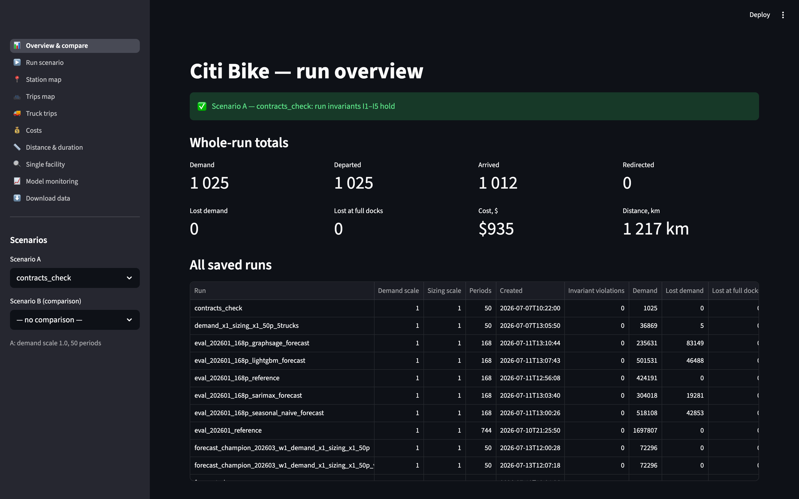

# gbp — a simulator for operational decisions on a flow graph

A **flow graph** is a network where some commodity moves between facilities.
This project builds one platform for problems on such graphs and implements one
domain end to end: the **Citi Bike** bike-sharing system in New York — about
2,300 stations and almost five million trips a month. The simulator replays the
city's real history exactly; you change one input, run it again, and read the
operational cost of the change straight from the output.

**Documentation lives at → https://vlzm.github.io/GFDRR/** — the scenario, the
architecture, the design decisions, and how to run it yourself.



## What is interesting here

- **An append-only flow journal is the single source of truth.** Every run is
  one growing table of events; every number a page shows is computed from it.
- **Exact historical replay.** The base run reproduces a real month of trips
  move for move — not a resample — so any change is measured against ground
  truth.
- **Two-level evaluation of a demand forecast.** A forecast is judged twice: by
  its error against actual demand, and by what the simulator does when it runs
  on that forecast with the physics held fixed. A model can win on error and
  still be the more expensive one to operate.
- **A full ML toolkit around it:** training, rolling-origin backtesting,
  champion promotion through an MLflow registry, and drift monitoring.

## Run it locally

Requires Python 3.11+ and [uv](https://docs.astral.sh/uv/).

```bash
uv venv
uv pip install -e ".[ui]"             # simulator + web interface
uv pip install -e ".[dev,ui,api,ml]"  # everything: tests, the API, and the ML toolkit
```

Activate the environment (`source .venv/bin/activate`), then launch the web
interface over the saved runs:

```bash
streamlit run app/main.py
python app/runner.py --run-name demo --demand-scale 1.5 --periods 50  # make a run first
```

The canonical scenario is two notebooks: the base replay of history in
`notebooks/test_pipeline.ipynb` and the run on forecast demand in
`notebooks/forecast_pipeline.ipynb`. The [Getting started](https://vlzm.github.io/GFDRR/docs/getting-started/)
section walks through install, a synthetic first run, and the web interface.

## Development

```bash
ruff check gbp/ tests/ app/       # lint
ruff format gbp/ tests/ app/      # format
mypy gbp/                         # type check
pytest                            # tests
```

## Docs

- The site — https://vlzm.github.io/GFDRR/
- [Notations.md](Notations.md) — the project's dictionary: one concept, one word.
