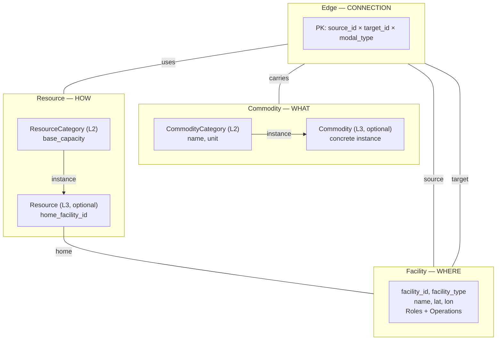
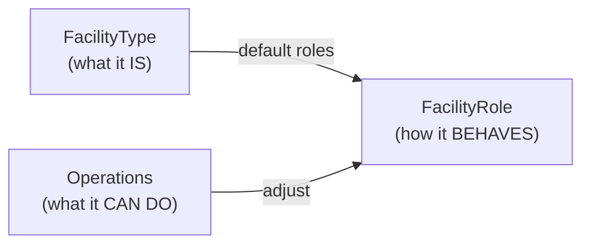
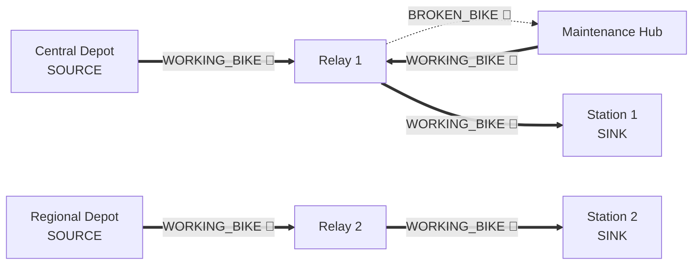

# Graph-Based Logistics Platform — Architecture Diagrams

This document provides a progressive visual guide to the graph-based data model implemented in `gbp/core`, `gbp/build`, `gbp/loaders`, and `gbp/io`. Diagrams are ordered from simple to complex — each one builds on the concepts introduced in the previous ones.

All diagrams are in Mermaid format and can be viewed in any Markdown renderer that supports Mermaid (GitHub, VS Code with extensions, etc.). Source files are in `docs/diagrams/`.

---

## 1. Core Entities — The Three Pillars

**What to learn:** The three fundamental entity types that form the model, and how they relate via edges.

The platform models commodity movement through a network of facilities using transport resources. Everything builds on these three pillars:

- **Facility** — WHERE commodity resides (nodes of the graph)
- **Commodity** — WHAT moves through the network (flow substance)
- **Resource** — HOW commodity is moved (transport vehicles/channels)
- **Edge** — CONNECTION between facilities (arcs of the graph)

Each entity has two levels: L2 (domain-agnostic category) and optional L3 (concrete instance for tracking).



> Full diagram: [`docs/diagrams/01_core_entities.mermaid`](diagrams/01_core_entities.mermaid)

---

## 2. Facility — Type, Operations, Roles

**What to learn:** How a single Facility entity replaces the need for separate "warehouse" and "receiver" through three orthogonal dimensions.

A facility is described by three independent aspects:

| Dimension | Purpose | Example |
|-----------|---------|---------|
| **FacilityType** | What it physically is | STATION, DEPOT, MAINTENANCE_HUB |
| **Operations** | What it can do (with cost & capacity) | RECEIVING, STORAGE, DISPATCH, REPAIR |
| **FacilityRole** | How it behaves in the flow network | SOURCE, SINK, STORAGE, TRANSSHIPMENT |

Roles are derived from type → adjusted by operations → optionally overridden manually.



> Full diagram: [`docs/diagrams/02_facility_roles.mermaid`](diagrams/02_facility_roles.mermaid)

---

## 3. Network Graph — Bike-Sharing Example

**What to learn:** How facilities and edges form a concrete network with commodity flows.

This shows a bike-sharing network: central/ regional depots supply **WORKING_BIKE** for rebalancing; **Maintenance Hub** repairs **BROKEN_BIKE → WORKING_BIKE**; relay depots and stations exchange bikes on **ROAD** (and optionally **RAIL** for inter-city legs).



> Full diagram: [`docs/diagrams/03_network_example.mermaid`](diagrams/03_network_example.mermaid)

---

## 4. Multi-Commodity Flow & Transformation

**What to learn:** How multiple commodity types flow through the network simultaneously, and how transformations convert one commodity into another.

Key concepts:
- **Flow variable:** `flow[edge, commodity_category, period]`
- **Conservation:** per-commodity balance at each node based on its role
- **Shared edge capacity:** all commodities share the edge capacity via `capacity_consumption` coefficients
- **Transformation:** N→M conversion at facilities (1→1 **REPAIR** at Maintenance Hub, 1→N refinery-style splitting, N→1 blending in other domains)

> Full diagram: [`docs/diagrams/04_multi_commodity_flow.mermaid`](diagrams/04_multi_commodity_flow.mermaid)

---

## 5. Temporal Model — Multi-Resolution Planning

**What to learn:** How time is structured with planning horizons, segments of different granularity, and periods.

The temporal axis is fundamental — without it, there's no inventory carry-over between periods.

```
PlanningHorizon (6 months)
├── Segment 0: DAY    (Jan 1–14)   → 14 periods
├── Segment 1: WEEK   (Jan 15–Mar) → 8 periods
└── Segment 2: MONTH  (Mar–Jun)    → ~4 periods
                                     ─────────
                                     26 periods total
                                     continuous index (0..25)
```

Raw data uses `date` columns. During build, dates are mapped to `period_id` via the **Time Resolution Pipeline** with appropriate aggregation (mean for costs, sum for demand/supply).

> Full diagram: [`docs/diagrams/05_temporal_model.mermaid`](diagrams/05_temporal_model.mermaid)

---

## 6. Edge Model — Multi-Modal Edges with Attributes

**What to learn:** The rich structure of edges — identity, commodities, capacities, vehicles, and lead time resolution.

Edge PK: `source_id × target_id × modal_type` (multiple edges between same facilities via different transport modes).

Key tables around an edge:

| Table | Purpose | Grain |
|-------|---------|-------|
| `edge` | Static attributes (distance, lead_time_hours) | edge |
| `edge_commodity` | Which commodities are allowed + capacity_consumption | edge × commodity |
| `edge_capacity` | Shared throughput limit (time-varying) | edge × date |
| `edge_commodity_capacity` | Per-commodity min/max shipment (time-varying) | edge × commodity × date |
| `edge_vehicle` | Discrete vehicle trips | edge × resource_category |
| `edge_lead_time_resolved` | Generated: lead_time_periods per departure period | edge × period |

Lead time in multi-resolution: the same 48h lead time = 2 DAY periods but 0 WEEK periods.

> Full diagram: [`docs/diagrams/06_edge_model.mermaid`](diagrams/06_edge_model.mermaid)

---

## 7. Attribute System — Specs, Grains, Groups, Spines

**What to learn:** How the attribute system handles parameters at different granularities for all three entity types.

The attribute system is the same for Facility, Edge, and Resource — only the `entity_grain` differs.

**AttributeSpec** declares: name, kind (COST/REVENUE/RATE/CAPACITY/ADDITIONAL), grain, value_column, aggregation rule.

**GrainGroups** solve the cross-join problem: attributes with chain-compatible grains (one is subset of another) go into one group; incompatible dimensions (e.g. `operation_type` vs `commodity_category`) stay in separate groups → separate spine DataFrames.

```
AttributeSpecs
    ↓ auto_group_attributes()
GrainGroups
    ↓ plan_merges() — non-expanding first, then minimal expansion
MergePlans
    ↓ build_spines() — left-join attribute tables onto base
Spine DataFrames (one per group)
```

> Full diagram: [`docs/diagrams/07_attribute_system.mermaid`](diagrams/07_attribute_system.mermaid)

---

## 8. Build Pipeline — RawModelData → ResolvedModelData

**What to learn:** The complete `build_model()` pipeline that transforms raw input into a ready-to-consume resolved model.

```
RawModelData (with dates)
    ↓ 1. Validation (units, referential integrity, connectivity)
    ↓ 2. Time Resolution (date → period_id, aggregation)
    ↓ 3. Edge Building (rules + manual pairs)
    ↓ 4. Lead Time Resolution (hours → periods per departure)
    ↓ 5. Transformation Resolution (N→M commodity conversion)
    ↓ 6. Fleet Capacity Computation (count × base_capacity)
    ↓ 7. Assembly into ResolvedModelData
    ↓ 8. Spine Assembly (facility_spines, edge_spines, resource_spines)
ResolvedModelData (with period_id, spines)
```

Validation checks: unit consistency, referential integrity (SINK has demand, SOURCE has supply, etc.), resource completeness, temporal coverage, graph connectivity (BFS from SOURCEs to SINKs), transformation consistency.

> Full diagram: [`docs/diagrams/08_build_pipeline.mermaid`](diagrams/08_build_pipeline.mermaid)

---

## 9. Data Consumers — Optimizer, Simulator, Analytics

**What to learn:** How the same `ResolvedModelData` is consumed differently by three types of consumers.

| | Optimizer | Simulator | Analytics |
|-|-----------|-----------|-----------|
| **Approach** | All periods at once | Step-by-step | Post-hoc |
| **Resources** | Capacity constraint | Stateful (position + status) | N/A |
| **Solver** | LP/MILP | Step-solver (VRP, greedy) | N/A |
| **Output** | `solution_*` | `simulation_*_log` | Plan vs Fact reports |

The data model does NOT change between consumers. `SimulationState` is runtime state of the simulator, not part of the data model.

> Full diagram: [`docs/diagrams/09_data_consumers.mermaid`](diagrams/09_data_consumers.mermaid)

---

## 10. Full ER Diagram

**What to learn:** Complete table-level view of all entities and their foreign key relationships.

Core entity groups:
- **Entity tables:** facility, commodity_category, resource_category (+ L3: commodity, resource)
- **Temporal tables:** planning_horizon → segments → periods
- **Behavior tables:** facility_role, facility_operation, edge_rule
- **Edge tables:** edge, edge_commodity, edge_capacity, edge_vehicle
- **Flow data:** demand, supply, inventory_initial, inventory_in_transit
- **Parameters:** operation_cost, transport_cost, resource_cost
- **Transformation:** transformation → inputs → outputs
- **Resource relations:** fleet, commodity_compatibility, modal_compatibility
- **Pricing:** sell_price_tier, procurement_cost_tier
- **Hierarchy:** type → level → node → membership (for both facility and commodity)
- **Scenario:** scenario, scenario_edge_rules, scenario_manual_edges, parameter_overrides
- **Output:** solution_flow/inventory/unmet_demand, simulation logs

> Full diagram: [`docs/diagrams/10_er_diagram.mermaid`](diagrams/10_er_diagram.mermaid)

---

## 11. Hierarchy & Aggregation

**What to learn:** How facility and commodity hierarchies enable scaling through aggregation and decomposition.

Both hierarchies follow the same pattern: `HierarchyType → HierarchyLevel → HierarchyNode (tree) → Membership (leaf entity → node)`.

Use cases:
- **Pre-solve aggregation** — collapse facilities in a region into a super-node for strategic planning
- **Post-solve disaggregation** — distribute regional flows back to individual facilities
- **Decomposition** — master problem at top level, sub-problems per region (Benders, Dantzig-Wolfe)
- **Reporting** — GROUP BY at any hierarchy level

Aggregation level is configured per scenario (`scenario.facility_aggregation_level`).

> Full diagram: [`docs/diagrams/11_hierarchy_aggregation.mermaid`](diagrams/11_hierarchy_aggregation.mermaid)

---

## 12. I/O & Loaders — Data Flow In and Out

**What to learn:** How data enters the system (loaders) and how models are serialized/deserialized (I/O).

**Loaders (`gbp.loaders`):**
- `DataSourceProtocol` — interface for any data source (CSV, DB, API, mock)
- `DataLoaderMock` — generates synthetic Citi Bike-style data
- `DataLoaderGraph` — transforms source data into graph representation, validates with Pandera schemas
- `GraphLoaderProtocol` — temporal graph with snapshots

**I/O (`gbp.io`):**
- Parquet: directory of `.parquet` files + `_metadata.json` manifest
- Dict/JSON: `json.dump()`-compatible dicts with date serialization

Both formats support `RawModelData` and `ResolvedModelData` with round-trip fidelity.

> Full diagram: [`docs/diagrams/12_io_loaders.mermaid`](diagrams/12_io_loaders.mermaid)

---

## Reading Order

For a progressive understanding of the model, follow this path:

| # | Diagram | Concept Level | Prerequisites |
|---|---------|---------------|---------------|
| 1 | Core Entities | Beginner | None |
| 2 | Facility Roles | Beginner | #1 |
| 3 | Network Example | Beginner | #1, #2 |
| 4 | Multi-Commodity Flow | Intermediate | #1, #3 |
| 5 | Temporal Model | Intermediate | #1 |
| 6 | Edge Model | Intermediate | #1, #3, #5 |
| 7 | Attribute System | Advanced | #1, #5, #6 |
| 8 | Build Pipeline | Advanced | #5, #6, #7 |
| 9 | Data Consumers | Advanced | #4, #8 |
| 10 | ER Diagram | Reference | All above |
| 11 | Hierarchy | Advanced | #1, #3 |
| 12 | I/O & Loaders | Advanced | #8 |

---

## Package Mapping

| Diagram | Primary Package(s) |
|---------|-------------------|
| 1–6 | `gbp.core.schemas`, `gbp.core.enums` |
| 7 | `gbp.core.attributes` |
| 8 | `gbp.build` |
| 9 | `gbp.core.schemas.output` |
| 10 | `gbp.core.model`, `gbp.core.schemas` |
| 11 | `gbp.core.schemas.hierarchy` |
| 12 | `gbp.io`, `gbp.loaders` |
