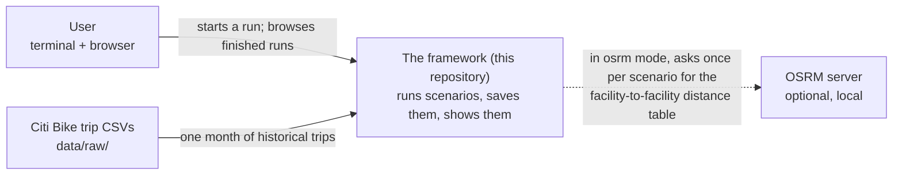

The one optional outside service is a local OSRM routing server
([set-up-osrm.md](../how-to/set-up-osrm.md)); without it, distances come from the
haversine formula, the straight line between two points on the globe. Zooming
one step in, the straight line is a handful of big blocks:

```mermaid
flowchart LR
    csv["raw trip CSVs<br/>data/raw/"]
    loaders["loaders<br/>gbp/loaders/"]
    sim["simulator<br/>gbp/consumers/simulator/"]
    builder["artifact builder<br/>gbp/artifacts.py"]
    runs[("run artifacts<br/>data/runs/, one folder per run")]
    ui["web interface<br/>app/main.py + app/views/"]
    api["run-artifact API<br/>app/api.py"]
    ml["demand forecasting<br/>gbp/ml/"]
    forecasts[("forecast artifacts<br/>data/ml/forecasts/")]

    csv -->|"historical trips"| loaders
    csv -->|"past months, as the training table"| ml
    ml -->|"forecast demand table + meta.json"| forecasts
    forecasts -.->|"in a forecast run, takes the place<br/>of the historical demand"| loaders
    loaders -->|"ResolvedModelData, read through<br/>the ScenarioInputs contract"| sim
    sim -->|"flow journal"| builder
    builder -->|"saved tables + meta.json"| runs
    runs -->|"saved tables"| ui
    runs -->|"saved tables"| api
    api -.->|"the same tables over HTTP,<br/>when API_URL is set"| ui
```

Each block has its own page: the loaders in
[data-model.md](data-model.md), the simulator in
[simulation-engine.md](simulation-engine.md) with its optional night-time truck
rebalancing in [rebalancing.md](rebalancing.md), the artifact builder and the
app in [visualization.md](visualization.md), the HTTP layer in
[api.md](../reference/api.md).

Why a straight line, and not a general platform? The top of this project calls
itself "a framework for problems on flow graphs," which sounds like an
invitation to build a domain-independent engine with bikes as one plug-in. It
deliberately refuses that. There is exactly one scenario, Citi Bike, and every
module is allowed to know it by name. The alternative — a generic core with
adapters — would buy the ability to add a second domain quickly, and would cost
an abstraction layer that no code today exercises and that would have to be
guessed at in advance. The project bets that a second domain, if it ever comes,
is better paid for when it arrives, against a real example, than guessed at now
against none. That is the "vertical, not horizontal" rule made concrete: the
flow-graph sentence describes the data, not a promise of a domain-independent
layer.

Demand forecasting ([ml-toolkit.md](ml-toolkit.md)) is the one piece that is not
on the line. It stands beside it. A model trained on past months writes a
forecast demand table, and a forecast run is the ordinary chain with a single
substitution: the forecast table takes the place of history, and nothing else
changes (see [forecast-replaces-only-demand](../decisions/forecast-replaces-only-demand.md)).
The tempting alternative was a separate "forecast simulator." It was rejected for
one reason: the base replay and the forecast run have to be comparable. Because
they differ only in the demand they face, any difference in the result is caused
by the forecast and by nothing else. A second code path would have quietly
broken that guarantee, and the whole point of the current phase is to trust the
comparison.

## Small, deep modules

The code follows one rule from John Ousterhout's *A Philosophy of Software
Design*: a module earns its place when its interface is small and the work
hidden behind it is large. The loaders hand back one object,
`ResolvedModelData`, and hide behind it the CSV cleaning, the period grid, the
origin-destination matrix, routing, and the sizing helpers. The router answers
two questions — the distance and the travel time between two facilities — and
hides whether the answer came from the haversine formula or from a road-network
server.

This buys a caller a great deal and asks a price. A deep module is pleasant from
the outside and harder on the inside: a change often means opening one large
module rather than rewiring many small ones. The project takes that trade on
purpose. It would rather protect the caller from complexity than spread the
complexity thin across many shallow parts. The opposite style — many small
classes, each easy to read on its own — reads well one file at a time, but
forces whoever uses it to hold ten of them in mind at once. The inside of each
module, where that hidden work actually lives, is what the per-module pages
above are for.

## What the design is betting on

The framework is really three bets stacked on one another. Keep one honest,
append-only journal, and compute every view from it. Keep the scope vertical —
one real scenario, known to every module — instead of a domain-independent
platform. Keep the modules few and deep, paying with harder insides for simpler
outsides.

Each bet trades away some flexibility or some speed for one thing: that you can
always ask what happened in a run and get a truthful answer, re-derived from the
record, at a scale where the cost of re-deriving it does not matter. That is the
wager the whole design is making. And the phase the project is now in — running
the simulator on forecast demand, side by side with the replay of history — is
exactly the kind of question that only pays off if the answer can be trusted.
