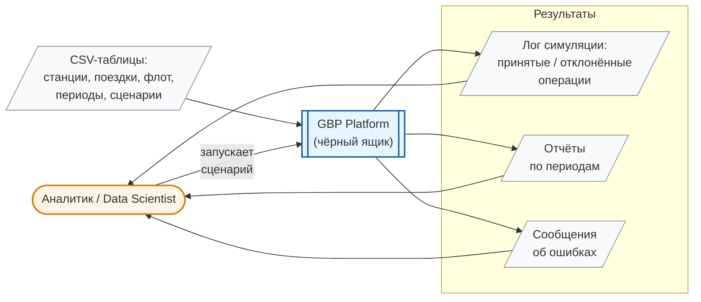
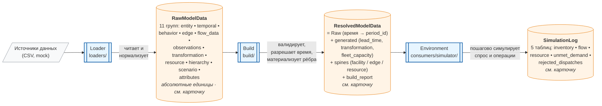
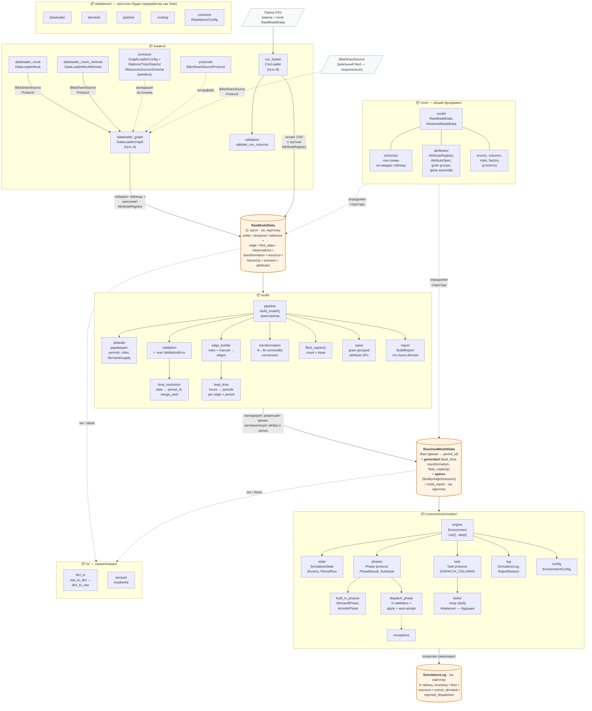
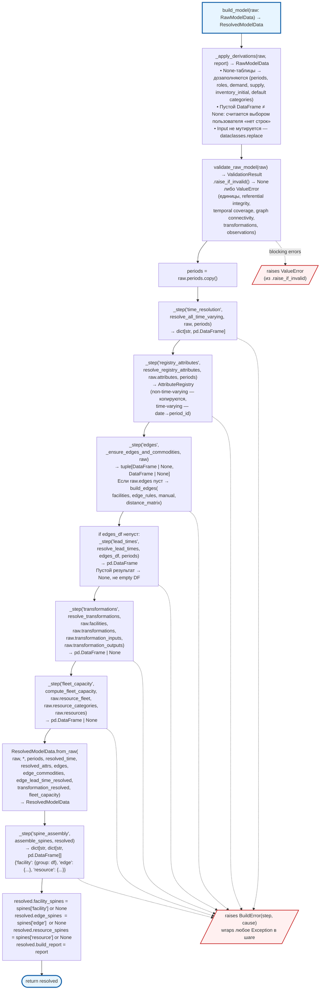

# Диаграммы уровней понимания (на примере GBP)

Этот файл — визуальное сопровождение к [уровни_понимания_кода.md](уровни_понимания_кода.md). Каждая диаграмма показывает **то, и только то**, что видит человек на соответствующем уровне понимания. Это не полная правда о системе — это её проекция, доступная наблюдателю с данной глубиной.

**Уровень 5 (пошаговая реализация) не диаграммируется** — это чтение кода, а не картинка.

**Уровень 4b (теория модуля — «почему так») тоже пропущен**: дизайн-решения, альтернативы и load-bearing-инварианты по своей природе текстовые (ADR, design doc). Mermaid здесь даст либо бедную картинку, либо плохо читаемый mindmap. Правильный инструмент для 4b — это [docs/design/](../design/) и ADR-карточки, а не диаграмма.

---

## Уровень 1. Пользователь интерфейса

На этом уровне человек видит систему как чёрный ящик: какие данные он подаёт на вход, какую кнопку нажимает, что получает на выходе. Никакой внутренней структуры — только поверхность взаимодействия.



**Что явно отсутствует на этом уровне:** как устроен пайплайн, из чего состоит модель, что такое Environment, чем отличается RawModelData от ResolvedModelData. Всё это — внутренности чёрного ящика, их пользователю знать не нужно.

---

## Справочник контрактов данных

Начиная с уровня 2, по диаграммам текут три «толстых» структуры: `RawModelData`, `ResolvedModelData`, `SimulationLog`. У Raw и Resolved — десятки таблиц каждой, перечислять их на диаграмме невозможно, а голое название ничего не говорит новичку. Поэтому ниже — три **карточки контрактов**, на которые опираются все последующие диаграммы. Группы в карточках не выдуманы — это ровно `_GROUPS` из [gbp/core/model.py:463](../../gbp/core/model.py#L463) и таблицы `to_dataframes()` из [gbp/consumers/simulator/log.py:154](../../gbp/consumers/simulator/log.py#L154).

Идея чтения: на диаграммах L2 и L3 каждая «пухлая» data-нода подписана списком групп, а что лежит внутри группы — смотрится здесь.

### Карточка: `RawModelData`

**Назначение.** Все входные таблицы пайплайна в «человеческих» единицах (даты, часы, абсолютные количества). Время ещё не привязано к `period_id`, рёбра могут быть не материализованы (их соберёт `build` из `edge_rules`). Это ровно то, что должны подготовить загрузчики.

**Состав — 11 семантических групп** (доступ к каждой — через одноимённое свойство, напр. `raw.entity_tables`):

| Группа | Что в ней | Ключевые таблицы | Обязательна? |
|--------|-----------|------------------|--------------|
| **entity** | что существует в сети | `facilities`\*, `commodities`, `resources`, `commodity_categories`, `resource_categories` | частично |
| **temporal** | горизонт планирования и сетка периодов | `planning_horizon`\*, `planning_horizon_segments`\*, `periods` | частично |
| **behavior** | что сущности умеют делать, правила рёбер | `facility_operations`\*, `edge_rules`\*, `facility_roles`, `facility_availability` | частично |
| **edge** | идентичность и атрибуты рёбер (если заданы явно) | `edges`, `edge_commodities`, `edge_capacities`, `edge_commodity_capacities`, `edge_vehicles`, `distance_matrix` | нет |
| **flow_data** | спрос, предложение, инвентарь | `demand`, `supply`, `inventory_initial`, `inventory_in_transit` | нет |
| **observations** | исторические наблюдения | `observed_flow`, `observed_inventory` | нет |
| **transformation** | N→M конверсия товаров | `transformations`, `transformation_inputs`, `transformation_outputs` | нет |
| **resource** | флот, совместимость, доступность | `resource_fleet`, `resource_commodity_compatibility`, `resource_modal_compatibility`, `resource_availability` | нет |
| **hierarchy** | иерархии facilities / commodities | `facility_hierarchy_*`, `commodity_hierarchy_*` (по 4 таблицы в каждой) | нет |
| **scenario** | конфиг прогона + оверрайды | `scenarios`, `scenario_edge_rules`, `scenario_manual_edges`, `scenario_parameter_overrides` | нет |
| **attributes** | атрибуты с произвольным grain (costs, capacity, prices) | `AttributeRegistry` — не табличное поле, набор `AttributeSpec` | нет |

`*` — должно быть заполнено до вызова `build_model`.

**Кто пишет:** `loaders/` — `DataLoaderGraph` (путь A: bike-share источник → Raw с заполненным `AttributeRegistry`), `CsvLoader` (путь B: CSV-папка → Raw с пустым `AttributeRegistry`).

**Кто читает:** `build/pipeline.py`.

**Ключевые инварианты:**
- **Absolute units.** Время — в часах/датах. Перевод в `period_id` — забота `build`, не loaders.
- **5 обязательных таблиц.** `facilities`, `planning_horizon`, `planning_horizon_segments`, `facility_operations`, `edge_rules`. Остальное — опционально.
- **`None` ≠ пустой DataFrame.** `None` → «не задано, домысли» (`build.defaults` попытается дозаполнить). Пустой DataFrame → «ничего не хочу» (`build` не трогает). Это load-bearing различие ([пайплайн](../../gbp/build/pipeline.py)).
- **Атрибуты — отдельно.** Costs / capacity / prices живут не в DataFrame-полях, а в `AttributeRegistry` — чтобы регистрировать их с любым grain.

---

### Карточка: `ResolvedModelData`

**Назначение.** Единственная точка контакта между `build` и любым consumer (Environment, будущий Optimizer, Analytics). Тот же набор сущностей, что в Raw, но приведён к форме, готовой к потреблению: время — в `period_id`, рёбра — материализованы, атрибуты — разложены в «spines» для vectorized lookup.

**Что содержит.** Все 11 групп из Raw (passthrough или time-resolved версия) + ещё две новые группы, плюс диагностика:

- **generated** — новые таблицы, которых в Raw не бывает вообще: `edge_lead_time_resolved`, `transformation_resolved`, `fleet_capacity`.
- **spines** — три словаря DataFrame'ов: `facility_spines`, `edge_spines`, `resource_spines`. Это не источник истины, а кэш удобного формата, собранный из `AttributeRegistry` по grain-группам.
- **build_report** — что было derived, какие шаги упали, чем дополнен Raw.

**Diff к Raw** (что именно добавляет `build_model`, а что просто passthrough):

| Что | Откуда берётся | Было в Raw? |
|-----|----------------|-------------|
| `periods` (если был `None`) | `build.defaults` из `planning_horizon_segments` | возможно нет |
| `facility_roles` (если был `None`) | `build.defaults` из `facility_operations` | возможно нет |
| Time-varying таблицы с `period_id` | `build.time_resolution.resolve_all_time_varying` — для `demand`, `supply`, `edge_capacities`, `edge_commodity_capacities`, `facility_availability`, `observed_flow`, `observed_inventory` | да, но с `date` |
| `edges` + `edge_commodities` материализованы | `build.edge_builder` из `facility_operations` + `edge_rules` + manual + `distance_matrix`, если `raw.edges` был пуст | возможно нет |
| `edge_lead_time_resolved` | `build.lead_time` — hours → periods на каждое ребро × период | **новое** |
| `transformation_resolved` | `build.transformation` — N→M конверсия | **новое** |
| `fleet_capacity` | `build.fleet_capacity` — `count × base_capacity` на facility × resource_category | **новое** |
| `facility_spines` / `edge_spines` / `resource_spines` | `build.spine.assemble_spines` — атрибуты из `AttributeRegistry`, сгруппированные по grain | **новое** |
| `build_report` | диагностика, всегда присоединяется | **новое** |
| `AttributeRegistry` с `period_id` | `build.time_resolution.resolve_registry_attributes` — time-varying entries; non-time-varying — passthrough | entries те же, но `date` |

Всё остальное (facilities, resources, hierarchies, scenarios, transformations-definitions, observations-passthrough, и т.п.) — копируется из Raw as-is.

**Кто пишет:** только `build/pipeline.py`. **Никто больше не должен создавать или мутировать `ResolvedModelData` извне pipeline.**

**Кто читает:** `consumers/simulator/` (Environment), будущие Optimizer / Analytics.

**Ключевые инварианты:**
- **Единственная точка контакта.** Все consumers получают один и тот же объект; значит, и время, и рёбра у них согласованы.
- **Время — в `period_id`.** В time-varying таблицах больше нет колонок `date`. Исключения — `planning_horizon` и `planning_horizon_segments` (они задают саму сетку).
- **Spine — кэш, не истина.** Источник атрибутов — `AttributeRegistry`. Spine нужен consumer'у для быстрых lookup'ов, но может быть пересобран в любой момент.
- **Узкое окно мутации.** После `ResolvedModelData.from_raw(...)` pipeline пишет только `*_spines` и `build_report`. Других точек мутации у Resolved нет.

---

### Карточка: `SimulationLog`

**Назначение.** Накопленный результат прогона симуляции. Внутри — пять буферов `list[DataFrame]`, которые финализируются в пять итоговых таблиц через `to_dataframes()`.

| Таблица | Гранулярность | Что записывается |
|---------|---------------|------------------|
| `simulation_inventory_log` | period × facility × commodity_category | снапшот инвентаря на конец периода |
| `simulation_flow_log` | phase × edge × commodity | принятые flow (что реально проехало) |
| `simulation_resource_log` | period × resource | где ресурс, в каком статусе, когда снова свободен |
| `simulation_unmet_demand_log` | phase × facility × commodity | requested / fulfilled / deficit |
| `simulation_rejected_dispatches_log` | phase × rejected dispatch | отказ + `RejectReason` (5 enum-значений) |

**Кто пишет:** `consumers/simulator/engine.Environment` — `record_period` в конце каждого периода (snapshot), `record_events` после каждой фазы (events).

**Кто читает:** пост-прогонная аналитика и отчётность. В онлайн-потоке никто не читает.

**Ключевые инварианты:**
- **Append-only в памяти.** Внутри — `list[DataFrame]`, concat только при `to_dataframes()`. Это даёт O(1) запись при больших прогонах.
- **Фиксированный enum причин.** `RejectReason` — 5 значений (`no_available_resource`, `insufficient_inventory`, `over_capacity`, `invalid_edge`, `invalid_arrival`). Расширение — правка кода, не конфига.
- **Snapshot vs events.** Inventory / resource — снапшоты на **границе** периода. Flow / unmet / rejected — события **внутри** периода, с разбивкой по фазе.

---

## Уровень 2. Верхнеуровневые модули и их крупноблочные контракты

Чёрный ящик раскрывается на три больших блока — ровно как в примере из основного документа («загрузчик → оптимизатор → отчётный слой»). Контракты между блоками сформулированы в терминах домена: «что в общих чертах отдаёт один блок другому», без деталей полей и сигнатур.



**Крупноблочные контракты (как их видят на уровне 2):**

| Блок | На входе | На выходе | Какие группы пишет |
|------|----------|-----------|-------------------|
| **Loader** | сырые CSV-источники / bike-share объект | `RawModelData` (11 групп, абсолютные единицы) | все 11 групп, включая `attributes` (только путь A) |
| **Build** | `RawModelData` | `ResolvedModelData` (= Raw с `period_id` + **generated** + **spines** + `build_report`) | материализует `edges`, ресолвит time-varying, добавляет `generated` и `spines` |
| **Environment** | `ResolvedModelData` + `EnvironmentConfig` + Schedule | `SimulationLog` (5 таблиц) | snapshot inventory/resource в конце периода, events flow/unmet/rejected на каждую фазу |

> Раскрытие каждой «колонки» — в [справочнике контрактов данных](#справочник-контрактов-данных) выше.

**Что на этом уровне уже видно:**
- что в системе есть разделение «сырые данные → валидированная модель → потребитель»;
- что `ResolvedModelData` — **единственная точка контакта** между Build и любым потребителем (это несущее архитектурное решение, оно видно уже на L2).

**Что ещё НЕ видно на этом уровне:**
- какие конкретно таблицы лежат внутри `RawModelData`/`ResolvedModelData`, какие у них колонки и типы;
- из каких шагов состоит Build (time resolution, edge builder, spine assembly и т.д.);
- как внутри Environment устроены фазы, задачи и состояние;
- что существует ещё модуль `core/` (определяет схемы и регистр атрибутов) и `io/` (сериализация) — они не в потоке данных, а инфраструктурные, и на L2 их обычно не показывают.

**Про rebalancer.** Каталог [gbp/rebalancer/](../../gbp/rebalancer/) на данный момент — ранний прототип PDP-решателя на OR-Tools, который будет переработан как **Task внутри Environment** (первая реальная Task). На диаграмме L2 его отдельным блоком **сознательно нет** — он не является независимым верхнеуровневым модулем в целевой архитектуре.

---

## Уровень 3. Все модули системы и их крупноблочные контракты

То же, что и L2, но «вглубь»: раскрываем каждый верхнеуровневый модуль до его внутренних подмодулей и показываем, как они соединены. Контракты остаются крупноблочными — «что вход, что выход», без точных сигнатур.

**Важно про загрузчики.** В системе **два параллельных пути** до `RawModelData`, а не один:
- **Путь A (bike-share domain):** объект, реализующий `BikeShareSourceProtocol` (мок или в будущем реальный источник), передаётся в `DataLoaderGraph`. Тот валидирует источник pandera-схемами из `contracts` и ассемблирует `RawModelData`, попутно **заполняя `AttributeRegistry`** (capacity, cost-атрибуты).
- **Путь B (generic CSV):** папка CSV-файлов, чьи имена совпадают с полями `RawModelData`, читается `CsvLoader` через `fields(RawModelData)`. Колонки валидируются `validators.validate_csv_columns` против row-схем из `core.schemas/`. `AttributeRegistry` в этом пути остаётся пустым.



**Крупноблочные контракты внутри подсистем (как их видит L3):**

Группы (`entity`, `temporal`, …) — это те же группы из [карточки `RawModelData`](#карточка-rawmodeldata) и [карточки `ResolvedModelData`](#карточка-resolvedmodeldata). `generated` и `spines` добавляются только на шаге `build`.

| Подмодуль | Вход | Выход | Какие группы трогает |
|-----------|------|-------|----------------------|
| **loaders**.`dataloader_mock` / `dataloader_mock_minimal` | конфиг (`n_stations`, `seed`, ...) | объект-источник, реализующий `BikeShareSourceProtocol` | — (ещё не `RawModelData`) |
| **loaders**.`dataloader_graph` (путь A) | `BikeShareSourceProtocol` + `GraphLoaderConfig` | `RawModelData` с **заполненным** `AttributeRegistry` | пишет во все 11 групп, включая `attributes` |
| **loaders**.`contracts` (pandera-схемы) | DataFrame-источника (`df_stations` и т.д.) | ✓ или ошибка валидации источника | — (валидация источника, не Raw) |
| **loaders**.`csv_loader` (путь B) | папка CSV, имена файлов = поля `RawModelData` | `RawModelData` с **пустым** `AttributeRegistry` | пишет во все 10 «табличных» групп; `attributes` остаётся пустой |
| **loaders**.`validators` | CSV + имя таблицы (+ row-схема из `core.schemas`) | список ошибок по колонкам | — |
| **build**.`defaults` | `RawModelData` | тот же Raw с дозаполненными выводимыми таблицами | `temporal` (`periods`), `behavior` (`facility_roles`), `flow_data`, `entity` (default categories) |
| **build**.`validation` | `RawModelData` | ✓ или `ValidationError` | читает все группы (единицы, ссылки, связность) |
| **build**.`time_resolution` | Raw + `periods` | таблицы, привязанные к `period_id` | `flow_data`, `observations`, `edge` (capacities), `behavior` (availability), `attributes` (time-varying) |
| **build**.`edge_builder` | facilities + rules + manual | материализованная таблица рёбер + `edge_commodities` | `edge` (если была пуста) |
| **build**.`lead_time` | рёбра + periods | `edge_lead_time_resolved` | **`generated`** (новое) |
| **build**.`transformation` | `transformations` + inputs/outputs | `transformation_resolved` | **`generated`** (новое) |
| **build**.`fleet_capacity` | `resource_fleet` + categories | `fleet_capacity` per facility × category | **`generated`** (новое) |
| **build**.`spine` | `ResolvedModelData` + `AttributeRegistry` | dict spines: facility / edge / resource по grain | **`spines`** (новое) |
| **build**.`pipeline` (оркестратор) | `RawModelData` | `ResolvedModelData` (+ `BuildReport`) | собирает всё; именно здесь Raw → Resolved |
| **simulator**.`state` | — | `SimulationState` (frozen), мутируется только через `replace` | — |
| **simulator**.`phases` + `built_in_phases` | `SimulationState` + период | `PhaseResult` (flows, unmet_demand) | читает `generated`/`spines`; пишет события в `SimulationLog` |
| **simulator**.`dispatch_phase` | state + dispatch-таблица от Task | `PhaseResult` или отказы (`RejectReason`) | пишет в `flow_log` / `rejected_dispatches_log` |
| **simulator**.`task` + `tasks/` | state + контекст периода | dispatch-таблица (что отправить куда) | не пишет напрямую в `SimulationLog` |
| **simulator**.`engine.Environment` | `ResolvedModelData` + `EnvironmentConfig` + Schedule | накопленный `SimulationLog` | пишет 5 логов: snapshot + events |
| **core**.`model` | — | определения `RawModelData` / `ResolvedModelData` + `_GROUPS` / `_SCHEMAS` maps | задаёт сами группы |
| **core**.`schemas/` | строка таблицы | Pydantic-валидированная модель строки (row-schema на каждую таблицу) | — (row-level) |
| **core**.`attributes/` | `AttributeRegistry` + grain-тэги | определения `AttributeRegistry` / `AttributeSpec` | определяет `attributes`; заполняется `dataloader_graph`, читается `build.spine` |
| **io**.`dict_io` | `RawModelData` | dict (и обратно) | все группы |
| **io**.`parquet` | таблицы / dict | файлы parquet (и обратно) | все группы |

**Что на этом уровне уже видно:**
- полная карта модулей — можно сказать **где** в системе лежит та или иная ответственность;
- в системе **два параллельных пути** наполнения `RawModelData` (A — bike-share через `DataLoaderGraph`, B — готовые CSV через `CsvLoader`); в пути A в `RawModelData` попадает также заполненный `AttributeRegistry`;
- `build.pipeline` — центральный оркестратор, все остальные `build/*` — чистые функции-шаги;
- `Environment` построен на **протоколах** `Phase` и `Task`, а не на жёсткой иерархии — это open-ended точка расширения (сюда встанет настоящий Rebalancer как Task);
- `core/` — общий фундамент, но он не в потоке данных, а лежит «снизу»; при этом `AttributeRegistry` (из `core.attributes`) — не чисто пассивная структура: её заполняют снаружи (`dataloader_graph`) и потом читают на этапе `build.spine`;
- `rebalancer/` внутри себя имеет свой pipeline/dataloader — это **отдельная параллельная реализация**, которая будет демонтирована, когда появится `SimulatorTask` для ребалансировки.

**Что ещё НЕ видно на этом уровне:**
- точные сигнатуры функций, типы параметров, исключения, инварианты — это уже L4a;
- почему именно такое разделение на `time_resolution` / `edge_builder` / `spine` выбрано, какие альтернативы отвергнуты — это L4b;
- как именно внутри `assemble_spines` группируются атрибуты по grain, почему такой порядок — это L5.

---

## Уровень 4a. Точные контракты внутри модуля — на примере `gbp/build/pipeline.py`

L4a применяется к **одному конкретному модулю**. Для всех модулей сразу — overkill: их точные контракты лучше держать в коде и docstring'ах. Здесь мы берём [gbp/build/pipeline.py](../../gbp/build/pipeline.py) как репрезентативный пример: оркестратор, в котором видны и последовательность шагов, и точные типы на каждом переходе, и исключения.

### Публичная поверхность модуля

```python
def build_model(raw: RawModelData) -> ResolvedModelData: ...

class BuildError(Exception):
    step: str         # имя шага, на котором упало
    cause: Exception  # исходное исключение
    def __init__(self, step: str, cause: Exception) -> None: ...
```

Всё остальное в модуле (`_apply_derivations`, `_ensure_edges_and_commodities`, `_prepare_distance_matrix`, внутренний `_step`) — приватное, не должно вызываться извне.

### Runtime-поток с точными сигнатурами



### Инварианты и граничные случаи

| Что | Инвариант / Условие |
|-----|---------------------|
| **Immutability входа** | `build_model` не мутирует переданный `raw`. Деривации создают новый `RawModelData` через `dataclasses.replace(raw, **updates)` |
| **«Manual wins»** | Если пользователь передал таблицу (даже пустую) — деривация НЕ срабатывает. Только `None` → попытка дозаполнить |
| **Пустая ≠ отсутствующая** | Явно пустой `DataFrame` = пользовательский выбор «нет строк». `None` = «не задано, домыслить». Это load-bearing различие, закреплено в docstring `_apply_derivations` |
| **Порядок validate → resolve** | Валидация **до** резолюции времени. Любая structural error → `ValueError` без попытки построить модель |
| **Обёртка `_step`** | Всё, что после validate, обёрнуто в `_step(name, fn, ...)`. Любое `Exception` внутри → `raise BuildError(name, exc) from exc`. Исходный traceback сохраняется через `from exc` |
| **Шаги с именами** | `"time_resolution"`, `"registry_attributes"`, `"edges"`, `"lead_times"`, `"transformations"`, `"fleet_capacity"`, `"spine_assembly"` — ровно эти 7 имён могут оказаться в `BuildError.step` |
| **`lead_times` пропускается** | если `edges_df` пуст/None. Результирующее поле `edge_lead_time_resolved` в этом случае = `None`, не empty DataFrame |
| **`fleet_capacity`** | возвращает `None` если `resource_fleet` пуст или в `resource_categories` нет `base_capacity` |
| **`transformations`** | возвращает `None` если любая из трёх таблиц (`transformations`/`inputs`/`outputs`) = `None` или `transformations` пустая |
| **Spines — write-after-construct** | `assemble_spines` выполняется **после** `ResolvedModelData.from_raw`, и три поля spines (`facility/edge/resource_spines`) записываются в уже собранный объект. Это единственный случай мутации `ResolvedModelData` внутри pipeline |
| **`build_report`** | всегда присоединяется к результату, даже если `derivations` пусто. Пользователь может проверить `.is_empty()` |

### Приватные помощники — точные контракты

```python
def _apply_derivations(raw: RawModelData, report: BuildReport) -> RawModelData:
    """Fills in derivable tables on a copy of raw. Returns same raw if no updates."""

def _ensure_edges_and_commodities(
    raw: RawModelData,
) -> tuple[pd.DataFrame | None, pd.DataFrame | None]:
    """If raw.edges non-empty → passthrough.
    Else → build_edges(facilities, edge_rules, manual, distance_matrix).
    Returns (edges, edge_commodities)."""

def _prepare_distance_matrix(raw_dm: pd.DataFrame | None) -> pd.DataFrame | None:
    """Rename 'duration' → 'lead_time_hours' for build_edges compat.
    Returns None if input None or empty."""
```

### Что на этом уровне уже видно (чего не было на L3)

- **точные типы на каждом переходе**: откуда берётся `dict[str, pd.DataFrame]`, откуда `AttributeRegistry`, где `tuple | None`;
- **семь имён шагов**, с которыми можно поймать `BuildError` и программно среагировать на падение конкретного шага;
- **где именно происходит валидация** и почему она раньше всего остального;
- **где мутируется `ResolvedModelData`** (только spine-поля и build_report после конструктора);
- **разница None vs empty DataFrame** как закреплённый инвариант «manual wins».

### Что по-прежнему не видно (L4b и L5)

- **почему** шаги разделены именно так (почему `time_resolution` и `lead_time` — отдельные, а не один шаг; почему `edges` построены **до** `lead_times`, а не наоборот) — это L4b;
- **как именно** внутри `resolve_all_time_varying` делается `merge_asof`, что происходит при пропусках, какая аггрегация выбрана — это L5.
