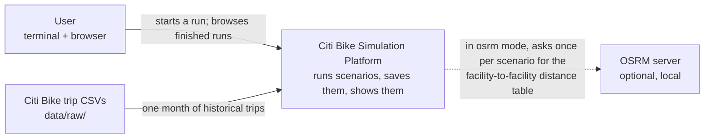
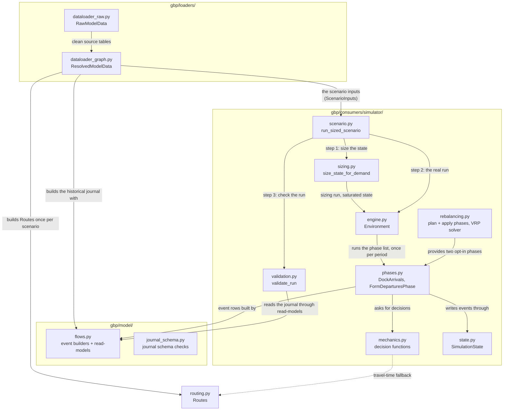
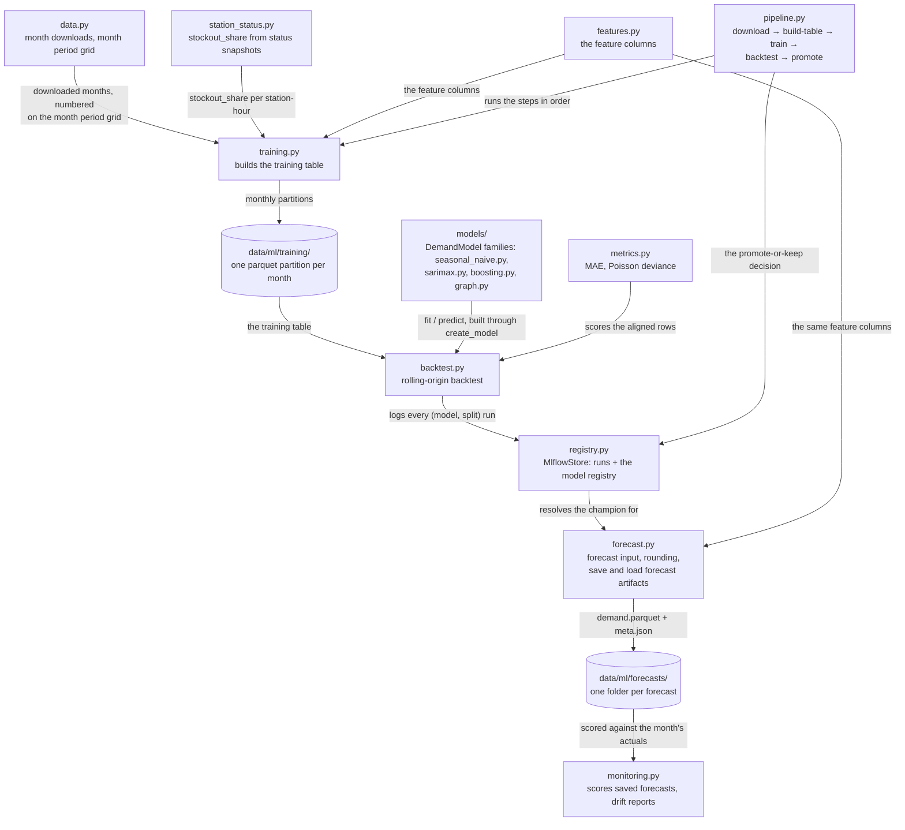
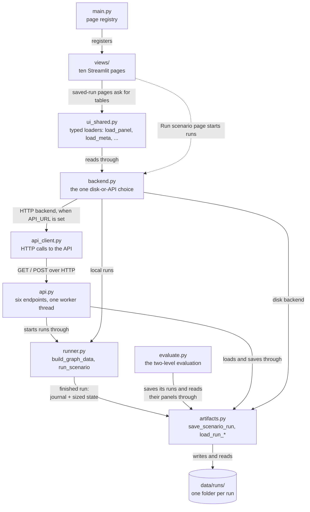

# Architecture — the system in diagrams

This page shows the system at three zoom levels, then gives a module depth
table. The diagrams stay high-level on purpose: every arrow names what one
block gives another, such as "passes the flow journal" — not a function
signature. Exact names and table contracts live in
[Notations.md](../../Notations.md) and in the per-module documents linked
below.

## Level 1 — the system and the outside world

The platform takes one month of published Citi Bike trips and replays that
demand period by period, with optional changes (scaled demand, overnight
rebalancing by truck). It can also run on predicted demand: a model trained
on past months saves a forecast demand table, and a forecast run
([Notations.md §11](../../Notations.md#11-run-kinds)) reads that table
through the same run chain. Each run is saved as one folder on disk — a run
artifact ([Notations.md §12](../../Notations.md#12-run-artifacts-the-files-the-ui-reads)) —
and the web interface shows the saved runs. The only optional outside service
is a local OSRM routing server ([set-up-osrm.md](../how-to/set-up-osrm.md));
without it, distances come from the haversine formula (the straight line
between two points on the globe).

## Level 2 — the big blocks

One run passes left to right through the run chain; the demand forecasting
subsystem stands beside the chain and supplies forecast demand:

```mermaid
flowchart LR
    csv["raw trip CSVs<br/>data/raw/"]
    loaders["loaders<br/>gbp/loaders/"]
    sim["simulator<br/>gbp/consumers/simulator/"]
    builder["artifact builder<br/>app/artifacts.py"]
    runs[("run artifacts<br/>data/runs/, one folder per run")]
    ui["web interface<br/>app/main.py + app/views/"]
    api["run-artifact API<br/>app/api.py"]
    ml["demand forecasting<br/>gbp/ml/"]
    forecasts[("forecast artifacts<br/>data/ml/forecasts/")]

    csv -->|"historical trips"| loaders
    csv -->|"past months, as the training table"| ml
    ml -->|"forecast demand table + meta.json"| forecasts
    forecasts -.->|"in a forecast run, takes the place<br/>of the historical demand"| loaders
    loaders -->|"ResolvedModelData, read through<br/>the ScenarioInputs contract"| sim
    sim -->|"flow journal"| builder
    builder -->|"saved tables + meta.json"| runs
    runs -->|"saved tables"| ui
    runs -->|"saved tables"| api
    api -.->|"the same tables over HTTP,<br/>when API_URL is set"| ui
```

One line per block, with its document:

- **loaders** ([data-model.md](../key-components/data-model.md)) — resolve the raw trip CSV
  into `ResolvedModelData`, the input tables of one scenario. The simulator
  is typed against `ScenarioInputs` (`gbp/consumers/simulator/inputs.py`);
  `ResolvedModelData` is one supplier of that contract.
- **simulator** ([simulation-engine.md](../key-components/simulation-engine.md)) — plays the scenario period
  by period and produces the flow journal. Overnight rebalancing
  ([rebalancing.md](../key-components/rebalancing.md)) is an opt-in part of it.
- **artifact builder** ([visualization.md](../key-components/visualization.md)) — turns a finished run into a run
  artifact: a folder of tables plus `meta.json`.
- **web interface** ([visualization.md](../key-components/visualization.md)) — saved-run pages load saved tables
  and draw them; the `Run scenario` page starts a run.
- **run-artifact API** ([api.md](../reference/api.md)) — serves the same folders over
  HTTP and can start new runs.
- **demand forecasting** ([ml-toolkit.md](../key-components/ml-toolkit.md)) — trains demand models on past
  months, keeps versions in a local MLflow store, saves forecasts under
  `data/ml/forecasts/`. A forecast run is the same run chain with one
  substitution: the forecast demand table takes the place of the historical
  demand ([decision record](../decisions/forecast-replaces-only-demand.md)).

Two shared libraries serve several blocks, so they are not separate blocks
here: `gbp/model/` ([flow-journal.md](../key-components/flow-journal.md)) owns the journal's
event schema, its builders and its read-models; `gbp/routing.py` answers
distance and travel-time questions for facility pairs. `app/runner.py` runs
the full sequence from CSV to saved folder; the terminal, the API and the
"Run scenario" page all go through it.

## Level 3 — every module

The full module map, split in three pictures at the same borders as the code.

### The run chain inside gbp/

Not drawn, to keep the picture readable: `journal_schema.py` is called from
many places (loaders, `scenario.py`, `validation.py`, `app/artifacts.py`);
`engine.py` and `state.py` also call small helpers from `flows.py`;
`config.py` (the `EnvironmentConfig` settings record) travels along every
arrow between `scenario.py`, `engine.py` and the phases.

### The forecasting subsystem inside gbp/ml/

Not drawn: `pipeline.py` also calls `data.py` and `backtest.py`;
`metrics.py` also scores monitoring's months; `forecast.py` builds a model
family through the same `create_model` when it is not using the champion.
The run chain reads this picture at one point: a forecast run loads a
forecast artifact by name, and `apply_forecast_demand` in
`dataloader_graph.py` puts its demand table in place of the historical one.

### From journal to browser inside app/

`runner.py` connects this picture to the previous ones: `build_graph_data`
calls the loaders, and `run_scenario` calls `run_sized_scenario`, then
passes the result to the artifact builder. `evaluate.py` is a second
terminal entry point: it runs the reference demand and one forecast run per
model, saves each as a normal run artifact, and writes
`data/ml/evaluation/<month>/comparison.csv`.

## Module depth — small interface, big module

The design rule this project follows (from John Ousterhout, "A Philosophy of
Software Design"): a module is good when its interface is short and the work
hidden behind it is large. When a change makes an interface column longer,
review the design.

### gbp/

| Module                        | Interface in one line                                                           | What it hides                                                                                                                              |
| ----------------------------- | ------------------------------------------------------------------------------- | ------------------------------------------------------------------------------------------------------------------------------------------ |
| `loaders/dataloader_raw.py`   | `RawModelData(trips_path, seed, fleet sizes, rates)`                            | CSV cleaning, the processed-parquet cache (`data/processed/`), the synthetic depots, trucks and price tables                               |
| `loaders/dataloader_graph.py` | `ResolvedModelData(raw, period_len, routing_mode)`                              | the period grid, the historical journal, the OD matrix, trip speeds, the replay sizing helpers, schema checks for the engine-facing tables |
| `routing.py`                  | `routes.distance_km(source, target)`, `routes.duration_periods(source, target)` | haversine vs OSRM, the one-shot `/table` fetch, the fallback for pairs OSRM cannot route                                                   |
| `model/flows.py`              | plain functions: journal-shaped table in, table out                             | `step_id` assignment, phase ordering, inventory reconstruction at any moment, the measure columns                                          |
| `model/journal_schema.py`     | `check_journal_schema(flows) -> list[str]`                                      | the pandera schema and the row-level rules of the event table                                                                              |
| `simulator/inputs.py`         | `ScenarioInputs` — the input tables of one scenario                             | nothing, by design: it is the named field list of the loader–simulator seam, so "what does the simulator read" has one answer              |
| `simulator/scenario.py`       | `run_sized_scenario(resolved, ...) -> ScenarioRun`                              | the fixed order: size, schema-check, copy, run, validate                                                                                   |
| `simulator/sizing.py`         | `size_state_for_demand(resolved, config) -> two tables`                         | the saturated run and why its journal is the right thing to measure                                                                        |
| `simulator/engine.py`         | `Environment(resolved, config).run() -> SimulationState`                        | the period loop, the phase-order guard, finalizing the journal on read                                                                     |
| `simulator/state.py`          | `SimulationState`: append events, advance the clock                             | step bookkeeping, in-transit tracking, inventory updates                                                                                   |
| `simulator/phases.py`         | `Phase.execute(state, resolved, period, config) -> state`                       | which events each phase writes, and in what order inside one period                                                                        |
| `simulator/mechanics.py`      | plain tables in, decision tables out                                            | the redirect rounds, capacity fitting, demand realization                                                                                  |
| `simulator/rebalancing.py`    | `rebalancing_phases(params)` -> the two truck phases                            | target inventory, imbalance, node splitting, the OR-Tools VRP, minute-to-period mapping                                                    |
| `simulator/validation.py`     | `validate_run(...) -> list[str]`                                                | the run invariants I1–I5 and how each is computed from the journal                                                                         |
| `simulator/config.py`         | `EnvironmentConfig` — the run settings                                          | nothing; a plain settings record, and that is fine — not every module needs depth                                                          |
| `ml/` (the forecasting package) | terminal commands `python -m gbp.ml.{training,backtest,pipeline,forecast,monitoring}`; `forecast.load_forecast(name)` for the runner | the feature columns, the training partitions, the four model families behind `DemandModel`, the MLflow store and the promote rule, the monitoring metrics and drift reports |

### app/

| Module               | Interface in one line                                                    | What it hides                                                                                          |
| -------------------- | ------------------------------------------------------------------------ | ------------------------------------------------------------------------------------------------------ |
| `runner.py`          | `build_graph_data(...)`, `run_scenario(graph_data, ...) -> saved folder` | the stage order and the progress reporting                                                             |
| `artifacts.py`       | `save_scenario_run(result, data, ...)`, `load_run_table`, `load_run_meta` | one build function per saved table, which result field feeds which builder, the artifact's pandera schemas, the `METRICS` registry, run naming |
| `evaluate.py`        | `python app/evaluate.py --month <YYYYMM>`                                 | the reference run, one replay-state forecast run per model, the shared demand cut (`restrict_demand_to_scenario`), `comparison.csv`          |
| `api.py`             | six HTTP endpoints ([api.md](../reference/api.md))                                    | the single worker thread, the run queue, the disk fallback after a restart                             |
| `api_client.py`      | `list_runs`, `load_table`, `start_run`, `run_status`                     | URL building, the API-key header, response decoding                                                    |
| `backend.py`         | `current()` — the chosen backend: reads, and `run_and_wait`              | the disk-or-API choice (`API_URL`), local in-process runs vs POST-and-poll over HTTP                   |
| `ui_shared.py`       | typed loaders: `load_panel(run_name)`, `load_meta(run_name)`, ...        | caching, old-artifact fallbacks                                                                        |
| `main.py` + `views/` | one Streamlit page per view                                              | saved-run pages only draw precomputed artifact values; `Run scenario` starts a run through the backend |

## Keeping this page true

No test catches a stale arrow, so the arrows stay high-level: domain words,
no signatures, no column names. Update this page only when a module appears,
disappears, or changes what it takes or gives. How a module works inside
belongs to the per-module documents ([data-model.md](../key-components/data-model.md),
[simulation-engine.md](../key-components/simulation-engine.md), [rebalancing.md](../key-components/rebalancing.md),
[flow-journal.md](../key-components/flow-journal.md), [visualization.md](../key-components/visualization.md), [api.md](../reference/api.md),
[ml-toolkit.md](../key-components/ml-toolkit.md)).
