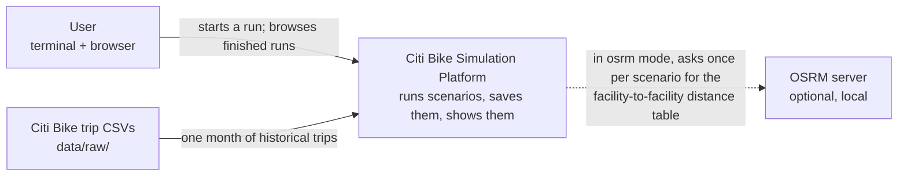
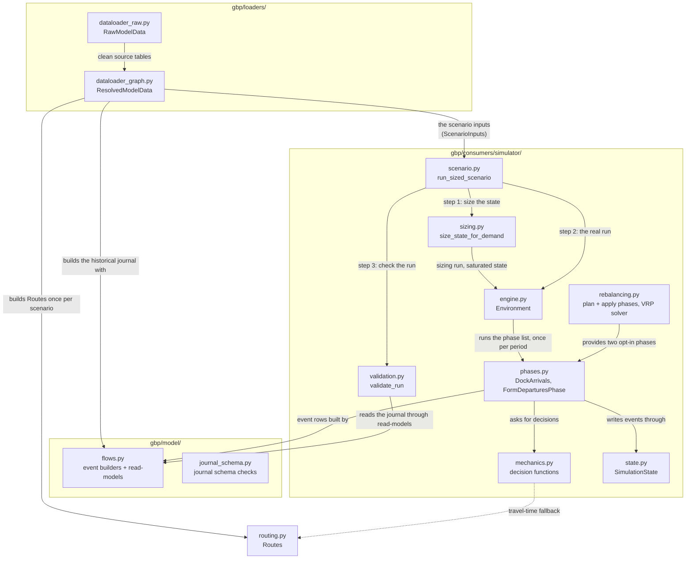
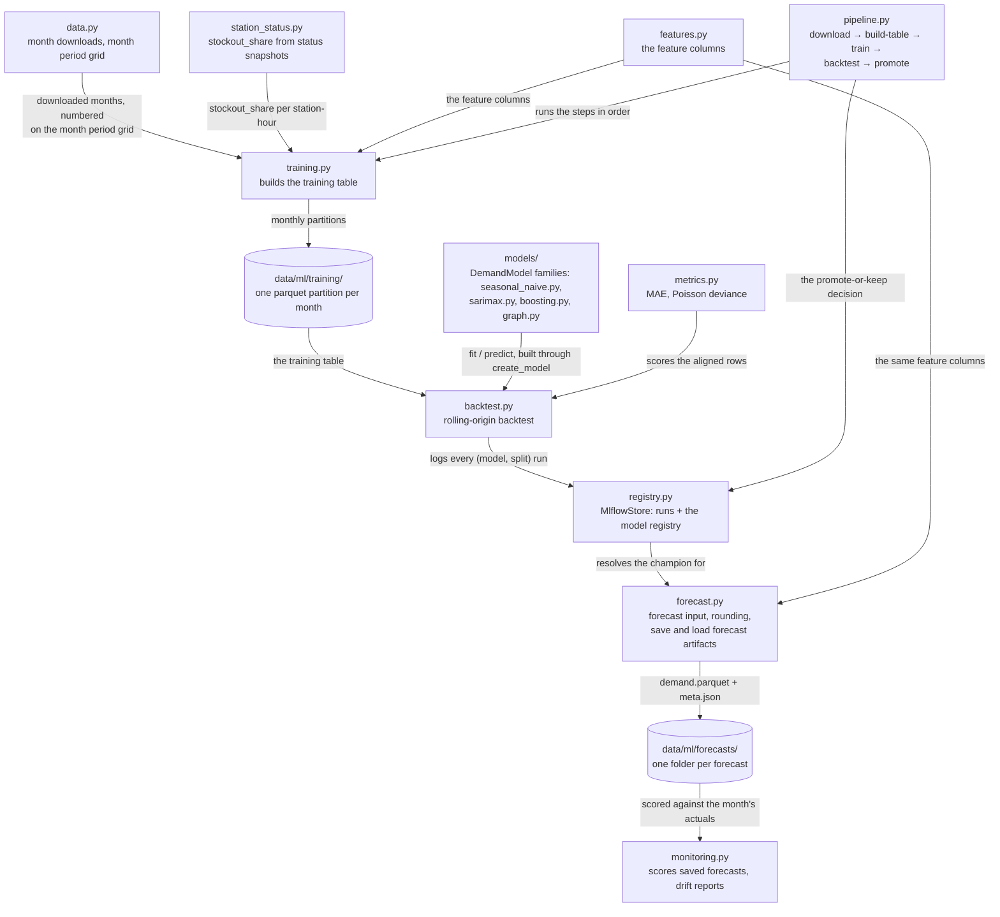
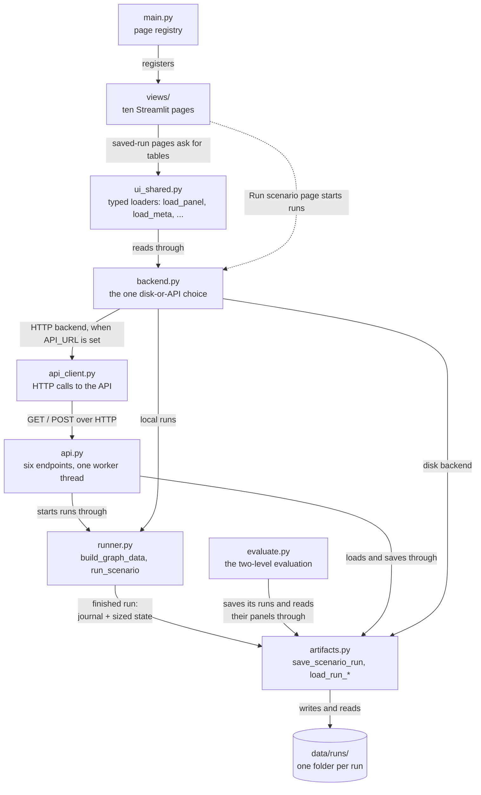

# Architecture — the system in diagrams

This page is a guide to the system: three diagrams, one per level of
understanding from [comprehension_levels.md](../method/comprehension_levels.md), and a
module depth table. The diagrams stay high-level on purpose: every arrow names
what one block gives another, such as "passes the flow journal". It is not a
function signature. Exact names and table contracts live in `[Notations.md](../../Notations.md)` and in the
per-module documents linked below.

How the sections map to the levels:

- [Level 1](#level-1--the-system-and-the-outside-world) — the system as one
box: who uses it, what goes in, what comes out.
- [Level 2](#level-2--the-big-blocks) — the big blocks and what each gives to
the next.
- [Level 3](#level-3--every-module) — every module, with labeled arrows.
- [Module depth](#module-depth--small-interface-big-module) — each module's
interface in one line next to what it hides.

## Level 1 — the system and the outside world

The platform takes one month of published Citi Bike trips and replays that
demand period by period, with optional changes (scaled demand, overnight
rebalancing by truck). It can also run on predicted demand instead of
history: a model trained on past months saves a forecast demand table, and a
forecast run ([Notations.md §11](../../Notations.md#11-run-kinds)) reads
that table through the same run chain. Each run is saved as one folder on
disk — a run artifact
([Notations.md §12](../../Notations.md#12-run-artifacts-the-files-the-ui-reads)) —
and the web interface shows the saved runs. The only optional outside service
is a local OSRM routing server ([osrm_setup.md](../guides/osrm_setup.md)); without it,
distances come from the haversine formula (the straight line between two
points on the globe).

## Level 2 — the big blocks

One run passes left to right through the run chain; the demand forecasting
subsystem stands beside the chain and supplies forecast demand:

```mermaid
flowchart LR
    csv["raw trip CSVs<br/>data/raw/"]
    loaders["loaders<br/>gbp/loaders/"]
    sim["simulator<br/>gbp/consumers/simulator/"]
    builder["artifact builder<br/>app/artifacts.py"]
    runs[("run artifacts<br/>data/runs/, one folder per run")]
    ui["web interface<br/>app/main.py + app/views/"]
    api["run-artifact API<br/>app/api.py"]
    ml["demand forecasting<br/>gbp/ml/"]
    forecasts[("forecast artifacts<br/>data/ml/forecasts/")]

    csv -->|"historical trips"| loaders
    csv -->|"past months, as the training table"| ml
    ml -->|"forecast demand table + meta.json"| forecasts
    forecasts -.->|"in a forecast run, takes the place<br/>of the historical demand"| loaders
    loaders -->|"ResolvedModelData, read through<br/>the ScenarioInputs contract"| sim
    sim -->|"flow journal"| builder
    builder -->|"saved tables + meta.json"| runs
    runs -->|"saved tables"| ui
    runs -->|"saved tables"| api
    api -.->|"the same tables over HTTP,<br/>when API_URL is set"| ui
```

- The **loaders** ([dataloader.md](dataloader.md)) read the raw trip CSV and
resolve it into `ResolvedModelData` — the input tables of one scenario:
facilities, the period grid, the demand, the OD matrix, the initial
inventory. The simulator does not depend on this class: it is typed against
`ScenarioInputs` (`gbp/consumers/simulator/inputs.py`), the named list of the
fields a run reads, and `ResolvedModelData` is one supplier of that contract.
- The **simulator** ([simulator.md](simulator.md)) plays the scenario period
by period and produces the flow journal
([Notations.md §0](../../Notations.md#0-the-flow-event-schema-the-symbol-table)) —
an append-only table of everything that happened to every bike. Overnight
rebalancing ([rebalancing.md](rebalancing.md)) is an opt-in part of the
simulator.
- The **artifact builder** ([app.md](app.md)) turns a finished run into a run
artifact: a folder of tables plus `meta.json`.
- The **web interface** ([app.md](app.md)) has two jobs. Saved-run pages load
saved tables and draw them. The `Run scenario` page starts a run and saves a
new artifact.
- The **run-artifact API** ([api.md](api.md)) serves the same folders over
HTTP and can start new runs.
- The **demand forecasting** subsystem (`gbp/ml/`,
[Notations.md §17](../../Notations.md#17-demand-forecasting-the-model-around-the-simulator))
trains demand models on past months, keeps trained versions in a local
MLflow store, and saves each forecast as a forecast artifact under
`data/ml/forecasts/`. A forecast run is the same run chain with one
substitution: the forecast demand table takes the place of the historical
demand (`apply_forecast_demand` in the loaders). Training, backtesting,
retraining and monitoring are terminal commands (`python -m
gbp.ml.pipeline`, `python -m gbp.ml.monitoring`); the "Model monitoring"
page shows what monitoring saves, and `app/evaluate.py` judges each model by
running the simulator on its forecast (the two-level evaluation).

Two shared libraries are used by several blocks in this chain, so they are not
separate blocks here: `gbp/model/` ([flow_journal.md](flow_journal.md)), which owns the
journal's event schema, its builders and its read-models (tables computed
from the journal), and `gbp/routing.py`, which answers distance and
travel-time questions for facility pairs. `app/runner.py` runs the full
sequence from CSV to saved folder; the terminal, the API and the "Run scenario"
page all go through it.

## Level 3 — every module

The full module map, split in three pictures at the same borders as the code:
the run chain in the library (`gbp/`), the forecasting subsystem (`gbp/ml/`),
and the runnable part (`app/`).

### The run chain inside gbp/

Three notes on what is not drawn, to keep the picture readable:

- `journal_schema.py` has no arrows because it is called from many places:
  the loaders, `scenario.py`, `validation.py` and `app/artifacts.py` all
  check journal-shaped tables against it.
- `engine.py` and `state.py` also call small helpers from `flows.py`
  (`finalize_flows`, the in-transit table helpers); only the two main arrows
  into `flows.py` are drawn.
- `config.py` (the `EnvironmentConfig` settings record) travels along every
  arrow between `scenario.py`, `engine.py` and the phases, and
  `tasks/` is an empty reserved package; neither would add a readable arrow.

### The forecasting subsystem inside gbp/ml/

Two notes on what is not drawn:

- `pipeline.py` also calls `data.py` (the download step) and `backtest.py`,
  `metrics.py` also scores monitoring's months, and `forecast.py` builds a
  model family through the same `create_model` when it is not using the
  champion; those arrows are omitted to keep the picture readable.
- The run chain reads this picture at one point: a forecast run loads a
  forecast artifact by name (`forecast.load_forecast`), and
  `apply_forecast_demand` in `dataloader_graph.py` puts its demand table in
  place of the historical one. `monitoring.py` writes `data/ml/monitoring/`;
  the "Model monitoring" page draws those files.

### From journal to browser inside app/

`runner.py` connects this picture to the previous ones: `build_graph_data`
calls the loaders, and `run_scenario` calls `run_sized_scenario`, then passes
the result to the artifact builder. `backend.py` is the one place the app
chooses between local files and the API (`API_URL` set): the `ui_shared.py`
loaders read through it, and the "Run scenario" page starts runs through it —
locally via `runner.py`, or over HTTP via `api_client.py`. `evaluate.py`
sits beside `runner.py` as a second terminal entry point: it loads the
scenario with `build_graph_data`, runs the reference run and one
replay-state forecast run per model with `run_sized_scenario`, saves each as
a normal run artifact, and writes `data/ml/evaluation/<month>/comparison.csv`.

## Module depth — small interface, big module

The design rule this project follows (from John Ousterhout, "A Philosophy of
Software Design"): a module is good when its interface is short and the work
hidden behind it is large. The table states, for each module, the interface
in one line and what a caller never has to know. When a change makes an
interface column longer, review the design.

### gbp/

| Module                        | Interface in one line                                                           | What it hides                                                                                                                              |
| ----------------------------- | ------------------------------------------------------------------------------- | ------------------------------------------------------------------------------------------------------------------------------------------ |
| `loaders/dataloader_raw.py`   | `RawModelData(trips_path, seed, fleet sizes, rates)`                            | CSV cleaning, the processed-parquet cache (`data/processed/`), the synthetic depots, trucks and price tables                               |
| `loaders/dataloader_graph.py` | `ResolvedModelData(raw, period_len, routing_mode)`                              | the period grid, the historical journal, the OD matrix, trip speeds, the replay sizing helpers, schema checks for the engine-facing tables |
| `routing.py`                  | `routes.distance_km(source, target)`, `routes.duration_periods(source, target)` | haversine vs OSRM, the one-shot `/table` fetch, the fallback for pairs OSRM cannot route                                                   |
| `model/flows.py`              | plain functions: journal-shaped table in, table out                             | `step_id` assignment, phase ordering, inventory reconstruction at any moment, the measure columns                                          |
| `model/journal_schema.py`     | `check_journal_schema(flows) -> list[str]`                                      | the pandera schema and the row-level rules of the event table                                                                              |
| `simulator/inputs.py`         | `ScenarioInputs` — the input tables of one scenario                             | nothing, by design: it is the named field list of the loader–simulator seam, so "what does the simulator read" has one answer              |
| `simulator/scenario.py`       | `run_sized_scenario(resolved, ...) -> ScenarioRun`                              | the fixed order: size, schema-check, copy, run, validate                                                                                   |
| `simulator/sizing.py`         | `size_state_for_demand(resolved, config) -> two tables`                         | the saturated run and why its journal is the right thing to measure                                                                        |
| `simulator/engine.py`         | `Environment(resolved, config).run() -> SimulationState`                        | the period loop, the phase-order guard, finalizing the journal on read                                                                     |
| `simulator/state.py`          | `SimulationState`: append events, advance the clock                             | step bookkeeping, in-transit tracking, inventory updates                                                                                   |
| `simulator/phases.py`         | `Phase.execute(state, resolved, period, config) -> state`                       | which events each phase writes, and in what order inside one period                                                                        |
| `simulator/mechanics.py`      | plain tables in, decision tables out                                            | the redirect rounds, capacity fitting, demand realization                                                                                  |
| `simulator/rebalancing.py`    | `rebalancing_phases(params)` -> the two truck phases                            | target inventory, imbalance, node splitting, the OR-Tools VRP, minute-to-period mapping                                                    |
| `simulator/validation.py`     | `validate_run(...) -> list[str]`                                                | the run invariants I1–I5 and how each is computed from the journal                                                                         |
| `simulator/config.py`         | `EnvironmentConfig` — the run settings                                          | nothing; a plain settings record, and that is fine — not every module needs depth                                                          |
| `ml/` (the forecasting package) | terminal commands `python -m gbp.ml.{training,backtest,pipeline,forecast,monitoring}`; `forecast.load_forecast(name)` for the runner | the feature columns, the training partitions, the four model families behind `DemandModel`, the MLflow store and the promote rule, the monitoring metrics and drift reports |

### app/

| Module               | Interface in one line                                                    | What it hides                                                                                          |
| -------------------- | ------------------------------------------------------------------------ | ------------------------------------------------------------------------------------------------------ |
| `runner.py`          | `build_graph_data(...)`, `run_scenario(graph_data, ...) -> saved folder` | the stage order and the progress reporting                                                             |
| `artifacts.py`       | `save_scenario_run(result, data, ...)`, `load_run_table`, `load_run_meta` | one build function per saved table, which result field feeds which builder, the artifact's pandera schemas, the `METRICS` registry, run naming |
| `evaluate.py`        | `python app/evaluate.py --month <YYYYMM>`                                 | the reference run, one replay-state forecast run per model, the shared demand cut (`restrict_demand_to_scenario`), `comparison.csv`          |
| `api.py`             | six HTTP endpoints ([api.md](api.md))                                    | the single worker thread, the run queue, the disk fallback after a restart                             |
| `api_client.py`      | `list_runs`, `load_table`, `start_run`, `run_status`                     | URL building, the API-key header, response decoding                                                    |
| `backend.py`         | `current()` — the chosen backend: reads, and `run_and_wait`              | the disk-or-API choice (`API_URL`), local in-process runs vs POST-and-poll over HTTP                   |
| `ui_shared.py`       | typed loaders: `load_panel(run_name)`, `load_meta(run_name)`, ...        | caching, old-artifact fallbacks                                                                        |
| `main.py` + `views/` | one Streamlit page per view                                              | saved-run pages only draw precomputed artifact values; `Run scenario` starts a run through the backend |

## Keeping this page true

Diagrams can become stale when code changes. No test catches a stale arrow.
Three rules reduce that risk:

- Every arrow stays high-level: domain words, no signatures, no column names.
A high-level arrow becomes stale only when a module's input or output changes,
which is rare.
- Update this page only when a module appears, disappears, or changes what
it takes or gives. A renamed function inside a module does not touch this
page.
- This page never explains how a module works inside. That belongs to the
per-module documents ([dataloader.md](dataloader.md),
[simulator.md](simulator.md), [rebalancing.md](rebalancing.md),
[flow_journal.md](flow_journal.md), [app.md](app.md), [api.md](api.md)) —
if a section starts explaining internals, move it to one of those documents.

