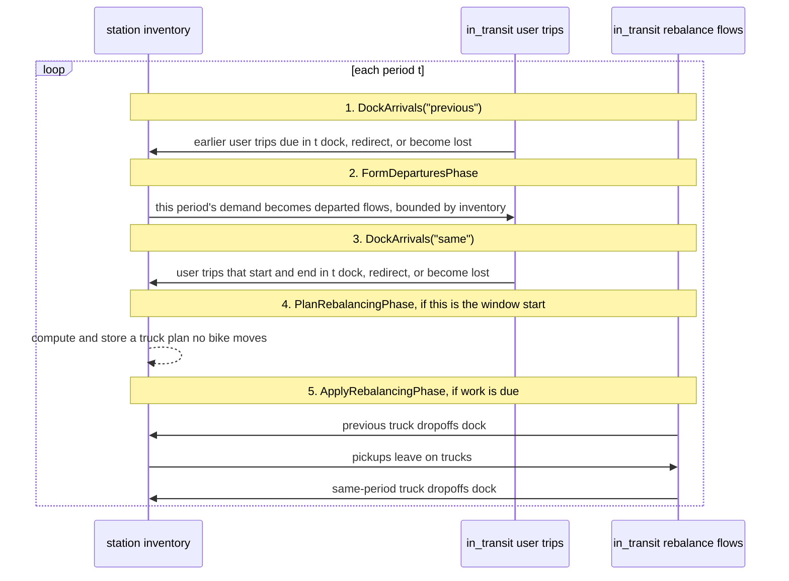

# The simulator

This document explains how one simulation run works. The simulator does three
things:

1. It moves bikes between pools: station inventory, `in_transit`, and, when
   rebalancing is enabled, trucks.
2. It writes every movement as rows in `state_flows_df`, the flow journal.
3. It checks that the finished journal and the live state still agree.

The terms are the same as in [`Notations.md`](../../Notations.md). Worked
examples with concrete journal rows are in [worked-examples.md](worked-examples.md). What
each phase and mechanics function reads, does, and writes is in the
docstrings of `gbp/consumers/simulator/` — this page only gives the map.

## Code Map

The simulator code is in `gbp/consumers/simulator/`.

| File | Main role |
|---|---|
| `inputs.py` | Owns `ScenarioInputs`, the input tables of one scenario — the fields every entry point below is typed against. |
| `engine.py` | Owns `Environment`, the object that steps periods. |
| `state.py` | Owns `SimulationState`, inventory arithmetic, and the one journal write path. |
| `phases.py` | Owns the three user-trip phases. |
| `mechanics.py` | Owns the rules used by phases: docking, redirects, demand, OD expansion. |
| `rebalancing.py` | Owns truck planning and execution ([rebalancing.md](rebalancing.md)). |
| `scenario.py` | Owns `canonical_phases()` and `run_sized_scenario()`. |
| `sizing.py` | Measures initial inventory and dock capacities for a demand level. |
| `validation.py` | Checks run invariants I1–I5. |
| `config.py` | Holds `EnvironmentConfig`, the settings for one run. |

The dependency direction is `journal <- state <- mechanics <- phases <-
engine`; a lower layer does not import a higher layer.

## The Main Idea

The simulator does not keep the run as one editable table. It keeps the
append-only flow journal `state_flows_df`; each row is a flow event —
`departed`, `arrived`, `redirected`, or `lost`
([decision record](../decisions/journal-as-source-of-truth.md)).

`SimulationState` is immutable: a phase reads one state and returns the next.
Besides the journal, the state carries `state_inventory_df` (bikes docked per
`(facility_id, commodity_category)`) and `in_transit` (bikes that departed
but have not docked yet). Both are caches derived from the journal, kept for
speed; invariant I3 recomputes inventory from the journal at run end and
compares the two.

Every phase writes through one method, `state.apply_step_events(new_flows,
phase_rank)`. It stamps the order columns, appends the rows to the journal,
and moves inventory and `in_transit` by exactly what the events imply — so
the journal and the two derived values cannot disagree. Its docstring in
`state.py` lists the exact steps.

Time has two axes. A `period` is one step of the simulation clock (one hour
in the canonical setup); `periods_df` maps each `period_id` to its wall-clock
bounds. A `step` is one ordered batch of inventory changes inside a period;
`step_id` numbers the batches run-globally, from a counter the state owns.
`phase_rank` and `phase_round` are labels: which phase wrote a row, and which
ordered round inside that phase.

## How A Run Starts

Most callers use `run_sized_scenario()` (`scenario.py`). It runs a sizing run
first, measures the initial inventory and dock capacities the demand needs,
replaces those two tables on a copy of the data, runs the real run, and
validates the result ([decision record](../decisions/sizing-run.md)).

The sizing run and the real run use two independent demand multipliers:
`sizing_scale_factor` sizes the state, `demand_scale_factor` is what the run
faces. Equal values give a clean run; a higher run scale is what makes
`stockout` and `dock_full` events appear at all. The `sizing_data` parameter
sizes the state on one demand table while the run faces another — the
two-level evaluation uses this for its forecast runs (Notations.md §11).
Both multipliers are runner flags (`--demand-scale`, `--sizing-scale`) and
are saved in `meta.json`.

## The Phase List

```python
canonical_phases() == [
    DockArrivals("previous"),   # phase_rank 0
    FormDeparturesPhase(),      # phase_rank 1
    DockArrivals("same"),       # phase_rank 2
]
```

A run with rebalancing appends `rebalancing_phases(params)`: the plan and
apply phases, both `phase_rank` 3.

A normal phase implements one method, `build_events`: it reads the state and
returns this period's events; the base class writes them through
`apply_step_events` with the phase's declared rank. The two rebalancing
phases override `execute` instead, because they also replace
`rebalance_plan` on the state. The engine refuses a phase list that is out of
`phase_rank` order (`SimulatorConfigError`).

## One Period At A Glance



Each phase keeps one balance, checked by the invariants below:

| Phase | Writes | Balance after the phase |
|---|---|---|
| `DockArrivals` | `arrived`, `redirected`, `departed` (redirect leg), `lost(dock_full)` | due == docked + redirected + lost |
| `FormDeparturesPhase` | `departed`, `lost(stockout)` | demand == departed + lost |
| `PlanRebalancingPhase` | nothing — replaces `rebalance_plan` | — |
| `ApplyRebalancingPhase` | `departed` / `arrived` with `flow_type = "rebalance"` | inventory change == dropoffs − pickups |

## Invariants

`validate_run()` checks the finished run: first the journal shape
(`check_journal_schema`, `gbp/model/journal_schema.py`), then five
invariants:

| Id | Statement |
|---|---|
| I1 | Demand splits exactly into `departed + lost(stockout)`. |
| I2 | Every departed flow due by run end closes with one `arrived` or `lost(dock_full)`. |
| I3 | Live final inventory equals inventory recomputed from the journal. |
| I4 | Bikes are conserved across final inventory, `lost(dock_full)`, and `in_transit`. |
| I5 | No step takes a station inventory below zero. |

`Environment.run()` calls these checks by default; `run_sized_scenario()`
calls them itself so it can return the violation list to the caller. The
scenario tables in [worked-examples.md](worked-examples.md) are rebuilt by
`tests/test_docs_scenarios.py`, so documented journal rows stay aligned with
the code.

## Why It Is Built This Way

### `step_id` Comes From A Counter

Labels like `(period_id, phase_rank, phase_round)` cannot prove batch
boundaries: two separately ordered batches must never share a `step_id`.
`apply_step_events()` opens each number from the state's counter, so a
number handed out once is never handed out again. The historical loader has
no counter and stamps `step_id` from the labels (`stamp_history_ordering`) —
safe there, because history is pure user trips and one label is always one
batch.

### Redirect Is A Real Second Leg

A redirect is not stored as one direct trip. The journal records the bounce:
`departed` → `redirected` → `departed` → `arrived`. This shows the full
station where the bike bounced, and it lets readers tell a real user
departure (`move_id == 0`, moves inventory) from a redirect continuation leg
(`move_id >= 1`, moves nothing).

### Arrivals Are Split Around Departures

One docking pass at the start would miss same-period trips — they do not
exist until `FormDeparturesPhase` creates them. One pass at the end would
make earlier arrivals unavailable for this period's demand. The split gives
both: earlier arrivals can serve this period, same-period trips can dock.

### Mechanics Decide, Phases Apply

Mechanics functions take plain tables and return decisions: which rows fit,
where overflow goes, how many trips depart. Phases turn decisions into
events and write them through `apply_step_events`. The rules stay testable
on small tables, while all journal writing goes through one path.
