# Worked examples — the flow journal on small scenarios

This document is the catalog of worked examples, one per simulator mechanic.
Each example is a small synthetic scenario about one bike (or one truck
route), a sequence diagram, and a small journal table with real values. The tables are not written by hand: each
one was produced by running the real engine on a small synthetic scenario, and
a test compares the document with a fresh run cell by cell. If the code
changes the journal rows, the test fails before this document can go out of
date.

The vocabulary is [Notations.md](../../Notations.md): the flow-event schema is
§0, the step axis (`step_id`, `phase_rank`, `phase_round`) is §0.1, the four
outcomes (`departed`, `arrived`, `redirected`, `lost`) are §1, rebalancing is
§14. This document does not re-explain those concepts; it shows their concrete
journal rows.

## How the scenarios are built

Every scenario is a tiny synthetic run built by `build_resolved` in
`tests/scenarios.py` from a few hand-written trips
`(source, target, start_period, end_period)`. The trips play two roles at
once:

- they are the history: the historical demand and the OD matrix are
  derived from them, so a pair of stations has exactly the travel time its
  trips show;
- the run replays that history: each period's demand departs again,
  against the initial inventory and the dock capacities the scenario sets.

Unless the setup says otherwise, dock capacities are large (10 000) and every
station starts empty. Periods are one hour long and start at
2026‑01‑01 00:00, so period 1 starts at 01:00 and period 6 at 06:00.

The rebalancing scenarios (10–14) extend the run with one depot (`depot_1`)
and one truck (`truck_1`, home depot `depot_1`) via `with_rebalancing_data`,
and inject a fixed hand-written truck route (`scripted_stops`) in place of the
routing solver, so the numbers do not depend on what the solver search finds.
The real OR-Tools solver is exercised separately, in
`tests/test_rebalancing.py::test_full_run_with_the_real_solver`.

## How to read the tables

A user-trip table shows the flow-event rows of **one flow**, in `event_id`
order. A rebalance table shows **all** the truck's flows, ordered by
`step_id`, then `flow_id`. Columns that are constant across a table's rows are
left out:

- user-trip tables: `flow_type = user_trip`, `commodity_category =
  classic_bike`, `quantity = 1`, `resource_id = NA`;
- rebalance tables: `flow_type = rebalance`, `move_id = 0`, `event_id` 0 for
  the pickup and 1 for the dropoff, `commodity_category = classic_bike`,
  `quantity = 1`, `resource_id = truck_1`, `reason = NA`.

`NA` marks a value that does not exist for that row (yet, or ever).

One warning about `step_id`: it is run-global (Notations.md §0.1). It counts
every inventory step of the whole run, so a gap inside one flow's rows means
another flow's step happened in between. Scenario 7 shows this: its final
`arrived` has `step_id` 3 because step 2 was another trip's docking.

Under every table there is a check line naming the test in
`tests/test_docs_scenarios.py` that rebuilds the scenario, runs the engine,
and compares the fresh journal with the table, cell by cell.

## How to read the diagrams

The participants of each diagram are the pools that can hold a bike: station
docks and `in_transit`, the set of bikes riding between stations (for a
rebalance flow: the bike on the truck). A solid arrow moves the bike from one
pool to another; an arrow with `--x` is an event that docks nothing
(`redirected`, `lost`). Each note names the period, the phase that wrote the
events below it, and the step.

---

## User-trip scenarios

### Scenario 1 — stockout: demand with no bike at the source

A user wants to leave `s1` in period 0, but `s1` holds no bike. The demand
never becomes a flow: no `flow_id`, no target, no `start_period` — one `lost`
row with `reason = stockout`, written by the departures phase
(`phase_rank` 1). In a bigger run, stockout losses are aggregated per
`(source, commodity)`: one row whose `quantity` counts the lost trips.

Setup: one trip `s1 → s2` (period 0 → 1); every station starts empty.

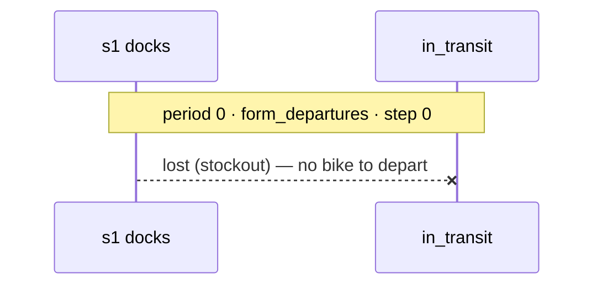

<!-- table:scenario-01 -->
| event_id | move_id | event_type | reason | source_id | planned_target_id | realized_target_id | period_id | start_period | phase_rank | phase_round | step_id |
|---|---|---|---|---|---|---|---|---|---|---|---|
| 0 | 0 | lost | stockout | s1 | NA | NA | 0 | NA | 1 | 0 | 0 |

Checked by `test_scenario_01_stockout` in `tests/test_docs_scenarios.py`.

### Scenario 2 — plain trip, docks in the same period

The simplest flow: one arc, two events. The bike departs `s1` in period 0 and
docks at `s2` within the same period, so the arrival is written by the
same-period dock phase (`phase_rank` 2). The departure is one inventory step,
the docking the next one.

Setup: one trip `s1 → s2` (period 0 → 0); `s1` starts with 1 bike.

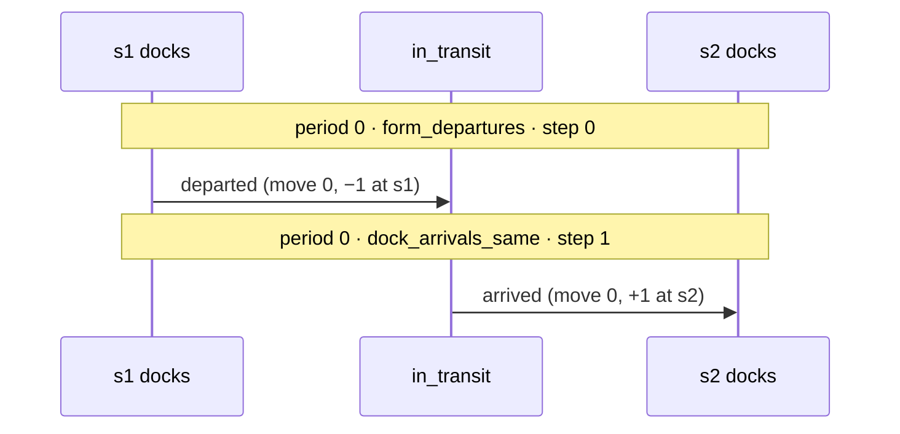

<!-- table:scenario-02 -->
| event_id | move_id | event_type | reason | source_id | planned_target_id | realized_target_id | period_id | start_period | phase_rank | phase_round | step_id |
|---|---|---|---|---|---|---|---|---|---|---|---|
| 0 | 0 | departed | NA | s1 | s2 | NA | 0 | 0 | 1 | 0 | 0 |
| 1 | 0 | arrived | NA | s1 | s2 | s2 | 0 | 0 | 2 | 0 | 1 |

Checked by `test_scenario_02_plain_trip_same_period` in
`tests/test_docs_scenarios.py`.

### Scenario 3 — plain trip, docks in a later period

The same trip, but the ride takes two periods. The only difference from
scenario 2 is the arrival row: its `period_id` (2) is now later than its
`start_period` (0), so the arrival belongs to the dock-previous phase
(`phase_rank` 0) of period 2 instead of the dock-same phase of period 0.

Setup: one trip `s1 → s2` (period 0 → 2); `s1` starts with 1 bike.

<!-- table:scenario-03 -->
| event_id | move_id | event_type | reason | source_id | planned_target_id | realized_target_id | period_id | start_period | phase_rank | phase_round | step_id |
|---|---|---|---|---|---|---|---|---|---|---|---|
| 0 | 0 | departed | NA | s1 | s2 | NA | 0 | 0 | 1 | 0 | 0 |
| 1 | 0 | arrived | NA | s1 | s2 | s2 | 2 | 0 | 0 | 0 | 1 |

Checked by `test_scenario_03_plain_trip_later_period` in
`tests/test_docs_scenarios.py`.

### Scenario 4 — redirect, all within one period

Two bikes head for `s3`, whose docks hold one. The first bike docks and fills
the station; the second bounces (`redirected`, `reason = dock_full`) and gets
a new arc (`move_id` 1) to the nearest station with a free dock, `s2`. The
pair `s3 → s2` has no historical travel time, so the new arc is instant and
the bike docks at `s2` still in period 0.

The bounce, the new arc's departure and its docking are one redirect round:
`phase_round` 1, one shared `step_id` (2). Step 1 belongs to the first bike's
docking — the round-0 batch of the same phase. The whole redirect changes
inventory exactly once: the final `arrived` (+1 at `s2`). The bounce and the
move‑1 `departed` move nothing — the bike never occupied a dock at `s3`.

Setup: trips `s1 → s3` twice (period 0 → 0) and `s2 → s1` (period 6 → 7, only
to create station `s2`); capacity of `s3` is 1; `s1` starts with 2 bikes.

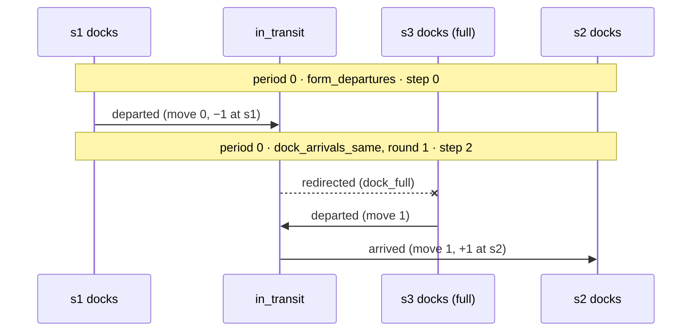

<!-- table:scenario-04 -->
| event_id | move_id | event_type | reason | source_id | planned_target_id | realized_target_id | period_id | start_period | phase_rank | phase_round | step_id |
|---|---|---|---|---|---|---|---|---|---|---|---|
| 0 | 0 | departed | NA | s1 | s3 | NA | 0 | 0 | 1 | 0 | 0 |
| 1 | 0 | redirected | dock_full | s1 | s3 | NA | 0 | 0 | 2 | 1 | 2 |
| 2 | 1 | departed | NA | s3 | s2 | NA | 0 | 0 | 2 | 1 | 2 |
| 3 | 1 | arrived | NA | s3 | s2 | s2 | 0 | 0 | 2 | 1 | 2 |

Checked by `test_scenario_04_redirect_same_period` in
`tests/test_docs_scenarios.py`.

### Scenario 5 — redirect, the new arc takes time

The same bounce as in scenario 4, but this time the OD matrix has a historical
trip where `s3 → s2` takes two periods. The bounce and the new arc's departure
are still written in period 0 (round 1, step 2); the bike then rides in
`in_transit` and docks at `s2` in period 2 — inside that period's normal
dock-previous batch (`phase_rank` 0, `phase_round` 0, step 3, shared with the
other trip docking at `s2` that period). The bike reserves nothing at `s2`
while it rides: whether it fits is decided on arrival, against period‑2
inventory. If `s2` had filled up meanwhile, the bike would bounce again
(scenario 8).

Setup: the `overflow_delayed` scenario from `tests/scenarios.py` — trips
`s1 → s3` twice (period 0 → 0) and `s3 → s2` (period 0 → 2, which provides the
two-period travel time); capacity of `s3` is 1; `s1` starts with 2 bikes,
`s3` with 1.

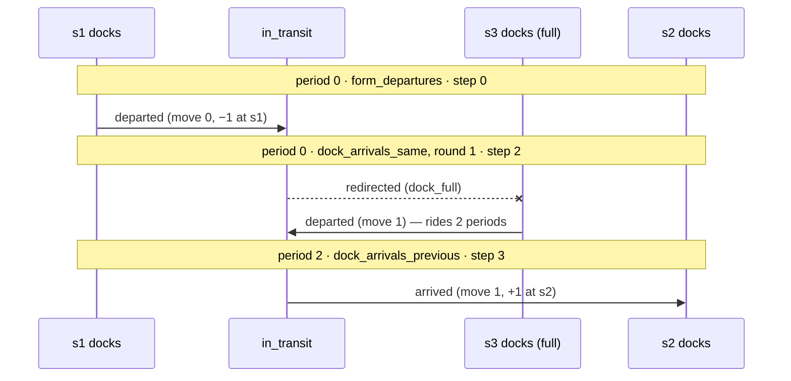

<!-- table:scenario-05 -->
| event_id | move_id | event_type | reason | source_id | planned_target_id | realized_target_id | period_id | start_period | phase_rank | phase_round | step_id |
|---|---|---|---|---|---|---|---|---|---|---|---|
| 0 | 0 | departed | NA | s1 | s3 | NA | 0 | 0 | 1 | 0 | 0 |
| 1 | 0 | redirected | dock_full | s1 | s3 | NA | 0 | 0 | 2 | 1 | 2 |
| 2 | 1 | departed | NA | s3 | s2 | NA | 0 | 0 | 2 | 1 | 2 |
| 3 | 1 | arrived | NA | s3 | s2 | s2 | 2 | 0 | 0 | 0 | 3 |

Checked by `test_scenario_05_redirect_new_arc_later` in
`tests/test_docs_scenarios.py`.

### Scenario 6 — redirect, the first arc takes time

Now the first arc is the slow one: the bike departs `s1` in period 0 and
reaches the full `s3` in period 1. The flow opened in period 0, so everything
written in period 1 belongs to the dock-previous phase (`phase_rank` 0). The
bounce and the instant new arc to `s2` are one redirect round (round 1,
step 1) inside that phase.

Setup: trips `s1 → s3` (period 0 → 1) and `s2 → s1` (period 6 → 7, only to
create station `s2`); capacity of `s3` is 0; `s1` starts with 1 bike.

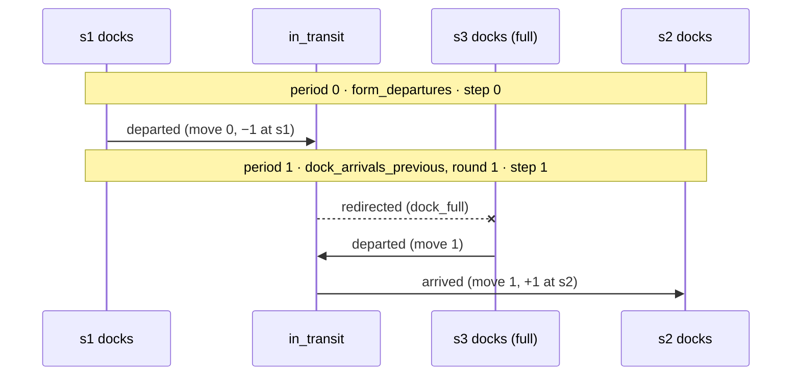

<!-- table:scenario-06 -->
| event_id | move_id | event_type | reason | source_id | planned_target_id | realized_target_id | period_id | start_period | phase_rank | phase_round | step_id |
|---|---|---|---|---|---|---|---|---|---|---|---|
| 0 | 0 | departed | NA | s1 | s3 | NA | 0 | 0 | 1 | 0 | 0 |
| 1 | 0 | redirected | dock_full | s1 | s3 | NA | 1 | 0 | 0 | 1 | 1 |
| 2 | 1 | departed | NA | s3 | s2 | NA | 1 | 0 | 0 | 1 | 1 |
| 3 | 1 | arrived | NA | s3 | s2 | s2 | 1 | 0 | 0 | 1 | 1 |

Checked by `test_scenario_06_redirect_first_arc_later` in
`tests/test_docs_scenarios.py`.

### Scenario 7 — redirect, both arcs take time

The most general single redirect. The bike departs `s1` in period 0, reaches
the full `s4` in period 1 and bounces there; the new arc to `s3` takes two
more periods (the historical `s4 → s3` trip provides that time), so the bike
docks at `s3` in period 3, with that period's dock-previous batch.

Note the `step_id` gap: the flow's steps are 0, 1, 1, 3. Step 2 is not
missing — it is the other trip (`s4 → s3`) docking at `s3` in period 2. This
is what run-global numbering looks like inside one flow.

Setup: trips `s1 → s4` (period 0 → 1) and `s4 → s3` (period 0 → 2, which
provides the two-period travel time); capacity of `s4` is 0; `s1` and `s4`
start with 1 bike each.

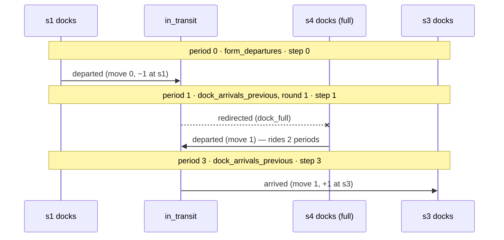

<!-- table:scenario-07 -->
| event_id | move_id | event_type | reason | source_id | planned_target_id | realized_target_id | period_id | start_period | phase_rank | phase_round | step_id |
|---|---|---|---|---|---|---|---|---|---|---|---|
| 0 | 0 | departed | NA | s1 | s4 | NA | 0 | 0 | 1 | 0 | 0 |
| 1 | 0 | redirected | dock_full | s1 | s4 | NA | 1 | 0 | 0 | 1 | 1 |
| 2 | 1 | departed | NA | s4 | s3 | NA | 1 | 0 | 0 | 1 | 1 |
| 3 | 1 | arrived | NA | s4 | s3 | s3 | 3 | 0 | 0 | 0 | 3 |

Checked by `test_scenario_07_redirect_both_arcs_later` in
`tests/test_docs_scenarios.py`.

### Scenario 8 — redirect chain: the bike bounces a second time

Scenario 7 with one change: while the bike rides its new arc toward `s3`, the
other trip docks there first and fills the single dock. When this bike arrives
in period 3, it bounces again and gets a third arc (`move_id` 2) to `s1` —
the only station left with a free dock — where it docks instantly.

This is the general event sequence of a flow: `departed`, then zero or more
(`redirected`, `departed`) pairs, then exactly one terminal `arrived` (or
`lost`). Arc `m` opens at event `2m` and closes at event `2m + 1`. However
many times it bounces, the flow still changes inventory exactly twice: −1 at
the source, +1 where it finally docks.

Setup: the `redirect_chain` scenario from `tests/scenarios.py` — trips
`s1 → s4` (period 0 → 1) and `s4 → s3` (period 0 → 2); capacity of `s4` is 0
and of `s3` is 1; `s1` and `s4` start with 1 bike each.

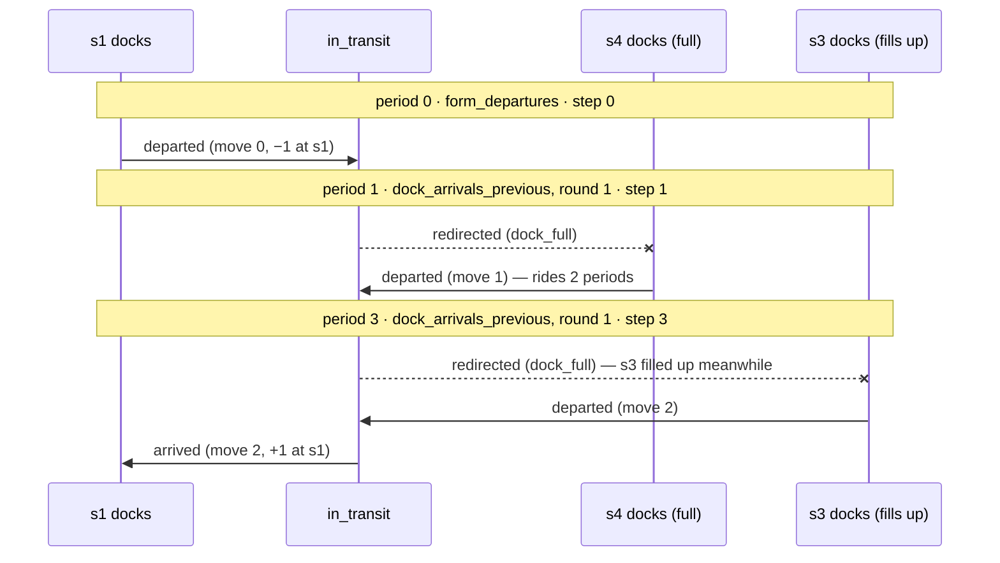

<!-- table:scenario-08 -->
| event_id | move_id | event_type | reason | source_id | planned_target_id | realized_target_id | period_id | start_period | phase_rank | phase_round | step_id |
|---|---|---|---|---|---|---|---|---|---|---|---|
| 0 | 0 | departed | NA | s1 | s4 | NA | 0 | 0 | 1 | 0 | 0 |
| 1 | 0 | redirected | dock_full | s1 | s4 | NA | 1 | 0 | 0 | 1 | 1 |
| 2 | 1 | departed | NA | s4 | s3 | NA | 1 | 0 | 0 | 1 | 1 |
| 3 | 1 | redirected | dock_full | s4 | s3 | NA | 3 | 0 | 0 | 1 | 3 |
| 4 | 2 | departed | NA | s3 | s1 | NA | 3 | 0 | 0 | 1 | 3 |
| 5 | 2 | arrived | NA | s3 | s1 | s1 | 3 | 0 | 0 | 1 | 3 |

Checked by `test_scenario_08_redirect_chain` in
`tests/test_docs_scenarios.py`.

### Scenario 9 — network full: the bike is lost to dock_full

Every dock in the network is full, so an arriving bike cannot dock. There is
no station to redirect to, so the flow closes with `lost`,
`reason = dock_full`. Unlike a stockout loss, this flow did depart: it keeps
its `flow_id` and its `start_period`, and its loss is counted at the
`planned_target_id` it could not enter. The bike leaves the system: the run
ends with one bike fewer docked than it started.

Setup: the `network_full` scenario from `tests/scenarios.py` — three trips
`s1 → s2` (period 0 → 1); both capacities are 0; `s1` starts with 50 bikes
(initial inventory may exceed capacity; only docking new bikes is limited).
The table shows one of the three identical flows.

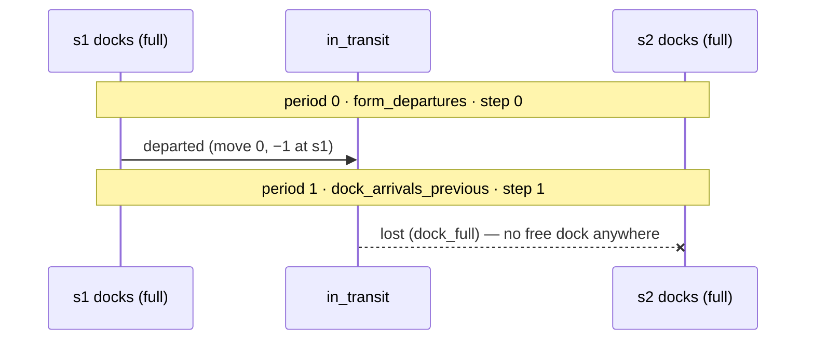

<!-- table:scenario-09 -->
| event_id | move_id | event_type | reason | source_id | planned_target_id | realized_target_id | period_id | start_period | phase_rank | phase_round | step_id |
|---|---|---|---|---|---|---|---|---|---|---|---|
| 0 | 0 | departed | NA | s1 | s2 | NA | 0 | 0 | 1 | 0 | 0 |
| 1 | 0 | lost | dock_full | s1 | s2 | NA | 1 | 0 | 0 | 0 | 1 |

Checked by `test_scenario_09_network_full` in
`tests/test_docs_scenarios.py`.

---

## Rebalancing scenarios

Rebalancing moves bikes by truck at night so bikes are available for morning
demand (Notations.md §14). `PlanRebalancingPhase` fires once per simulated
day, in the period whose start hour is the window start (default 01:00 —
period 1 here), and stores a bike-level plan; it writes no events.
`ApplyRebalancingPhase` runs every period at `phase_rank` 3, in three rounds:
dock dropoffs due from earlier periods (round 0), execute this period's
pickups (round 1), dock same-period dropoffs (round 2). A pickup is a
`departed` (−1), a dropoff an `arrived` (+1); between them the bike sits in
`in_transit` like any riding bike. Rebalance flows are not demand: every
demand read-model filters them out by `flow_type`.

All four scenarios below share one case: three morning trips want to leave
`s2` at 06:00 (period 6), but `s2` starts empty while `s1` holds 5 bikes
nobody asks for. The scripted route picks 3 bikes at `s1` and drops them at
`s2`; only the stop minutes (and one capacity) differ. Without the truck, all
three morning trips would be stockout losses. That case is checked by
`tests/test_rebalancing.py::test_without_rebalancing_the_same_story_loses_the_morning_demand`.

### Scenario 10 — truck route inside one period

Pickup at minute 10 and dropoff at minute 50 both fall inside the window
period (period 1). The pickups are round 1 (step 0), the same-period dropoffs
round 2 (step 1). At 06:00 the three bikes depart `s2` as normal user trips —
the morning demand is served.

Setup: trips `s2 → s1` three times (period 6 → 7); `s1` starts with 5 bikes;
scripted stops: pick 3 at `s1` (minute 10), drop 3 at `s2` (minute 50).

<!-- table:scenario-10 -->
| flow_id | event_id | event_type | source_id | planned_target_id | realized_target_id | period_id | start_period | phase_rank | phase_round | step_id |
|---|---|---|---|---|---|---|---|---|---|---|
| rb_1_0 | 0 | departed | s1 | s2 | NA | 1 | 1 | 3 | 1 | 0 |
| rb_1_1 | 0 | departed | s1 | s2 | NA | 1 | 1 | 3 | 1 | 0 |
| rb_1_2 | 0 | departed | s1 | s2 | NA | 1 | 1 | 3 | 1 | 0 |
| rb_1_0 | 1 | arrived | s1 | s2 | s2 | 1 | 1 | 3 | 2 | 1 |
| rb_1_1 | 1 | arrived | s1 | s2 | s2 | 1 | 1 | 3 | 2 | 1 |
| rb_1_2 | 1 | arrived | s1 | s2 | s2 | 1 | 1 | 3 | 2 | 1 |

Checked by `test_scenario_10_truck_route_inside_one_period` in
`tests/test_docs_scenarios.py`.

### Scenario 11 — truck route across periods

The same route, but the dropoff is at minute 70: after the one-hour period
ends, so it lands in period 2. The truck does not return to the depot when the
period ends; the bikes stay in `in_transit` overnight. In period 2 the
dropoffs are due from an earlier period, so they dock in round 0 (step 1).

Setup: as scenario 10, but the dropoff is at minute 70.

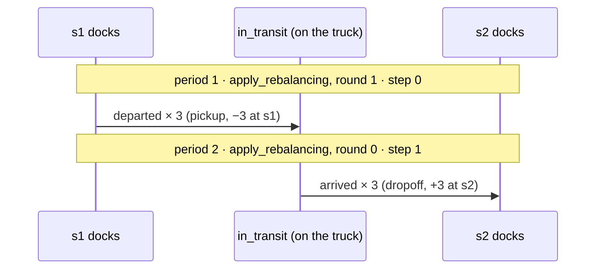

<!-- table:scenario-11 -->
| flow_id | event_id | event_type | source_id | planned_target_id | realized_target_id | period_id | start_period | phase_rank | phase_round | step_id |
|---|---|---|---|---|---|---|---|---|---|---|
| rb_1_0 | 0 | departed | s1 | s2 | NA | 1 | 1 | 3 | 1 | 0 |
| rb_1_1 | 0 | departed | s1 | s2 | NA | 1 | 1 | 3 | 1 | 0 |
| rb_1_2 | 0 | departed | s1 | s2 | NA | 1 | 1 | 3 | 1 | 0 |
| rb_1_0 | 1 | arrived | s1 | s2 | s2 | 2 | 1 | 3 | 0 | 1 |
| rb_1_1 | 1 | arrived | s1 | s2 | s2 | 2 | 1 | 3 | 0 | 1 |
| rb_1_2 | 1 | arrived | s1 | s2 | s2 | 2 | 1 | 3 | 0 | 1 |

Checked by `test_scenario_11_truck_route_across_periods` in
`tests/test_docs_scenarios.py`.

### Scenario 12 — dropoff overflow docks at the home depot

The truck brings 3 bikes to `s2`, whose docks hold two. Two bikes dock at
`s2`; the third cannot be unloaded and rides back to the truck's home depot —
its `realized_target_id` becomes `depot_1` while its `planned_target_id`
stays `s2`, so the plan-versus-reality difference is visible in the journal.
The depot's own capacity is never checked: it is where the truck can always
drop bikes when a station is full.

The consequence shows up at 06:00: `s2` holds only 2 bikes against a demand
of 3, so one morning trip is lost to a stockout.

Setup: as scenario 11, but the capacity of `s2` is 2.

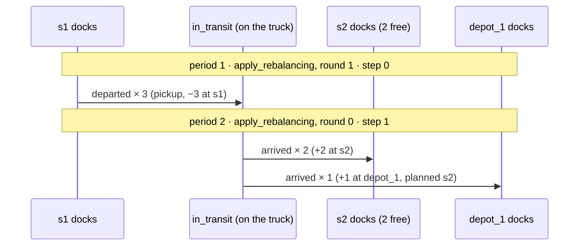

<!-- table:scenario-12 -->
| flow_id | event_id | event_type | source_id | planned_target_id | realized_target_id | period_id | start_period | phase_rank | phase_round | step_id |
|---|---|---|---|---|---|---|---|---|---|---|
| rb_1_0 | 0 | departed | s1 | s2 | NA | 1 | 1 | 3 | 1 | 0 |
| rb_1_1 | 0 | departed | s1 | s2 | NA | 1 | 1 | 3 | 1 | 0 |
| rb_1_2 | 0 | departed | s1 | s2 | NA | 1 | 1 | 3 | 1 | 0 |
| rb_1_0 | 1 | arrived | s1 | s2 | s2 | 2 | 1 | 3 | 0 | 1 |
| rb_1_1 | 1 | arrived | s1 | s2 | s2 | 2 | 1 | 3 | 0 | 1 |
| rb_1_2 | 1 | arrived | s1 | s2 | depot_1 | 2 | 1 | 3 | 0 | 1 |

Checked by `test_scenario_12_dropoff_overflow_docks_at_the_depot` in
`tests/test_docs_scenarios.py`.

### Scenario 13 — pickup cut to the bikes on hand

The plan is built at 01:00 from the inventory of that moment (5 bikes at
`s1`), but execution checks inventory again before pickup. Here the truck
reaches `s1` at
minute 70 — in period 2 — and by then three night riders have left `s1`
(their departures run at `phase_rank` 1, before the truck's `phase_rank` 3).
Only 2 bikes remain, so the pickup executes for 2; the third plan row is
removed together with its dropoff. The journal shows two rebalance flows, not
three.

Setup: trips `s1 → s2` three times (period 2 → 3, the night riders) and
`s2 → s1` three times (period 6 → 7); `s1` starts with 5 bikes; scripted
stops: pick 3 at `s1` (minute 70), drop 3 at `s2` (minute 110).

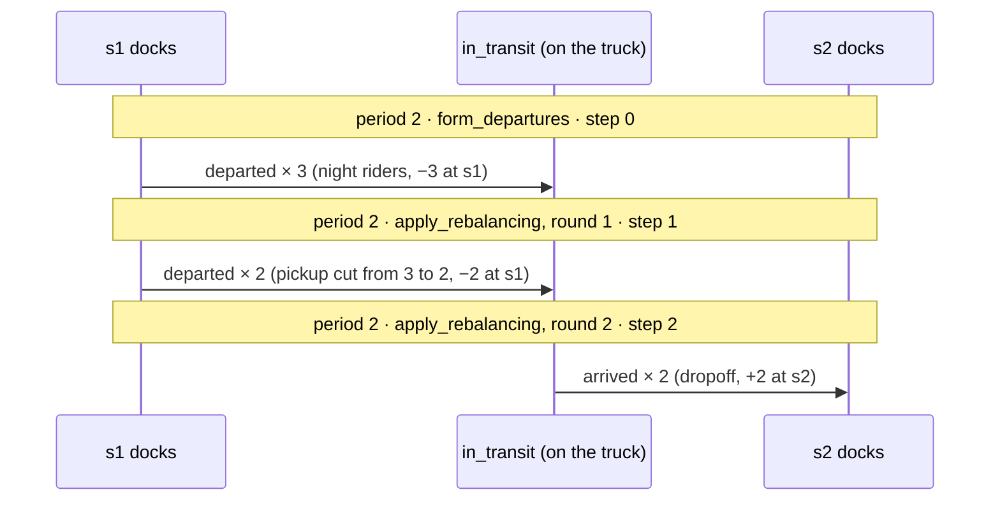

<!-- table:scenario-13 -->
| flow_id | event_id | event_type | source_id | planned_target_id | realized_target_id | period_id | start_period | phase_rank | phase_round | step_id |
|---|---|---|---|---|---|---|---|---|---|---|
| rb_1_0 | 0 | departed | s1 | s2 | NA | 2 | 2 | 3 | 1 | 1 |
| rb_1_1 | 0 | departed | s1 | s2 | NA | 2 | 2 | 3 | 1 | 1 |
| rb_1_0 | 1 | arrived | s1 | s2 | s2 | 2 | 2 | 3 | 2 | 2 |
| rb_1_1 | 1 | arrived | s1 | s2 | s2 | 2 | 2 | 3 | 2 | 2 |

Checked by `test_scenario_13_pickup_cut_to_the_bikes_on_hand` in
`tests/test_docs_scenarios.py`.

### Scenario 14 — nothing to move: no plan, no events

When no station is short of bikes (or none has bikes to give), the planner
stores an empty plan and never calls the routing solver. The journal contains
no rebalance rows at all — only the user trips. There is no table for this
scenario; the test asserts the absence directly, and injects a solver that
fails the test if it is ever called.

Setup: one trip `s1 → s2` (period 6 → 7); `s1` and `s2` start with 5 bikes
each, so every target is already met.

Checked by `test_scenario_14_nothing_to_move` in
`tests/test_docs_scenarios.py`.

---

## The checks every scenario passes

Besides its own table, every scenario above is run through the same three
checks in `tests/test_docs_scenarios.py`:

- `test_journal_is_well_formed_and_run_invariants_hold` — the journal has the
  right schema and legal event sequences (`tests/invariants.py`), and the run
  invariants I1–I5 hold (`validate_run`).
- `test_steps_apply_in_label_order` — all rows of one `step_id` carry one
  `(period_id, phase_rank, phase_round)` label, and steps sorted by `step_id`
  are also sorted by that label: within a period, dock-previous (0) comes
  before departures (1), departures before dock-same (2), and rebalancing (3)
  last; within a phase, the rounds come in order.
- `test_each_docked_flow_departs_once_and_docks_once` — every flow that ends
  in `arrived` has exactly one −1 (its opening `departed`) and exactly one +1
  (its terminal `arrived`), and the −1 step comes before the +1 step. However
  long the redirect chain, no bike is created or duplicated.

To watch any of these journals step by step, `inventory_at_moments`
(`gbp/model/flows.py`) shows each station's inventory just before and just
after every `step_id` (Notations.md §0.1).
