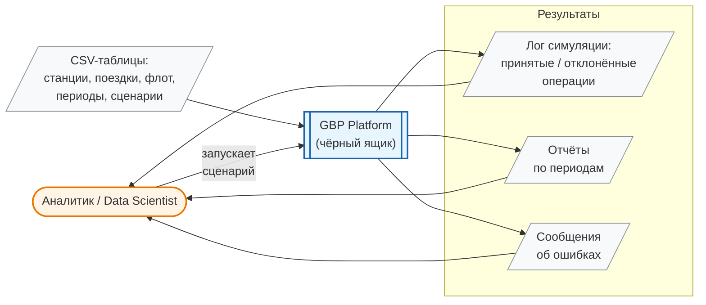
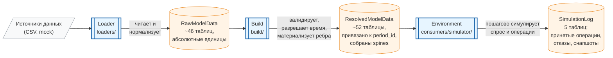
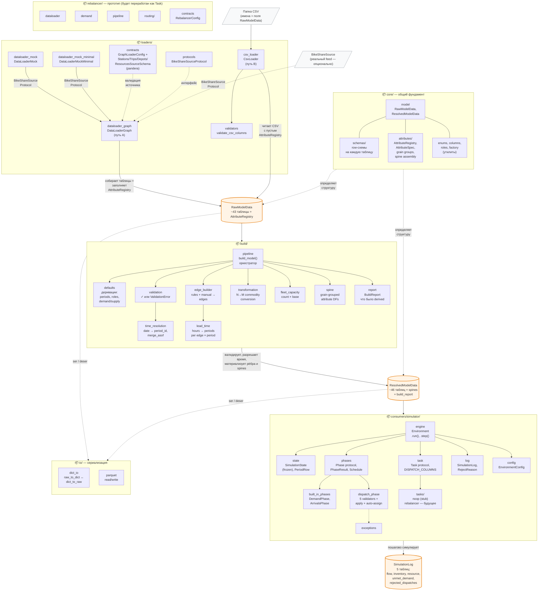
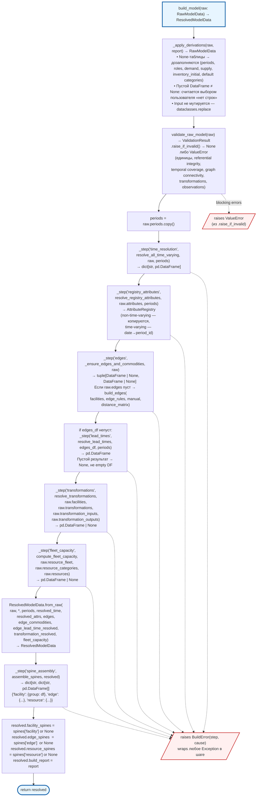

# Диаграммы уровней понимания (на примере GBP)

Этот файл — визуальное сопровождение к [уровни_понимания_кода.md](уровни_понимания_кода.md). Каждая диаграмма показывает **то, и только то**, что видит человек на соответствующем уровне понимания. Это не полная правда о системе — это её проекция, доступная наблюдателю с данной глубиной.

**Уровень 5 (пошаговая реализация) не диаграммируется** — это чтение кода, а не картинка.

**Уровень 4b (теория модуля — «почему так») тоже пропущен**: дизайн-решения, альтернативы и load-bearing-инварианты по своей природе текстовые (ADR, design doc). Mermaid здесь даст либо бедную картинку, либо плохо читаемый mindmap. Правильный инструмент для 4b — это [docs/design/](../design/) и ADR-карточки, а не диаграмма.

---

## Уровень 1. Пользователь интерфейса

На этом уровне человек видит систему как чёрный ящик: какие данные он подаёт на вход, какую кнопку нажимает, что получает на выходе. Никакой внутренней структуры — только поверхность взаимодействия.



**Что явно отсутствует на этом уровне:** как устроен пайплайн, из чего состоит модель, что такое Environment, чем отличается RawModelData от ResolvedModelData. Всё это — внутренности чёрного ящика, их пользователю знать не нужно.

---

## Уровень 2. Верхнеуровневые модули и их крупноблочные контракты

Чёрный ящик раскрывается на три больших блока — ровно как в примере из основного документа («загрузчик → оптимизатор → отчётный слой»). Контракты между блоками сформулированы в терминах домена: «что в общих чертах отдаёт один блок другому», без деталей полей и сигнатур.



**Крупноблочные контракты (как их видят на уровне 2):**

| Блок | На входе | На выходе |
|------|----------|-----------|
| **Loader** | сырые CSV-источники | `RawModelData` — набор таблиц в общем формате, единицы измерения абсолютные (часы, даты) |
| **Build** | `RawModelData` | `ResolvedModelData` — таблицы с привязкой ко времени (`period_id`), материализованными рёбрами, собранными spines |
| **Environment** | `ResolvedModelData` + сценарий | `SimulationLog` — результат пошаговой симуляции (принятые операции, отказы, снапшоты инвентаря) |

**Что на этом уровне уже видно:**
- что в системе есть разделение «сырые данные → валидированная модель → потребитель»;
- что `ResolvedModelData` — **единственная точка контакта** между Build и любым потребителем (это несущее архитектурное решение, оно видно уже на L2).

**Что ещё НЕ видно на этом уровне:**
- какие конкретно таблицы лежат внутри `RawModelData`/`ResolvedModelData`, какие у них колонки и типы;
- из каких шагов состоит Build (time resolution, edge builder, spine assembly и т.д.);
- как внутри Environment устроены фазы, задачи и состояние;
- что существует ещё модуль `core/` (определяет схемы и регистр атрибутов) и `io/` (сериализация) — они не в потоке данных, а инфраструктурные, и на L2 их обычно не показывают.

**Про rebalancer.** Каталог [gbp/rebalancer/](../../gbp/rebalancer/) на данный момент — ранний прототип PDP-решателя на OR-Tools, который будет переработан как **Task внутри Environment** (первая реальная Task). На диаграмме L2 его отдельным блоком **сознательно нет** — он не является независимым верхнеуровневым модулем в целевой архитектуре.

---

## Уровень 3. Все модули системы и их крупноблочные контракты

То же, что и L2, но «вглубь»: раскрываем каждый верхнеуровневый модуль до его внутренних подмодулей и показываем, как они соединены. Контракты остаются крупноблочными — «что вход, что выход», без точных сигнатур.

**Важно про загрузчики.** В системе **два параллельных пути** до `RawModelData`, а не один:
- **Путь A (bike-share domain):** объект, реализующий `BikeShareSourceProtocol` (мок или в будущем реальный источник), передаётся в `DataLoaderGraph`. Тот валидирует источник pandera-схемами из `contracts` и ассемблирует `RawModelData`, попутно **заполняя `AttributeRegistry`** (capacity, cost-атрибуты).
- **Путь B (generic CSV):** папка CSV-файлов, чьи имена совпадают с полями `RawModelData`, читается `CsvLoader` через `fields(RawModelData)`. Колонки валидируются `validators.validate_csv_columns` против row-схем из `core.schemas/`. `AttributeRegistry` в этом пути остаётся пустым.



**Крупноблочные контракты внутри подсистем (как их видит L3):**

| Подмодуль | Вход | Выход |
|-----------|------|-------|
| **loaders**.`dataloader_mock` / `dataloader_mock_minimal` | конфиг (`n_stations`, `seed`, ...) | объект-источник, реализующий `BikeShareSourceProtocol` (`df_stations`, `df_trips`, ...) |
| **loaders**.`dataloader_graph` (путь A) | `BikeShareSourceProtocol` + `GraphLoaderConfig` | `RawModelData` с **заполненным** `AttributeRegistry` (capacity, cost) |
| **loaders**.`contracts` (pandera-схемы) | DataFrame-источника (`df_stations` и т.д.) | ✓ или ошибка валидации источника |
| **loaders**.`csv_loader` (путь B) | папка с CSV, имена файлов = поля `RawModelData` | `RawModelData` с **пустым** `AttributeRegistry` |
| **loaders**.`validators` | CSV + имя таблицы (+ row-схема из `core.schemas`) | список ошибок по колонкам |
| **build**.`defaults` | `RawModelData` | тот же Raw с дозаполненными выводимыми таблицами |
| **build**.`validation` | `RawModelData` | ✓ или `ValidationError` (единицы, ссылки, связность графа) |
| **build**.`time_resolution` | Raw + `periods` | таблицы, привязанные к `period_id` (вместо дат) |
| **build**.`edge_builder` | facilities + rules + manual | материализованная таблица рёбер |
| **build**.`lead_time` | рёбра + periods | `lead_time_periods` на каждое ребро × период |
| **build**.`transformation` | transformations + inputs/outputs | resolved transformation table |
| **build**.`fleet_capacity` | resource_fleet + categories | `fleet_capacity` per facility × category |
| **build**.`spine` | `ResolvedModelData` | dict spines: facility / edge / resource, сгруппированные по grain |
| **build**.`pipeline` (оркестратор) | `RawModelData` | `ResolvedModelData` (+ `BuildReport` о деривациях) |
| **simulator**.`state` | — | `SimulationState` (frozen), мутируется только через `replace` |
| **simulator**.`phases` + `built_in_phases` | `SimulationState` + период | `PhaseResult` (flows, unmet_demand) |
| **simulator**.`dispatch_phase` | state + dispatch-таблица от Task | `PhaseResult` или отказы (`RejectReason`) |
| **simulator**.`task` + `tasks/` | state + контекст периода | dispatch-таблица (что отправить куда) |
| **simulator**.`engine.Environment` | `ResolvedModelData` + `EnvironmentConfig` + Schedule | накопленный `SimulationLog` |
| **core**.`model` | — | определения `RawModelData` / `ResolvedModelData` + `_SCHEMAS` map (используется CsvLoader и validators) |
| **core**.`schemas/` | строка таблицы | Pydantic-валидированная модель строки (row-schema на каждую таблицу `RawModelData`) |
| **core**.`attributes/` | `AttributeRegistry` + grain-тэги | определения `AttributeRegistry` и `AttributeSpec` (заполняется `dataloader_graph`, читается `build.spine`, сериализуется `io`) |
| **io**.`dict_io` | `RawModelData` | dict (и обратно) |
| **io**.`parquet` | таблицы / dict | файлы parquet (и обратно) |

**Что на этом уровне уже видно:**
- полная карта модулей — можно сказать **где** в системе лежит та или иная ответственность;
- в системе **два параллельных пути** наполнения `RawModelData` (A — bike-share через `DataLoaderGraph`, B — готовые CSV через `CsvLoader`); в пути A в `RawModelData` попадает также заполненный `AttributeRegistry`;
- `build.pipeline` — центральный оркестратор, все остальные `build/*` — чистые функции-шаги;
- `Environment` построен на **протоколах** `Phase` и `Task`, а не на жёсткой иерархии — это open-ended точка расширения (сюда встанет настоящий Rebalancer как Task);
- `core/` — общий фундамент, но он не в потоке данных, а лежит «снизу»; при этом `AttributeRegistry` (из `core.attributes`) — не чисто пассивная структура: её заполняют снаружи (`dataloader_graph`) и потом читают на этапе `build.spine`;
- `rebalancer/` внутри себя имеет свой pipeline/dataloader — это **отдельная параллельная реализация**, которая будет демонтирована, когда появится `SimulatorTask` для ребалансировки.

**Что ещё НЕ видно на этом уровне:**
- точные сигнатуры функций, типы параметров, исключения, инварианты — это уже L4a;
- почему именно такое разделение на `time_resolution` / `edge_builder` / `spine` выбрано, какие альтернативы отвергнуты — это L4b;
- как именно внутри `assemble_spines` группируются атрибуты по grain, почему такой порядок — это L5.

---

## Уровень 4a. Точные контракты внутри модуля — на примере `gbp/build/pipeline.py`

L4a применяется к **одному конкретному модулю**. Для всех модулей сразу — overkill: их точные контракты лучше держать в коде и docstring'ах. Здесь мы берём [gbp/build/pipeline.py](../../gbp/build/pipeline.py) как репрезентативный пример: оркестратор, в котором видны и последовательность шагов, и точные типы на каждом переходе, и исключения.

### Публичная поверхность модуля

```python
def build_model(raw: RawModelData) -> ResolvedModelData: ...

class BuildError(Exception):
    step: str         # имя шага, на котором упало
    cause: Exception  # исходное исключение
    def __init__(self, step: str, cause: Exception) -> None: ...
```

Всё остальное в модуле (`_apply_derivations`, `_ensure_edges_and_commodities`, `_prepare_distance_matrix`, внутренний `_step`) — приватное, не должно вызываться извне.

### Runtime-поток с точными сигнатурами



### Инварианты и граничные случаи

| Что | Инвариант / Условие |
|-----|---------------------|
| **Immutability входа** | `build_model` не мутирует переданный `raw`. Деривации создают новый `RawModelData` через `dataclasses.replace(raw, **updates)` |
| **«Manual wins»** | Если пользователь передал таблицу (даже пустую) — деривация НЕ срабатывает. Только `None` → попытка дозаполнить |
| **Пустая ≠ отсутствующая** | Явно пустой `DataFrame` = пользовательский выбор «нет строк». `None` = «не задано, домыслить». Это load-bearing различие, закреплено в docstring `_apply_derivations` |
| **Порядок validate → resolve** | Валидация **до** резолюции времени. Любая structural error → `ValueError` без попытки построить модель |
| **Обёртка `_step`** | Всё, что после validate, обёрнуто в `_step(name, fn, ...)`. Любое `Exception` внутри → `raise BuildError(name, exc) from exc`. Исходный traceback сохраняется через `from exc` |
| **Шаги с именами** | `"time_resolution"`, `"registry_attributes"`, `"edges"`, `"lead_times"`, `"transformations"`, `"fleet_capacity"`, `"spine_assembly"` — ровно эти 7 имён могут оказаться в `BuildError.step` |
| **`lead_times` пропускается** | если `edges_df` пуст/None. Результирующее поле `edge_lead_time_resolved` в этом случае = `None`, не empty DataFrame |
| **`fleet_capacity`** | возвращает `None` если `resource_fleet` пуст или в `resource_categories` нет `base_capacity` |
| **`transformations`** | возвращает `None` если любая из трёх таблиц (`transformations`/`inputs`/`outputs`) = `None` или `transformations` пустая |
| **Spines — write-after-construct** | `assemble_spines` выполняется **после** `ResolvedModelData.from_raw`, и три поля spines (`facility/edge/resource_spines`) записываются в уже собранный объект. Это единственный случай мутации `ResolvedModelData` внутри pipeline |
| **`build_report`** | всегда присоединяется к результату, даже если `derivations` пусто. Пользователь может проверить `.is_empty()` |

### Приватные помощники — точные контракты

```python
def _apply_derivations(raw: RawModelData, report: BuildReport) -> RawModelData:
    """Fills in derivable tables on a copy of raw. Returns same raw if no updates."""

def _ensure_edges_and_commodities(
    raw: RawModelData,
) -> tuple[pd.DataFrame | None, pd.DataFrame | None]:
    """If raw.edges non-empty → passthrough.
    Else → build_edges(facilities, edge_rules, manual, distance_matrix).
    Returns (edges, edge_commodities)."""

def _prepare_distance_matrix(raw_dm: pd.DataFrame | None) -> pd.DataFrame | None:
    """Rename 'duration' → 'lead_time_hours' for build_edges compat.
    Returns None if input None or empty."""
```

### Что на этом уровне уже видно (чего не было на L3)

- **точные типы на каждом переходе**: откуда берётся `dict[str, pd.DataFrame]`, откуда `AttributeRegistry`, где `tuple | None`;
- **семь имён шагов**, с которыми можно поймать `BuildError` и программно среагировать на падение конкретного шага;
- **где именно происходит валидация** и почему она раньше всего остального;
- **где мутируется `ResolvedModelData`** (только spine-поля и build_report после конструктора);
- **разница None vs empty DataFrame** как закреплённый инвариант «manual wins».

### Что по-прежнему не видно (L4b и L5)

- **почему** шаги разделены именно так (почему `time_resolution` и `lead_time` — отдельные, а не один шаг; почему `edges` построены **до** `lead_times`, а не наоборот) — это L4b;
- **как именно** внутри `resolve_all_time_varying` делается `merge_asof`, что происходит при пропусках, какая аггрегация выбрана — это L5.
