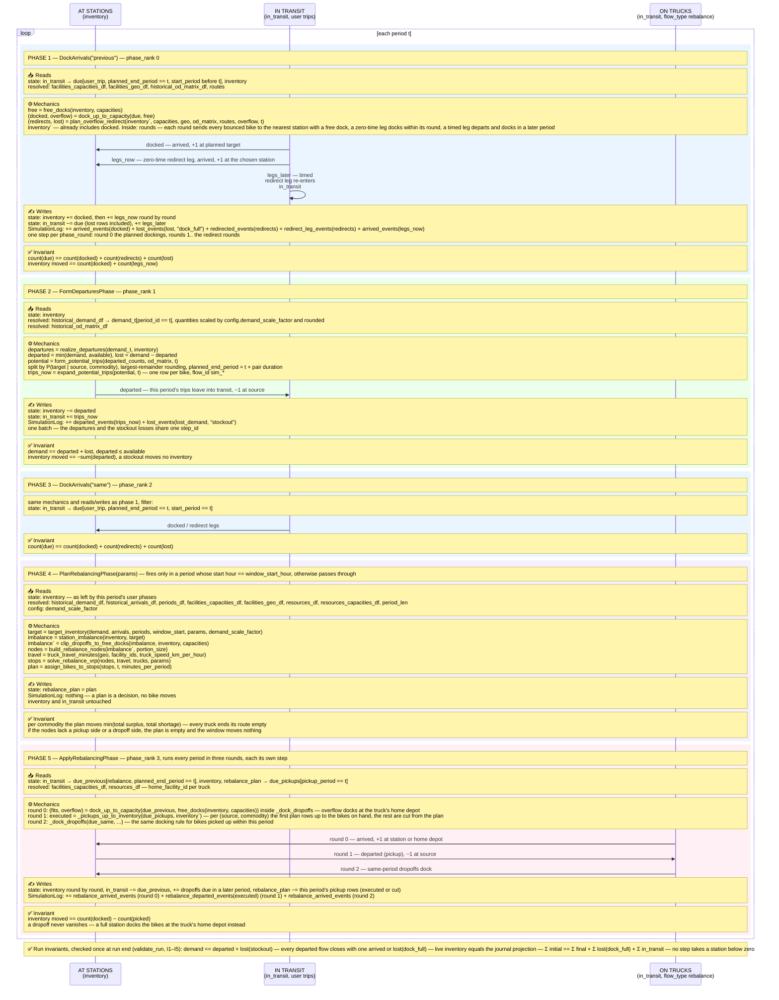

# The simulator

How a run works, from the inside: what a period is, what state the simulator
carries, which phases run in what order, which rules they apply, and which
invariants hold afterwards. The vocabulary comes from
[`Notations.md`](../Notations.md); each term links to its section on first use.
Worked examples of the journal each situation produces live in
[`scenarios.md`](scenarios.md) — this document does not repeat them.

The code lives in `gbp/consumers/simulator/`:

| File | What it holds |
|---|---|
| `engine.py` | `Environment` — steps the run period by period. |
| `state.py` | `SimulationState` — the live facts of the run, plus the inventory arithmetic. |
| `phases.py` | The three user-trip phases. |
| `mechanics.py` | The rules the phases apply: docking, redirect, demand realization. |
| `rebalancing.py` | The two truck phases: planning and execution ([Notations.md §14](../Notations.md#14-rebalancing-moving-bikes-by-truck)). |
| `scenario.py` | `canonical_phases()` and `run_sized_scenario` — how a run is launched. |
| `sizing.py` | `size_state_for_demand` — measures the initial inventory and capacities a demand needs. |
| `validation.py` | The run-level invariants I1–I5. |
| `config.py` | `EnvironmentConfig` — the settings of one run. |

Dependency direction, lowest layer first:
`journal <- state <- mechanics <- phases <- engine`. A lower layer never
imports a higher one.

## Period and step: the two time axes

A **period** ([Notations.md §6](../Notations.md#6-time)) is one step of the
simulation clock. The period grid (`periods_df`) maps each `period_id` to its
wall-clock bounds; one period is `period_len` long (default one hour), and
period 0 starts at `t0`.

A **step** ([Notations.md §0.1](../Notations.md#01-moment-and-step-the-inventory-time-axis))
is time *below* the period. Inventory changes in discrete batches of `+1`/`−1`
applied together — a dock batch, a period's departures, one redirect round.
One such batch is one step; between two steps inventory is constant. `step_id`
is the step's run-global ordinal: it orders periods, the phases inside a
period, and the rounds inside a phase.

Every journal row carries three ordering columns, stamped when the row is
written: `phase_rank` (which phase of the period — 0 dock-previous, 1 the
period's own departures, 2 dock-same, 3 rebalancing), `phase_round` (which
round inside a phase that applies several batches in a row), and `step_id`
(the global order). `phase_rank` and `phase_round` are labels; `step_id` is
the number that actually orders the steps.

## State: what the simulator carries between phases (`state.py`)

```python
@dataclasses.dataclass(frozen=True)
class SimulationState:
    state_period_id_obj: PeriodRow
    state_inventory_df: pd.DataFrame
    state_flows_df: pd.DataFrame
    state_resources_df: pd.DataFrame
    in_transit: pd.DataFrame = dataclasses.field(default_factory=empty_in_transit)
    next_step_id: int = 0
    rebalance_plan: pd.DataFrame = dataclasses.field(default_factory=pd.DataFrame)
```

`SimulationState` is frozen: a phase never modifies it in place, it returns a
replaced copy. The fields:

| Field | What it is |
|---|---|
| `state_period_id_obj` | The clock position: the current period's id and wall-clock bounds (`PeriodRow`). |
| `state_flows_df` | The flow journal ([Notations.md §3.1](../Notations.md#31-the-flow-event-table-and-its-names)): the append-only table of flow events, the single source of truth for what happened. |
| `state_inventory_df` | The [inventory](../Notations.md#2-core-state): bikes currently docked, per `(facility_id, commodity_category)`. A value computed from the journal, kept incrementally for speed. |
| `in_transit` | Bikes that departed but have not yet docked ([Notations.md §2](../Notations.md#2-core-state)). Also kept incrementally. |
| `state_resources_df` | Resource (truck) observations; empty in the historical replay ([Notations.md §5b](../Notations.md#5b-resource-the-carrier)). |
| `next_step_id` | The step counter: the next `step_id` to hand out. |
| `rebalance_plan` | The bike-level rebalance plan still to execute ([Notations.md §14](../Notations.md#14-rebalancing-moving-bikes-by-truck)); empty outside a rebalancing window. |

The journal is the truth; `state_inventory_df` and `in_transit` are values
computed from it, carried along so each phase does not recompute them from
scratch. Invariant I3 (below) checks at run end that the carried inventory
still equals the inventory recomputed from the journal.

The [marginals](../Notations.md#9-marginals-the-read-models-of-the-journal)
are exposed as read-only properties computed on demand from the live journal:
`state_departures_df`, `state_arrivals_df`, `state_demand_df`,
`state_supply_df`, `state_od_matrix_df` (the `state_` prefix —
[Notations.md §10](../Notations.md#10-the-prefix-system-one-concept-three-views)).

### The one write path

Every phase writes its events through a single method:

```python
def apply_step_events(self, new_flows: pd.DataFrame, phase_rank: int) -> "SimulationState":
    flows["phase_rank"] = phase_rank
    ...
    for round_no in sorted(flows["phase_round"].unique()):
        step_by_round[round_no], working = working.open_step()
    flows["step_id"] = flows["phase_round"].map(step_by_round)
    return working.append_flows(flows)
```

The phase hands over the events it built this period and its rank. Behind
this method the state stamps `phase_rank` on every row, fills `phase_round`
with 0 where a builder did not set it, opens one step per distinct round
(`open_step` — the next number from the run-global counter), stamps that
number as the rows' `step_id`, and appends the rows to the journal. Because
the number comes from a counter and never from the event columns, two
separately ordered batches can never share a `step_id`.

Three small helpers do the inventory arithmetic: `adjust_inventory` adds
signed deltas per `(facility_id, commodity_category)`, `dock_deltas` builds
`+1` per docking bike, `departure_deltas_from_counts` builds `−departed` per
source.

## The phase loop (`engine.py`)

```python
def step(self) -> SimulationState:
    period = self._periods[self._period_cursor]
    for phase in self._config.phases:
        self._state = phase.execute(self._state, self._resolved, period, self._config)
    self._period_cursor += 1
    ...
```

`Environment` holds the resolved scenario data (`ResolvedModelData`) and an
`EnvironmentConfig` (the ordered phase list, `scenario_id`, `validate`,
`demand_scale_factor`, `number_of_periods`). One `step()` runs every phase in
list order against the current period and advances the clock. `run()` steps
every period to the end and then checks the run invariants I1–I5
(`validate_run`, on by default).

The phase list is built once, in `scenario.py`:

```python
def canonical_phases() -> list[Phase]:
    return [DockArrivals("previous"), FormDeparturesPhase(), DockArrivals("same")]
```

These three are the [canonical phases](../Notations.md#11-run-kinds) every run
of the scenario uses. A run opts into overnight rebalancing by appending
`rebalancing_phases(params)` — `PlanRebalancingPhase` and
`ApplyRebalancingPhase` ([Notations.md §14](../Notations.md#14-rebalancing-moving-bikes-by-truck)).

Runs are normally launched through `run_sized_scenario`
([Notations.md §11](../Notations.md#11-run-kinds)): first a sizing run
measures the initial inventory and dock capacities the demand needs
(`size_state_for_demand`), then the real demand runs against that state, then
the invariants are checked. The terminal runner (`app/runner.py`) and the
canonical notebook (`notebooks/test_pipeline.ipynb`) both call it.

## One period, phase by phase

The diagram shows one period with all five phases (the canonical three plus
the two rebalancing phases). Participants are the pools bikes live in; each
phase block lists what it reads, the mechanics it applies, what it writes,
and the invariant that holds after it.



In prose, the same five phases:

**Phase 1 — `DockArrivals("previous")`** docks the user-trip bikes due this
period that departed in an earlier period. Each bike docks at its planned
station while it has free docks. A bike that does not fit bounces
([`redirected`](../Notations.md#1-the-four-flow-outcomes-and-the-two-reasons))
and gets a new leg to the nearest station with a free dock: a zero-time leg
docks within this same phase, a leg that takes time re-enters `in_transit`
and is decided when it arrives. A bike is
[`lost`](../Notations.md#1-the-four-flow-outcomes-and-the-two-reasons) with
`reason="dock_full"` only when no station in the network has a free dock.
After the phase: every due bike docked, left on a new leg, or was lost —
exactly once.

**Phase 2 — `FormDeparturesPhase`** takes this period's
[demand](../Notations.md#2-core-state), bounds it by the inventory
(`departed = min(demand, inventory)` per source and commodity), books the
rest as `lost` events with `reason="stockout"`, spreads the departures over
targets with the OD probabilities, and emits one `departed` flow per bike.
After the phase: `demand == departed + lost`, and the inventory dropped by
exactly the departed count.

**Phase 3 — `DockArrivals("same")`** is phase 1 again, for bikes whose trip
starts and ends within this period. It must run after phase 2 — those trips
do not exist earlier. Same invariant as phase 1.

**Phase 4 — `PlanRebalancingPhase`** (only in a run that opted into
rebalancing) fires once per simulated day, in the period whose wall-clock
start hour equals `window_start_hour`. It computes each station's
[target inventory](../Notations.md#14-rebalancing-moving-bikes-by-truck) for
the morning, compares it with the bikes on hand, routes the trucks through
the resulting pickups and dropoffs (OR-Tools), and stores the bike-level
plan on the state. It writes no events and moves no inventory.

**Phase 5 — `ApplyRebalancingPhase`** runs every period and executes the plan
rows whose period has come, in three rounds: dock the dropoffs due from
earlier periods, execute this period's pickups (cut down to the bikes
actually on hand), dock the same-period dropoffs. A dropoff that finds its
station full docks at the truck's home depot instead. After the phase: the
inventory moved by exactly `docked − picked`, and no bike on a truck ever
leaves the system.

What each situation writes into the journal, row by row, is worked out in
[`scenarios.md`](scenarios.md) — one scenario per shape, each table
reproduced by a test.

## Mechanics: the rules (`mechanics.py`)

Mechanics never touch `SimulationState` or the journal. They take plain
tables and return decisions — what fits, what overflows, where each overflow
bike goes. Applying the decisions (inventory, events) is the phase's job.
This split keeps every rule testable on small hand-made tables.

The dock side:

```python
rank = due.groupby(target_col).cumcount()
capacity_here = due[target_col].map(free).fillna(0)
fits = rank < capacity_here
```

`dock_up_to_capacity(due, free)` is the one docking rule: within each target
the rows are numbered 0, 1, 2, …, and a row docks if its number is less than
the station's free docks. The two halves are
[`fits` and `overflow`](../Notations.md#2-core-state). `free_docks(inventory,
capacities)` supplies the free-dock counts: capacity minus all bikes docked
there, summed across commodities — classic and electric bikes share the same
physical docks.

`plan_overflow_redirect(...)` plans a new leg for each overflow bike. It works
in rounds: each round sends every bounced bike to the nearest station that
still has a free dock (ranked by
[`neighbor_distance_sq`](../Notations.md#4-facility-and-its-roles-in-a-trip),
the same metric the redirect explainer shows). Zero-time legs dock inside the
round, on a running local copy of the inventory, so the next round sees those
docks taken. A leg that takes time holds no dock now — whether it fits is
decided when it arrives, and it may bounce again there. A bike is lost only
when no station anywhere has a free dock.

The departure side:

`realize_departures(demand_now, inventory)` bounds the demand:
`departed = min(demand, available)` per `(facility, commodity)`, the rest is
`lost`. `form_potential_trips(departures, od_matrix, period_id)` spreads each
source's departures over targets with the OD probabilities
`P(target | source, commodity)`; expected counts are rounded to whole bikes by
the largest-remainder method, so each source's total is preserved exactly.
`expand_potential_trips` then repeats each aggregate row into one row per
bike and assigns simulator `flow_id`s (`sim_` prefix, so they never collide
with the historical `hist_` ids).

## Travel time and distance

Trip duration is measured in whole periods
([`duration_periods`](../Notations.md#6-time)), never in seconds.

- **Historical trips**: the raw timestamps are mapped to periods
  (`to_period_id` in `gbp/loaders/dataloader_graph.py`), and
  `duration = planned_end_period − start_period`.
- **Simulated trips**: `form_potential_trips` sets
  `planned_end_period = period_id + duration`, where `duration` is the pair's
  mean historical duration from the OD matrix.
- **Redirect legs**: `_leg_durations` takes the pair's mean OD duration; for a
  pair no historical trip ever rode, it asks
  [`routes`](../Notations.md#13-routing-distance-and-travel-time-between-facilities)
  (`routes.duration_periods`) — straight-line distance over the mean riding
  speed `trip_speed_km_per_period` in `haversine` mode, or the OSRM riding
  time in `osrm` mode. With one-hour periods most redirect legs round to zero
  periods and dock in the same period; only a leg to a far station takes
  extra periods.

Distance in kilometres (`distance_km`) is not a simulation input — it is
computed for analysis on top of the finished journal (`flows_with_measures`,
the run artifacts — [Notations.md §12](../Notations.md#12-run-artifacts-the-files-the-ui-reads)).
The one simulation use of distance is the redirect travel-time fallback
above. The squared coordinate distance `neighbor_distance_sq` only ranks
neighbour stations during a redirect; it is never stored as a trip distance.

## Invariants: what is checked, and where

Three layers, from the narrowest to the widest.

**Inside a phase (tier 1).** Each phase and mechanic asserts its own
contract at the moment it applies: `dock_up_to_capacity` — no target docks
more flows than it has free slots; `plan_overflow_redirect` — every overflow
flow gets a leg or is lost, never both; `realize_departures` — departures
never exceed the available inventory; `DockArrivals` — due flows are
conserved and only the docked ones moved inventory. These fail fast, at the
step that broke the rule.

**At run end (I1–I5, `validation.py`).** `validate_run` checks the whole
finished journal; `Environment.run` calls it by default, and a violation
raises `RunInvariantError`.

| Id | Statement | Where |
|---|---|---|
| I1 | The demand splits exactly: `demand == departed + lost(stockout)` per period, source and commodity. | `check_demand_split` (`gbp/model/flows.py`) |
| I2 | Every departed flow due by run end closes with exactly one terminal event: `arrived` or `lost(dock_full)`. | `check_flow_closure` (`gbp/model/flows.py`) |
| I3 | The live final inventory equals the inventory recomputed from the journal. | `_check_projection_consistency` |
| I4 | Bikes are conserved: `Σ initial == Σ final inventory + Σ lost(dock_full) + Σ in_transit`. | `_check_conservation` |
| I5 | No inventory step takes a station below zero (`inventory_after ≥ 0` at every step). | `_check_step_nonnegativity` |

I3 exists because the live inventory is carried incrementally: if a new event
type moved the live inventory but the journal projection did not count it (or
the other way around), the two would diverge, and I3 catches it. I5 guards
the step contract: if two batches that needed ordering were merged into one
step, applying them together can take a station below zero.

**Journal shape (test side).** `tests/invariants.py` checks the structural
contract of any finalized journal: the exact column schema, unique
`(flow_id, event_id)` pairs, `move_id == event_id // 2`, time never running
backwards inside a flow, and each flow's event sequence matching

```python
LEGAL_FLOW_SHAPE = re.compile(r"departed(,redirected,departed)*(,(arrived|lost))?")
```

— a `departed`, then zero or more bounce-and-new-leg pairs, then at most one
terminal. It is a checking tool for tests, not part of the runtime.

The scenario tables in [`scenarios.md`](scenarios.md) are each reproduced by
`tests/test_docs_scenarios.py`, so the documented journals cannot drift from
the code silently.

## Why it is built this way

Five decisions carry the design. For each: the decision, the alternative,
and why the alternative lost.

### 1. A journal of events, not a mutable state table

The record of a run is an append-only journal of flow events; inventory is a
value computed from it. The alternative was the natural first idea: keep one
wide per-station table and update its cells in place as the run goes.

It lost for three reasons. First, a bike is a conserved quantity: every
failure has to land somewhere as a row (`lost` with its `reason`), not as a
silent decrement — that is what makes I1 and I4 checkable at all. Second,
inventory is a running sum over time: its value in period `t` does not exist
until period `t−1` is simulated, so a pre-filled inventory column can only be
a guess. In an exact replay the guess happens to match and everything looks
fine; the first time a limit takes effect it silently becomes wrong — the
worst kind of bug. Third, with one source of truth the historical and
simulated views are computed by the same read-model functions and are equal
in a base replay by construction, instead of being two blocks kept in sync by
hand. Wide tables still exist — the panel, the wide journal — but as values
computed from the journal after the run, never as state.

### 2. `step_id` is opened from a counter, not derived from labels

Each phase gets its `step_id` values from a run-global counter at the moment
it writes (`open_step` behind `apply_step_events`). The alternative — derive
the number afterwards by sorting the `(period_id, phase_rank, phase_round)`
labels — is what the historical loader still does, and what the simulator
itself did at first.

Deriving is correct only while an unwritten contract holds: one label tuple
is exactly one ordered batch. The journal cannot prove that contract, because
the batch boundary is not stored once the rows are written. A future phase
that emitted two ordered batches under one tuple would have them silently
merged into one step. Opening the number from a counter makes that collision
impossible to express; the labels stay on every row, but only as labels. The
historical loader keeps deriving because history is pure user trips — no
redirects, no rebalancing — so its tuples are always one batch.
(Notations.md [§0.1](../Notations.md#01-moment-and-step-the-inventory-time-axis)
records the same decision from the vocabulary side.)

### 3. Trip ids are stamped at emit time, and a redirect is two arcs

Every event builder writes its `move_id` (arc index) and `event_id` (event
ordinal inside the trip) as constants at the moment the event is created,
and a redirect produces a real second arc: `departed` → `redirected` (the
bounce) → `departed` (the new leg) → `arrived`. The alternative was the
original model: one collapsed arc `source → realized_target`, plus a global
row number assigned once at the end, in `finalize_flows`.

The collapsed arc hid the intermediate full station — the journal could not
show where the bike bounced, only where it ended up. And ids assigned only at
finalize time meant the live, un-finalized journal lacked them, while the
live read-models (`state_departures_df` and friends) need `move_id` to tell
a real user departure (`move_id == 0`) from a redirect continuation leg
(`move_id ≥ 1`). Since each event's position inside its trip is fixed by its
outcome, the builders can stamp the ids statically — so `finalize_flows` now
only sorts and projects. The rebalancer confirmed the choice: a truck journey
is genuinely multi-leg, and it reuses the same arc machinery.

### 4. The docking is split around the departures

The period runs dock-previous → departures → dock-same. The alternative was
one docking pass per period, at the start or at the end.

One pass at the start cannot dock same-period trips: they do not exist yet —
they are formed by the departures phase. One pass at the end starves the
period's own demand: a bike that finished its trip early in the period could
not depart again within it, while in the real data (one-hour periods) a bike
routinely arrives and leaves within the same hour — the replay would diverge
from history. So arrivals from earlier periods dock before the departures
(making those bikes available to this period's demand), and same-period
arrivals dock after them.

### 5. Mechanics return decisions; phases apply them

`mechanics.py` computes what happens (what fits, what overflows, where each
overflow bike goes) on plain tables; `phases.py` applies those decisions to
the state and writes the events; all journal writes go through one method,
`apply_step_events`. The alternative was to let each phase carry its own
rules inline and write to the journal directly.

Inline rules lost because the rules are exactly the part worth testing in
isolation — `dock_up_to_capacity` or `realize_departures` can be exercised on
a five-row table without building a run. Scattered writes lost because the
step numbering lives behind the write path: one shared method is what
guarantees every batch gets its own correctly ordered `step_id`. The
rebalancer reuses both halves unchanged — `dock_up_to_capacity` for truck
dropoffs, `apply_step_events` for its three rounds — which is the test of a
seam placed right.
