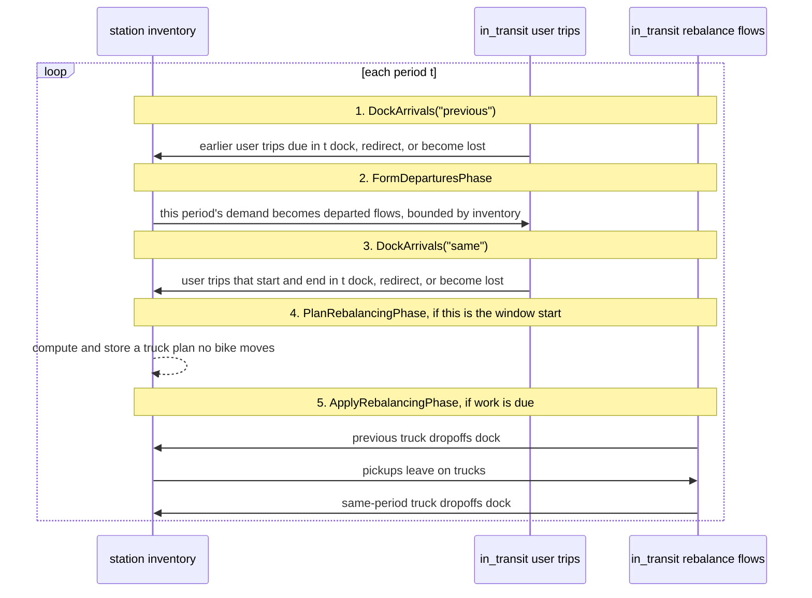

# The simulator, step by step

This document explains how one simulation run works.

The simulator does three things:

1. It moves bikes between pools: station inventory, `in_transit`, and, when
   rebalancing is enabled, trucks.
2. It writes every movement as rows in `state_flows_df`, the flow journal.
3. It checks that the final journal and the live state still agree.

The terms are the same as in [`Notations.md`](../Notations.md). The scenario
examples, with concrete journal rows, are in [`scenarios.md`](scenarios.md).

## Code Map

The simulator code is in `gbp/consumers/simulator/`.

| File | Main role |
|---|---|
| `engine.py` | Owns `Environment`, the object that steps periods. |
| `state.py` | Owns `SimulationState`, inventory arithmetic, and the one journal write path. |
| `phases.py` | Owns the three user-trip phases. |
| `mechanics.py` | Owns the rules used by phases: docking, redirects, demand, OD expansion. |
| `rebalancing.py` | Owns truck planning and execution. |
| `scenario.py` | Owns `canonical_phases()` and `run_sized_scenario()`. |
| `sizing.py` | Measures initial inventory and dock capacities for a demand level. |
| `validation.py` | Checks run invariants I1-I5. |
| `config.py` | Holds `EnvironmentConfig`, the settings for one run. |

The dependency direction is:

```text
journal <- state <- mechanics <- phases <- engine
```

A lower layer does not import a higher layer.

## The Main Idea

The simulator does not keep the run as one editable table.

It keeps an append-only flow journal:

```python
state_flows_df
```

Each row is a flow event: `departed`, `arrived`, `redirected`, or `lost`.

The current station inventory is also carried in the state:

```python
state_inventory_df
```

This inventory is kept for speed. It is not the source of truth. At the end of
the run, invariant I3 recomputes inventory from the journal and compares it with
the live `state_inventory_df`.

`in_transit` is the set of bikes that have departed but have not yet docked. A
user trip waits there between `departed` and `arrived`. A rebalance flow waits
there while a bike is on a truck.

## Time In The Simulator

There are two time axes.

### Period

A `period` is one step of the simulation clock. In the canonical setup, a period
is one hour. `periods_df` maps each `period_id` to its wall-clock start and end.

The engine runs periods in order:

```python
while not env.is_done:
    env.step()
```

### Step

A `step` is smaller than a period. It is one ordered batch of inventory changes.

Examples:

| Batch | Why it is one step |
|---|---|
| Planned arrivals docking at their target | All those `+1` changes happen together. |
| One period's departures | All `-1` departures and stockout losses are one decision. |
| One redirect round | Those bikes try their next stations together. |
| One rebalancing round | The truck phase applies three ordered rounds. |

Every journal row has:

| Column | Meaning |
|---|---|
| `phase_rank` | Which phase wrote the row inside the period. |
| `phase_round` | Which ordered round inside that phase. Default is 0. |
| `step_id` | The run-global order of inventory steps. |

Important: `phase_rank` and `phase_round` are labels. The simulator opens
`step_id` values from a counter in `SimulationState.apply_step_events()`.

That prevents two ordered batches from accidentally sharing one `step_id`.

## State

`SimulationState` is immutable. A phase does not edit it in place. A phase reads
one state and returns the next state.

The main fields are:

| Field | Meaning |
|---|---|
| `state_period_id_obj` | The current period id and wall-clock bounds. |
| `state_flows_df` | The append-only flow journal. |
| `state_inventory_df` | Bikes currently docked, per `(facility_id, commodity_category)`. |
| `in_transit` | Departed flows that have not docked yet. |
| `state_resources_df` | Resource observations. Empty in historical replay. |
| `next_step_id` | The next `step_id` to hand out. |
| `rebalance_plan` | Bike-level truck plan still to execute. Empty outside a rebalancing window. |

The state also exposes read-only values derived from `state_flows_df`:

```python
state_departures_df
state_arrivals_df
state_demand_df
state_supply_df
state_od_matrix_df
```

These are read-models of the journal. They are not separate sources of truth.

## The One Journal Write Path

All phases write flow events through one method:

```python
state.apply_step_events(new_flows, phase_rank)
```

This method does the same work for every phase:

1. Copy the new flow events.
2. Set `phase_rank` on every row.
3. Fill missing `phase_round` with 0.
4. Open one `step_id` per distinct `phase_round`, in round order.
5. Stamp `step_id` on the rows.
6. Append the rows to `state_flows_df`.

Empty `new_flows` opens no step. This keeps the step numbers continuous.

## How A Run Starts

Most callers use `run_sized_scenario()`.

It owns the safe order:

1. Run a sizing run with `canonical_phases()`.
2. Measure the initial inventory and dock capacities the demand needs.
3. Copy the resolved data and replace its initial inventory and capacities.
4. Build an `Environment` with the real run settings.
5. Run the periods.
6. Validate the finished journal with I1-I5.

The sizing run always uses the canonical three user-trip phases. If the real run
uses rebalancing, the rebalancing effect is measured against the sized user-trip
state instead of being hidden by the sizing step.

## The Phase List

The canonical phase list is:

```python
canonical_phases() == [
    DockArrivals("previous"),
    FormDeparturesPhase(),
    DockArrivals("same"),
]
```

A run with rebalancing appends:

```python
rebalancing_phases(params) == [
    PlanRebalancingPhase(params),
    ApplyRebalancingPhase(),
]
```

So one full period can have five phases:

| Order | Phase | Journal rank | Always active? |
|---|---|---:|---|
| 1 | `DockArrivals("previous")` | 0 | Yes |
| 2 | `FormDeparturesPhase()` | 1 | Yes |
| 3 | `DockArrivals("same")` | 2 | Yes |
| 4 | `PlanRebalancingPhase(params)` | None | Only at `window_start_hour` |
| 5 | `ApplyRebalancingPhase()` | 3 | Only when rebalancing is enabled and work exists |

`PlanRebalancingPhase` has no journal rank because it writes no flow events. It
only stores a plan on the state.

## One Period At A Glance



The order matters.

Earlier arrivals dock before departures so those bikes can serve this period's
demand. Same-period arrivals dock after departures because those trips do not
exist until the departures phase creates them.

## Phase 1: `DockArrivals("previous")`

This phase handles user trips that:

```text
planned_end_period == current period
start_period < current period
flow_type == "user_trip"
```

It reads:

| Source | Data |
|---|---|
| State | `in_transit`, `state_inventory_df` |
| Resolved data | capacities, facility geography, OD matrix, `routes` |

It does this:

1. Select due user trips.
2. Try to dock each bike at its `planned_target_id`.
3. Split the due rows into `fits` and `overflow` with `dock_up_to_capacity()`.
4. Add `+1` inventory for rows that fit.
5. Redirect overflow bikes to the nearest facility with a free dock.
6. Dock zero-period redirect legs in redirect rounds.
7. Put longer redirect legs back into `in_transit`.
8. Mark a bike `lost` with `reason = "dock_full"` only when no facility has a
   free dock.

It writes:

| Event | Meaning |
|---|---|
| `arrived` | A due bike docked. |
| `redirected` | A bike bounced off a full target. |
| `departed` | The redirect continuation leg. |
| `lost` | No dock was available anywhere. |

The planned docking rows are `phase_round = 0`. Redirect rounds are
`phase_round = 1, 2, ...`.

After the phase:

```text
due == docked + redirected + lost
```

Only `arrived` rows move inventory.

## Phase 2: `FormDeparturesPhase`

This phase handles the demand of the current period.

It reads:

| Source | Data |
|---|---|
| State | `state_inventory_df` |
| Resolved data | `historical_demand_df`, `historical_od_matrix_df` |
| Config | `demand_scale_factor` |

It does this:

1. Take the demand rows where `period_id == current period`.
2. Scale demand by `demand_scale_factor`.
3. For each `(facility_id, commodity_category)`, compute:

   ```text
   departed = min(demand, inventory)
   lost = demand - departed
   ```

4. Remove the departed bikes from inventory.
5. Spread departed bikes across targets with OD probabilities.
6. Round target counts with the largest-remainder method, so the source total is
   preserved exactly.
7. Expand aggregate rows into one `flow_id` per bike.

It writes:

| Event | Meaning |
|---|---|
| `departed` | A user trip left a source. |
| `lost` with `reason = "stockout"` | Demand did not depart because no bike was available. |

All rows in this phase are one batch: `phase_round = 0`.

After the phase:

```text
demand == departed + lost(stockout)
```

A stockout does not move inventory. Only `departed` moves inventory.

## Phase 3: `DockArrivals("same")`

This phase uses the same docking and redirect rules as phase 1.

The only difference is the due-arrival filter:

```text
planned_end_period == current period
start_period == current period
flow_type == "user_trip"
```

It must run after `FormDeparturesPhase`, because same-period trips are created by
that phase.

## Phase 4: `PlanRebalancingPhase`

This phase is present only when a run enables rebalancing.

It runs only in periods whose wall-clock start hour equals
`params.window_start_hour`. Other periods pass through unchanged.

It reads:

| Source | Data |
|---|---|
| State | `state_inventory_df` after the user-trip phases |
| Resolved data | demand, arrivals, periods, capacities, geography, trucks |
| Config | `demand_scale_factor` |

It does this:

1. Compute `target inventory` for the morning demand window.
2. Compare current inventory with the target.
3. Build `imbalance`: positive values mean pickup side, negative values mean
   dropoff side.
4. Reduce planned dropoffs to the free docks available at planning time.
5. Split large pickup and dropoff amounts into nodes.
6. Match total pickup and dropoff amounts per commodity.
7. Route trucks through the nodes.
8. Convert route stops into a bike-level `rebalance_plan`.

It writes no flow events and moves no inventory.

It only replaces:

```python
state.rebalance_plan
```

If there is no pickup side or no dropoff side, the plan is empty.

## Phase 5: `ApplyRebalancingPhase`

This phase is present only when rebalancing is enabled.

It runs every period, but it returns the state unchanged when there is no plan
work and no rebalance bike in `in_transit`.

It has three ordered rounds:

| Round | What happens | Inventory change |
|---:|---|---|
| 0 | Dock truck dropoffs due from earlier periods. | `+1` per arrived bike |
| 1 | Pick up bikes whose `pickup_period` is this period. | `-1` per executed pickup |
| 2 | Dock truck dropoffs whose pickup and dropoff are in this same period. | `+1` per arrived bike |

Round 1 cuts pickups down to bikes actually on hand. A cut pickup is removed from
the plan, and the bike stays in inventory.

Truck dropoffs use the same `dock_up_to_capacity()` rule as user arrivals. If a
station is full, the bike docks at the truck's `home_facility_id`. The depot is
the last place to unload the bike.

It writes:

| Event | Meaning |
|---|---|
| `departed` with `flow_type = "rebalance"` | A truck picked up a bike. |
| `arrived` with `flow_type = "rebalance"` | A truck dropoff docked a bike. |

After the phase:

```text
inventory change == docked dropoffs - executed pickups
```

A rebalance dropoff does not become `lost`.

## Mechanics

Mechanics functions do not touch `SimulationState`.

They take plain tables and return decisions. Phases apply those decisions to the
state and write events to the journal.

### Free Docks

`free_docks(inventory, capacities)` computes free docks per facility:

```text
free = capacity - docked bikes
```

Classic and electric bikes share the same physical docks, so the occupied count
is summed across commodities.

### Docking

`dock_up_to_capacity(due, free)` is the only docking rule.

For each target, it numbers rows in input order:

```python
rank = due.groupby(target_col).cumcount()
capacity_here = due[target_col].map(free).fillna(0)
fits = rank < capacity_here
```

Rows where `fits` is true dock. The rest are `overflow`.

The same rule is used for:

| Use | Target column |
|---|---|
| User trip arriving at the planned station | `planned_target_id` |
| Redirect leg docking at its chosen station | `realized_target_id` |
| Truck dropoff docking at its planned station | `planned_target_id` |

### Redirect

`plan_overflow_redirect(...)` handles user-trip overflow.

It plans rounds:

1. Find the nearest other facility with a free dock.
2. Create a redirect leg to that facility.
3. If the leg has zero-period travel time, try to dock it now.
4. If it does not fit, it enters the next redirect round.
5. If the leg takes time, put it back into `in_transit`.
6. If no facility has a free dock, write `lost` with `reason = "dock_full"`.

The nearest facility is ranked by `neighbor_distance_sq`. Travel time comes from
the OD matrix when that pair exists there. Otherwise it comes from `routes`.

### Demand

`realize_departures(demand_now, inventory)` computes the demand split:

```text
departed = min(demand, available)
lost = demand - departed
```

`form_potential_trips(departures, od_matrix, period_id)` spreads the departed
count across targets with OD probabilities.

`expand_potential_trips(...)` turns aggregate rows into one row per bike and
assigns simulator `flow_id` values with the `sim_` prefix.

## Travel Time And Distance

The simulator uses whole periods for trip time.

For simulated user trips:

```text
planned_end_period = start period + duration
```

The `duration` comes from the OD matrix.

For redirect legs:

1. Use the mean OD duration for the pair if the OD matrix has the pair.
2. Otherwise ask `routes.duration_periods(...)`.

`routes` can use:

| `routing_mode` | Meaning |
|---|---|
| `haversine` | Straight-line distance over mean riding speed. |
| `osrm` | Road-network distance and riding time from a local OSRM server. |

Distance in kilometres is not an input to the user-trip phase. It is mostly
computed after the run for artifacts such as `flows.parquet`, `arcs.parquet`,
and `flow_totals.parquet`.

One exception exists: redirect travel time may use `routes` when the OD matrix
has no duration for a pair.

Truck travel time in rebalancing uses straight-line distance at truck speed. It
does not use `routes`, because `routes` is built for bike travel time.

## Invariants

The simulator checks correctness at three levels.

### Phase Checks

These checks run inside mechanics and phases:

| Place | Check |
|---|---|
| `dock_up_to_capacity()` | No target docks more flows than it has free docks. |
| `plan_overflow_redirect()` | Every overflow flow is either redirected or lost. |
| `realize_departures()` | Departures never exceed available inventory. |
| `DockArrivals` | Every due flow docks, redirects, or is lost exactly once. |
| `FormDeparturesPhase` | Stockout losses do not move inventory. |
| `ApplyRebalancingPhase` | Inventory change equals docked dropoffs minus pickups. |

### Run Checks

`validate_run()` checks the finished run.

| Id | Statement |
|---|---|
| I1 | Demand splits exactly into `departed + lost(stockout)`. |
| I2 | Every departed flow due by run end closes with one `arrived` or `lost(dock_full)`. |
| I3 | Live final inventory equals inventory recomputed from the journal. |
| I4 | Bikes are conserved across final inventory, `lost(dock_full)`, and `in_transit`. |
| I5 | No step takes a station inventory below zero. |

`Environment.run()` calls these checks by default. `run_sized_scenario()` calls
them itself so it can return the violation list to the caller.

### Journal Shape In Tests

Tests also check the structure of finalized journals:

```python
departed(,redirected,departed)*(,(arrived|lost))?
```

That means:

1. A flow starts with `departed`.
2. It may bounce one or more times.
3. Each bounce is `redirected, departed`.
4. It ends with at most one terminal event: `arrived` or `lost`.

The scenario tables in [`scenarios.md`](scenarios.md) are rebuilt by
`tests/test_docs_scenarios.py`, so documented journal rows must stay aligned
with the code.

## Why The Design Works This Way

### The Journal Is The Source Of Truth

The flow journal records every movement and every loss as rows.

That makes these questions checkable:

| Question | Where the answer comes from |
|---|---|
| Did demand depart or become a stockout loss? | `departed` and `lost(reason = "stockout")` rows |
| Did a bike dock, bounce, or leave the system? | `arrived`, `redirected`, and `lost(reason = "dock_full")` rows |
| Does live inventory still match the run history? | Inventory recomputed from `state_flows_df` |

If inventory were only updated in place, a missing event could silently change
the run result. With the journal, the event and the inventory movement can be
checked against each other.

### `step_id` Comes From A Counter

The simulator does not derive `step_id` by sorting
`(period_id, phase_rank, phase_round)`.

Instead, `apply_step_events()` opens the next number from `next_step_id`.

This matters because labels are not enough to prove batch boundaries. If a phase
needs two ordered batches, they must receive different `step_id` values. The
counter makes that direct.

The historical loader still derives `step_id` from labels because historical
data has only user trips: no redirects and no rebalancing rounds.

### Redirect Is A Real Second Leg

A redirect is not stored as one direct trip from the source to the final station.

The journal records the bounce:

```text
departed -> redirected -> departed -> arrived
```

This shows the full station where the bike bounced. It also lets the live
read-models tell a real user departure from a redirect continuation leg:

| Event | Inventory effect |
|---|---|
| `departed` with `move_id == 0` | The bike leaves a dock. |
| `departed` with `move_id >= 1` | A redirect continuation leg; no dock is touched. |

### Arrivals Are Split Around Departures

The user-trip phases are ordered like this:

```text
dock earlier arrivals -> form departures -> dock same-period arrivals
```

One docking pass at the start would miss same-period trips, because those trips
are created by `FormDeparturesPhase`.

One docking pass at the end would make earlier arrivals unavailable for this
period's demand.

The split lets bikes that arrived before this period depart in this period, and
it also lets trips that start and end in the same period dock after they are
created.

### Mechanics Decide, Phases Apply

Mechanics functions answer questions such as:

```text
Which rows fit?
Which rows overflow?
Where should overflow bikes go?
How many demanded trips can depart?
```

Phases then update inventory, update `in_transit`, and write journal events.

This keeps the rules easy to test on small tables, while all journal writing
still goes through `apply_step_events()`.
