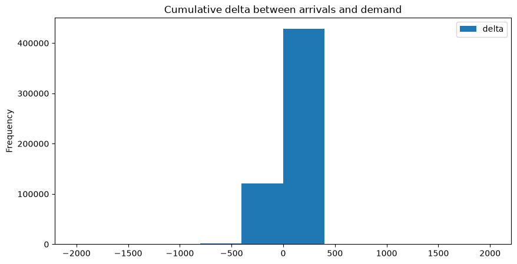

# Pipeline smoke test

Raw Citi Bike data -> `RawModelData` -> `ResolvedModelData` -> `Environment` -> `SimulationLog`.

The base scenario reproduces historical **demand** exactly. `FormDeparturesPhase`
re-releases every historical departure (limited by inventory) and assigns each
departure a destination and duration from the OD demand model
`P(target | source, commodity)` + mean historical duration.

The initial inventory and dock capacities come from a **sizing run**
(`size_state_for_demand`): the same scenario is run once with saturated inventory
and capacities, and the smallest state that runs its demand with no stockout and
no dock-full is read from that run's journal. This works for any
`demand_scale_factor` -- raise it and the sized state grows to match, so the
limits and the overflow redirect stay in the pipeline but never take effect.

The size -> run -> validate order lives in one function, `run_sized_scenario`
(Notations.md §11): it sizes the state, runs the demand against it, and checks
the run invariants I1-I5 (`validate_run`) -- its `validate` flag is on by default.

Because targets and durations come from the (aggregate) OD model rather than each
trip's own record, the per-trip journal is **not** identical to history, and the
OD-count matrix drifts slightly under per-period largest-remainder rounding. The
marginal that is preserved exactly is the departures table:
`simulated_departures_df == historical_departures_df`.


```python
import pandas as pd

from gbp.loaders.dataloader_raw import RawModelData
from gbp.loaders.dataloader_graph import ResolvedModelData, attach_simulation
from gbp.consumers.simulator import run_sized_scenario
from gbp.logging import configure_logging

# INFO shows the stage boundaries and a progress line every 50 periods;
# pass logging.DEBUG to also see one line per phase per period.
import logging
configure_logging(level = logging.DEBUG)
```


```python
ubuntu_path = "/mnt/outer/Documents/vlzm/GFDRR_ubuntu/GFDRR/data/raw/202602-citibike-tripdata_1.csv"
mac_path = "/Users/vladislav/Documents/vlzm/GFDRR/data/raw/202601-citibike-tripdata_1.csv"

# Raw model data: read the trip CSV, derive raw entities.
raw_data = RawModelData(
    trips_path=mac_path,
    seed=42,
    n_depots=10,
    depot_capacity=9000,
    n_trucks=5,
    truck_capacity_bikes=20,
    truck_rate=50.0,
    electric_bike_rate=5,
    classic_bike_rate=3,
)
# routing_mode picks how facility-pair distances and travel times are measured
# (Notations.md §13): "haversine" (default, straight-line formula) or "osrm"
# (road network; needs the local OSRM server from docs/how-to/set-up-osrm.md running).
graph_data = ResolvedModelData(raw_data, period_len=pd.Timedelta(hours=1))

historical_flows_df_raw = graph_data.historical_flows_df.copy()
```

    23:23:31 [info     ] trips_loaded                   path=/Users/vladislav/Documents/vlzm/GFDRR/data/processed/202601-citibike-tripdata_1.parquet rows=996388 source=processed
    23:23:57 [info     ] graph_resolved                 facilities=2260 historical_events=1992776 period_len='0 days 01:00:00' periods=360 routing_mode=haversine


```python
# Two demand levels on purpose:
#   sizing_scale -- the demand the state is built to survive with no loss.
#   run_scale    -- the demand the real run actually faces.
# When run_scale > sizing_scale the state is too small for the run: inventory
# runs out (stockout) and arrivals overrun the docks (dock_full). Set the two
# equal to get the clean, no-loss run again.
sizing_scale = 1.0
run_scale = 1.0
number_of_periods = 50

# One call owns the whole order: size the state against sizing_scale, run the
# demand at run_scale against it, and check the run invariants I1-I5.
# graph_data itself is not modified; the sized tables come back on the result.
sized_run = run_sized_scenario(
    graph_data,
    scenario_id="historical_replay",
    demand_scale_factor=run_scale,
    sizing_scale_factor=sizing_scale,
    number_of_periods=number_of_periods,
)

# Later cells read the sized state off graph_data, so store it there, then wire
# the finished run into the graph-data container's simulated_* slots.
graph_data.initial_inventory_df = sized_run.initial_inventory_df
graph_data.facilities_capacities_df = sized_run.facilities_capacities_df
attach_simulation(graph_data, sized_run.simulated_flows_df)
simulated_flows_df = graph_data.simulated_flows_df
simulated_departures_df = graph_data.simulated_departures_df
historical_departures_df = graph_data.historical_departures_df
```

    23:23:59 [info     ] sizing_run_started             number_of_periods=50 scenario_id=historical_replay sizing_scale_factor=1.0
    23:23:59 [debug    ] phase_executed                 events=0 period_id=0 phase=DockArrivals scenario_id=historical_replay_sizing
    23:23:59 [debug    ] phase_executed                 events=1 period_id=0 phase=FormDeparturesPhase scenario_id=historical_replay_sizing
    23:23:59 [debug    ] phase_executed                 events=0 period_id=0 phase=DockArrivals scenario_id=historical_replay_sizing
    23:23:59 [debug    ] phase_executed                 events=0 period_id=1 phase=DockArrivals scenario_id=historical_replay_sizing
    23:23:59 [debug    ] phase_executed                 events=0 period_id=1 phase=FormDeparturesPhase scenario_id=historical_replay_sizing
    23:23:59 [debug    ] phase_executed                 events=0 period_id=1 phase=DockArrivals scenario_id=historical_replay_sizing
    23:23:59 [debug    ] phase_executed                 events=0 period_id=2 phase=DockArrivals scenario_id=historical_replay_sizing
    23:23:59 [debug    ] phase_executed                 events=0 period_id=2 phase=FormDeparturesPhase scenario_id=historical_replay_sizing
    23:23:59 [debug    ] phase_executed                 events=0 period_id=2 phase=DockArrivals scenario_id=historical_replay_sizing
    23:23:59 [debug    ] phase_executed                 events=0 period_id=3 phase=DockArrivals scenario_id=historical_replay_sizing
    23:23:59 [debug    ] phase_executed                 events=0 period_id=3 phase=FormDeparturesPhase scenario_id=historical_replay_sizing
    23:23:59 [debug    ] phase_executed                 events=0 period_id=3 phase=DockArrivals scenario_id=historical_replay_sizing
    23:23:59 [debug    ] phase_executed                 events=0 period_id=4 phase=DockArrivals scenario_id=historical_replay_sizing
    23:23:59 [debug    ] phase_executed                 events=3 period_id=4 phase=FormDeparturesPhase scenario_id=historical_replay_sizing
    23:23:59 [debug    ] phase_executed                 events=0 period_id=4 phase=DockArrivals scenario_id=historical_replay_sizing
    23:23:59 [debug    ] phase_executed                 events=0 period_id=5 phase=DockArrivals scenario_id=historical_replay_sizing
    23:24:00 [debug    ] phase_executed                 events=2 period_id=5 phase=FormDeparturesPhase scenario_id=historical_replay_sizing
    23:24:00 [debug    ] phase_executed                 events=0 period_id=5 phase=DockArrivals scenario_id=historical_replay_sizing
    23:24:00 [debug    ] phase_executed                 events=0 period_id=6 phase=DockArrivals scenario_id=historical_replay_sizing
    23:24:00 [debug    ] phase_executed                 events=4 period_id=6 phase=FormDeparturesPhase scenario_id=historical_replay_sizing
    23:24:00 [debug    ] phase_executed                 events=0 period_id=6 phase=DockArrivals scenario_id=historical_replay_sizing
    23:24:00 [debug    ] phase_executed                 events=0 period_id=7 phase=DockArrivals scenario_id=historical_replay_sizing
    23:24:00 [debug    ] phase_executed                 events=5 period_id=7 phase=FormDeparturesPhase scenario_id=historical_replay_sizing
    23:24:00 [debug    ] phase_executed                 events=0 period_id=7 phase=DockArrivals scenario_id=historical_replay_sizing
    23:24:00 [debug    ] phase_executed                 events=0 period_id=8 phase=DockArrivals scenario_id=historical_replay_sizing
    23:24:00 [debug    ] phase_executed                 events=1 period_id=8 phase=FormDeparturesPhase scenario_id=historical_replay_sizing
    23:24:00 [debug    ] phase_executed                 events=0 period_id=8 phase=DockArrivals scenario_id=historical_replay_sizing
    23:24:00 [debug    ] phase_executed                 events=0 period_id=9 phase=DockArrivals scenario_id=historical_replay_sizing
    23:24:00 [debug    ] phase_executed                 events=0 period_id=9 phase=FormDeparturesPhase scenario_id=historical_replay_sizing
    23:24:00 [debug    ] phase_executed                 events=0 period_id=9 phase=DockArrivals scenario_id=historical_replay_sizing
    23:24:00 [debug    ] phase_executed                 events=0 period_id=10 phase=DockArrivals scenario_id=historical_replay_sizing
    23:24:00 [debug    ] phase_executed                 events=3 period_id=10 phase=FormDeparturesPhase scenario_id=historical_replay_sizing
    23:24:00 [debug    ] phase_executed                 events=0 period_id=10 phase=DockArrivals scenario_id=historical_replay_sizing
    23:24:00 [debug    ] phase_executed                 events=0 period_id=11 phase=DockArrivals scenario_id=historical_replay_sizing
    23:24:00 [debug    ] phase_executed                 events=0 period_id=11 phase=FormDeparturesPhase scenario_id=historical_replay_sizing
    23:24:00 [debug    ] phase_executed                 events=0 period_id=11 phase=DockArrivals scenario_id=historical_replay_sizing
    23:24:00 [debug    ] phase_executed                 events=0 period_id=12 phase=DockArrivals scenario_id=historical_replay_sizing
    23:24:00 [debug    ] phase_executed                 events=2 period_id=12 phase=FormDeparturesPhase scenario_id=historical_replay_sizing
    23:24:00 [debug    ] phase_executed                 events=0 period_id=12 phase=DockArrivals scenario_id=historical_replay_sizing
    23:24:00 [debug    ] phase_executed                 events=0 period_id=13 phase=DockArrivals scenario_id=historical_replay_sizing
    23:24:00 [debug    ] phase_executed                 events=4 period_id=13 phase=FormDeparturesPhase scenario_id=historical_replay_sizing
    23:24:00 [debug    ] phase_executed                 events=0 period_id=13 phase=DockArrivals scenario_id=historical_replay_sizing
    23:24:00 [debug    ] phase_executed                 events=0 period_id=14 phase=DockArrivals scenario_id=historical_replay_sizing
    23:24:00 [debug    ] phase_executed                 events=177 period_id=14 phase=FormDeparturesPhase scenario_id=historical_replay_sizing
    23:24:00 [debug    ] phase_executed                 events=0 period_id=14 phase=DockArrivals scenario_id=historical_replay_sizing
    23:24:00 [debug    ] phase_executed                 events=174 period_id=15 phase=DockArrivals scenario_id=historical_replay_sizing
    23:24:00 [debug    ] phase_executed                 events=1387 period_id=15 phase=FormDeparturesPhase scenario_id=historical_replay_sizing
    23:24:00 [debug    ] phase_executed                 events=1007 period_id=15 phase=DockArrivals scenario_id=historical_replay_sizing
    23:24:00 [debug    ] phase_executed                 events=377 period_id=16 phase=DockArrivals scenario_id=historical_replay_sizing
    23:24:00 [debug    ] phase_executed                 events=1760 period_id=16 phase=FormDeparturesPhase scenario_id=historical_replay_sizing
    23:24:00 [debug    ] phase_executed                 events=1434 period_id=16 phase=DockArrivals scenario_id=historical_replay_sizing
    23:24:00 [debug    ] phase_executed                 events=331 period_id=17 phase=DockArrivals scenario_id=historical_replay_sizing
    23:24:00 [debug    ] phase_executed                 events=1455 period_id=17 phase=FormDeparturesPhase scenario_id=historical_replay_sizing
    23:24:00 [debug    ] phase_executed                 events=1233 period_id=17 phase=DockArrivals scenario_id=historical_replay_sizing
    23:24:01 [debug    ] phase_executed                 events=224 period_id=18 phase=DockArrivals scenario_id=historical_replay_sizing
    23:24:01 [debug    ] phase_executed                 events=887 period_id=18 phase=FormDeparturesPhase scenario_id=historical_replay_sizing
    23:24:01 [debug    ] phase_executed                 events=772 period_id=18 phase=DockArrivals scenario_id=historical_replay_sizing
    23:24:01 [debug    ] phase_executed                 events=114 period_id=19 phase=DockArrivals scenario_id=historical_replay_sizing
    23:24:01 [debug    ] phase_executed                 events=480 period_id=19 phase=FormDeparturesPhase scenario_id=historical_replay_sizing
    23:24:01 [debug    ] phase_executed                 events=416 period_id=19 phase=DockArrivals scenario_id=historical_replay_sizing
    23:24:01 [debug    ] phase_executed                 events=62 period_id=20 phase=DockArrivals scenario_id=historical_replay_sizing
    23:24:01 [debug    ] phase_executed                 events=290 period_id=20 phase=FormDeparturesPhase scenario_id=historical_replay_sizing
    23:24:01 [debug    ] phase_executed                 events=251 period_id=20 phase=DockArrivals scenario_id=historical_replay_sizing
    23:24:01 [debug    ] phase_executed                 events=41 period_id=21 phase=DockArrivals scenario_id=historical_replay_sizing
    23:24:01 [debug    ] phase_executed                 events=250 period_id=21 phase=FormDeparturesPhase scenario_id=historical_replay_sizing
    23:24:01 [debug    ] phase_executed                 events=213 period_id=21 phase=DockArrivals scenario_id=historical_replay_sizing
    23:24:01 [debug    ] phase_executed                 events=37 period_id=22 phase=DockArrivals scenario_id=historical_replay_sizing
    23:24:01 [debug    ] phase_executed                 events=313 period_id=22 phase=FormDeparturesPhase scenario_id=historical_replay_sizing
    23:24:01 [debug    ] phase_executed                 events=272 period_id=22 phase=DockArrivals scenario_id=historical_replay_sizing
    23:24:01 [debug    ] phase_executed                 events=44 period_id=23 phase=DockArrivals scenario_id=historical_replay_sizing
    23:24:01 [debug    ] phase_executed                 events=465 period_id=23 phase=FormDeparturesPhase scenario_id=historical_replay_sizing
    23:24:01 [debug    ] phase_executed                 events=389 period_id=23 phase=DockArrivals scenario_id=historical_replay_sizing
    23:24:01 [debug    ] phase_executed                 events=75 period_id=24 phase=DockArrivals scenario_id=historical_replay_sizing
    23:24:02 [debug    ] phase_executed                 events=668 period_id=24 phase=FormDeparturesPhase scenario_id=historical_replay_sizing
    23:24:02 [debug    ] phase_executed                 events=559 period_id=24 phase=DockArrivals scenario_id=historical_replay_sizing
    23:24:02 [debug    ] phase_executed                 events=106 period_id=25 phase=DockArrivals scenario_id=historical_replay_sizing
    23:24:02 [debug    ] phase_executed                 events=931 period_id=25 phase=FormDeparturesPhase scenario_id=historical_replay_sizing
    23:24:02 [debug    ] phase_executed                 events=767 period_id=25 phase=DockArrivals scenario_id=historical_replay_sizing
    23:24:02 [debug    ] phase_executed                 events=161 period_id=26 phase=DockArrivals scenario_id=historical_replay_sizing
    23:24:02 [debug    ] phase_executed                 events=1306 period_id=26 phase=FormDeparturesPhase scenario_id=historical_replay_sizing
    23:24:02 [debug    ] phase_executed                 events=1075 period_id=26 phase=DockArrivals scenario_id=historical_replay_sizing
    23:24:02 [debug    ] phase_executed                 events=228 period_id=27 phase=DockArrivals scenario_id=historical_replay_sizing
    23:24:02 [debug    ] phase_executed                 events=1475 period_id=27 phase=FormDeparturesPhase scenario_id=historical_replay_sizing
    23:24:02 [debug    ] phase_executed                 events=1213 period_id=27 phase=DockArrivals scenario_id=historical_replay_sizing
    23:24:02 [debug    ] phase_executed                 events=258 period_id=28 phase=DockArrivals scenario_id=historical_replay_sizing
    23:24:02 [debug    ] phase_executed                 events=1637 period_id=28 phase=FormDeparturesPhase scenario_id=historical_replay_sizing
    23:24:02 [debug    ] phase_executed                 events=1319 period_id=28 phase=DockArrivals scenario_id=historical_replay_sizing
    23:24:02 [debug    ] phase_executed                 events=309 period_id=29 phase=DockArrivals scenario_id=historical_replay_sizing
    23:24:02 [debug    ] phase_executed                 events=1785 period_id=29 phase=FormDeparturesPhase scenario_id=historical_replay_sizing
    23:24:02 [debug    ] phase_executed                 events=1470 period_id=29 phase=DockArrivals scenario_id=historical_replay_sizing
    23:24:02 [debug    ] phase_executed                 events=315 period_id=30 phase=DockArrivals scenario_id=historical_replay_sizing
    23:24:03 [debug    ] phase_executed                 events=2018 period_id=30 phase=FormDeparturesPhase scenario_id=historical_replay_sizing
    23:24:03 [debug    ] phase_executed                 events=1671 period_id=30 phase=DockArrivals scenario_id=historical_replay_sizing
    23:24:03 [debug    ] phase_executed                 events=347 period_id=31 phase=DockArrivals scenario_id=historical_replay_sizing
    23:24:03 [debug    ] phase_executed                 events=1836 period_id=31 phase=FormDeparturesPhase scenario_id=historical_replay_sizing
    23:24:03 [debug    ] phase_executed                 events=1542 period_id=31 phase=DockArrivals scenario_id=historical_replay_sizing
    23:24:03 [debug    ] phase_executed                 events=298 period_id=32 phase=DockArrivals scenario_id=historical_replay_sizing
    23:24:03 [debug    ] phase_executed                 events=1752 period_id=32 phase=FormDeparturesPhase scenario_id=historical_replay_sizing
    23:24:03 [debug    ] phase_executed                 events=1482 period_id=32 phase=DockArrivals scenario_id=historical_replay_sizing
    23:24:03 [debug    ] phase_executed                 events=274 period_id=33 phase=DockArrivals scenario_id=historical_replay_sizing
    23:24:03 [debug    ] phase_executed                 events=1561 period_id=33 phase=FormDeparturesPhase scenario_id=historical_replay_sizing
    23:24:03 [debug    ] phase_executed                 events=1355 period_id=33 phase=DockArrivals scenario_id=historical_replay_sizing
    23:24:03 [debug    ] phase_executed                 events=219 period_id=34 phase=DockArrivals scenario_id=historical_replay_sizing
    23:24:03 [debug    ] phase_executed                 events=1300 period_id=34 phase=FormDeparturesPhase scenario_id=historical_replay_sizing
    23:24:03 [debug    ] phase_executed                 events=1108 period_id=34 phase=DockArrivals scenario_id=historical_replay_sizing
    23:24:04 [debug    ] phase_executed                 events=191 period_id=35 phase=DockArrivals scenario_id=historical_replay_sizing
    23:24:04 [debug    ] phase_executed                 events=1014 period_id=35 phase=FormDeparturesPhase scenario_id=historical_replay_sizing
    23:24:04 [debug    ] phase_executed                 events=892 period_id=35 phase=DockArrivals scenario_id=historical_replay_sizing
    23:24:04 [debug    ] phase_executed                 events=127 period_id=36 phase=DockArrivals scenario_id=historical_replay_sizing
    23:24:04 [debug    ] phase_executed                 events=883 period_id=36 phase=FormDeparturesPhase scenario_id=historical_replay_sizing
    23:24:04 [debug    ] phase_executed                 events=760 period_id=36 phase=DockArrivals scenario_id=historical_replay_sizing
    23:24:04 [debug    ] phase_executed                 events=124 period_id=37 phase=DockArrivals scenario_id=historical_replay_sizing
    23:24:04 [debug    ] phase_executed                 events=774 period_id=37 phase=FormDeparturesPhase scenario_id=historical_replay_sizing
    23:24:04 [debug    ] phase_executed                 events=675 period_id=37 phase=DockArrivals scenario_id=historical_replay_sizing
    23:24:04 [debug    ] phase_executed                 events=97 period_id=38 phase=DockArrivals scenario_id=historical_replay_sizing
    23:24:04 [debug    ] phase_executed                 events=585 period_id=38 phase=FormDeparturesPhase scenario_id=historical_replay_sizing
    23:24:04 [debug    ] phase_executed                 events=497 period_id=38 phase=DockArrivals scenario_id=historical_replay_sizing
    23:24:04 [debug    ] phase_executed                 events=89 period_id=39 phase=DockArrivals scenario_id=historical_replay_sizing
    23:24:04 [debug    ] phase_executed                 events=426 period_id=39 phase=FormDeparturesPhase scenario_id=historical_replay_sizing
    23:24:04 [debug    ] phase_executed                 events=375 period_id=39 phase=DockArrivals scenario_id=historical_replay_sizing
    23:24:04 [debug    ] phase_executed                 events=50 period_id=40 phase=DockArrivals scenario_id=historical_replay_sizing
    23:24:04 [debug    ] phase_executed                 events=252 period_id=40 phase=FormDeparturesPhase scenario_id=historical_replay_sizing
    23:24:04 [debug    ] phase_executed                 events=226 period_id=40 phase=DockArrivals scenario_id=historical_replay_sizing
    23:24:04 [debug    ] phase_executed                 events=26 period_id=41 phase=DockArrivals scenario_id=historical_replay_sizing
    23:24:05 [debug    ] phase_executed                 events=159 period_id=41 phase=FormDeparturesPhase scenario_id=historical_replay_sizing
    23:24:05 [debug    ] phase_executed                 events=137 period_id=41 phase=DockArrivals scenario_id=historical_replay_sizing
    23:24:05 [debug    ] phase_executed                 events=22 period_id=42 phase=DockArrivals scenario_id=historical_replay_sizing
    23:24:05 [debug    ] phase_executed                 events=125 period_id=42 phase=FormDeparturesPhase scenario_id=historical_replay_sizing
    23:24:05 [debug    ] phase_executed                 events=104 period_id=42 phase=DockArrivals scenario_id=historical_replay_sizing
    23:24:05 [debug    ] phase_executed                 events=21 period_id=43 phase=DockArrivals scenario_id=historical_replay_sizing
    23:24:05 [debug    ] phase_executed                 events=151 period_id=43 phase=FormDeparturesPhase scenario_id=historical_replay_sizing
    23:24:05 [debug    ] phase_executed                 events=120 period_id=43 phase=DockArrivals scenario_id=historical_replay_sizing
    23:24:05 [debug    ] phase_executed                 events=31 period_id=44 phase=DockArrivals scenario_id=historical_replay_sizing
    23:24:05 [debug    ] phase_executed                 events=396 period_id=44 phase=FormDeparturesPhase scenario_id=historical_replay_sizing
    23:24:05 [debug    ] phase_executed                 events=331 period_id=44 phase=DockArrivals scenario_id=historical_replay_sizing
    23:24:05 [debug    ] phase_executed                 events=65 period_id=45 phase=DockArrivals scenario_id=historical_replay_sizing
    23:24:05 [debug    ] phase_executed                 events=905 period_id=45 phase=FormDeparturesPhase scenario_id=historical_replay_sizing
    23:24:05 [debug    ] phase_executed                 events=751 period_id=45 phase=DockArrivals scenario_id=historical_replay_sizing
    23:24:05 [debug    ] phase_executed                 events=153 period_id=46 phase=DockArrivals scenario_id=historical_replay_sizing
    23:24:05 [debug    ] phase_executed                 events=1394 period_id=46 phase=FormDeparturesPhase scenario_id=historical_replay_sizing
    23:24:05 [debug    ] phase_executed                 events=1185 period_id=46 phase=DockArrivals scenario_id=historical_replay_sizing
    23:24:05 [debug    ] phase_executed                 events=209 period_id=47 phase=DockArrivals scenario_id=historical_replay_sizing
    23:24:05 [debug    ] phase_executed                 events=2038 period_id=47 phase=FormDeparturesPhase scenario_id=historical_replay_sizing
    23:24:06 [debug    ] phase_executed                 events=1701 period_id=47 phase=DockArrivals scenario_id=historical_replay_sizing
    23:24:06 [debug    ] phase_executed                 events=326 period_id=48 phase=DockArrivals scenario_id=historical_replay_sizing
    23:24:06 [debug    ] phase_executed                 events=1983 period_id=48 phase=FormDeparturesPhase scenario_id=historical_replay_sizing
    23:24:06 [debug    ] phase_executed                 events=1690 period_id=48 phase=DockArrivals scenario_id=historical_replay_sizing
    23:24:06 [debug    ] phase_executed                 events=275 period_id=49 phase=DockArrivals scenario_id=historical_replay_sizing
    23:24:06 [debug    ] phase_executed                 events=2026 period_id=49 phase=FormDeparturesPhase scenario_id=historical_replay_sizing
    23:24:06 [debug    ] phase_executed                 events=1714 period_id=49 phase=DockArrivals scenario_id=historical_replay_sizing
    23:24:06 [info     ] periods_stepped                done=50 elapsed_s=6.5 journal_rows=73375 scenario_id=historical_replay_sizing total=50
    23:24:07 [info     ] sizing_run_finished            elapsed_s=7.7 facilities=2260 total_initial_inventory=10197
    23:24:07 [info     ] run_started                    demand_scale_factor=1.0 number_of_periods=50 phases=['DockArrivals', 'FormDeparturesPhase', 'DockArrivals'] scenario_id=historical_replay
    23:24:07 [debug    ] phase_executed                 events=0 period_id=0 phase=DockArrivals scenario_id=historical_replay
    23:24:07 [debug    ] phase_executed                 events=1 period_id=0 phase=FormDeparturesPhase scenario_id=historical_replay
    23:24:07 [debug    ] phase_executed                 events=0 period_id=0 phase=DockArrivals scenario_id=historical_replay
    23:24:07 [debug    ] phase_executed                 events=0 period_id=1 phase=DockArrivals scenario_id=historical_replay
    23:24:07 [debug    ] phase_executed                 events=0 period_id=1 phase=FormDeparturesPhase scenario_id=historical_replay
    23:24:07 [debug    ] phase_executed                 events=0 period_id=1 phase=DockArrivals scenario_id=historical_replay
    23:24:07 [debug    ] phase_executed                 events=0 period_id=2 phase=DockArrivals scenario_id=historical_replay
    23:24:07 [debug    ] phase_executed                 events=0 period_id=2 phase=FormDeparturesPhase scenario_id=historical_replay
    23:24:07 [debug    ] phase_executed                 events=0 period_id=2 phase=DockArrivals scenario_id=historical_replay
    23:24:07 [debug    ] phase_executed                 events=0 period_id=3 phase=DockArrivals scenario_id=historical_replay
    23:24:07 [debug    ] phase_executed                 events=0 period_id=3 phase=FormDeparturesPhase scenario_id=historical_replay
    23:24:07 [debug    ] phase_executed                 events=0 period_id=3 phase=DockArrivals scenario_id=historical_replay
    23:24:07 [debug    ] phase_executed                 events=0 period_id=4 phase=DockArrivals scenario_id=historical_replay
    23:24:07 [debug    ] phase_executed                 events=3 period_id=4 phase=FormDeparturesPhase scenario_id=historical_replay
    23:24:07 [debug    ] phase_executed                 events=0 period_id=4 phase=DockArrivals scenario_id=historical_replay
    23:24:07 [debug    ] phase_executed                 events=0 period_id=5 phase=DockArrivals scenario_id=historical_replay
    23:24:07 [debug    ] phase_executed                 events=2 period_id=5 phase=FormDeparturesPhase scenario_id=historical_replay
    23:24:07 [debug    ] phase_executed                 events=0 period_id=5 phase=DockArrivals scenario_id=historical_replay
    23:24:07 [debug    ] phase_executed                 events=0 period_id=6 phase=DockArrivals scenario_id=historical_replay
    23:24:07 [debug    ] phase_executed                 events=4 period_id=6 phase=FormDeparturesPhase scenario_id=historical_replay
    23:24:07 [debug    ] phase_executed                 events=0 period_id=6 phase=DockArrivals scenario_id=historical_replay
    23:24:07 [debug    ] phase_executed                 events=0 period_id=7 phase=DockArrivals scenario_id=historical_replay
    23:24:07 [debug    ] phase_executed                 events=5 period_id=7 phase=FormDeparturesPhase scenario_id=historical_replay
    23:24:07 [debug    ] phase_executed                 events=0 period_id=7 phase=DockArrivals scenario_id=historical_replay
    23:24:07 [debug    ] phase_executed                 events=0 period_id=8 phase=DockArrivals scenario_id=historical_replay
    23:24:07 [debug    ] phase_executed                 events=1 period_id=8 phase=FormDeparturesPhase scenario_id=historical_replay
    23:24:07 [debug    ] phase_executed                 events=0 period_id=8 phase=DockArrivals scenario_id=historical_replay
    23:24:07 [debug    ] phase_executed                 events=0 period_id=9 phase=DockArrivals scenario_id=historical_replay
    23:24:07 [debug    ] phase_executed                 events=0 period_id=9 phase=FormDeparturesPhase scenario_id=historical_replay
    23:24:07 [debug    ] phase_executed                 events=0 period_id=9 phase=DockArrivals scenario_id=historical_replay
    23:24:07 [debug    ] phase_executed                 events=0 period_id=10 phase=DockArrivals scenario_id=historical_replay
    23:24:07 [debug    ] phase_executed                 events=3 period_id=10 phase=FormDeparturesPhase scenario_id=historical_replay
    23:24:07 [debug    ] phase_executed                 events=0 period_id=10 phase=DockArrivals scenario_id=historical_replay
    23:24:07 [debug    ] phase_executed                 events=0 period_id=11 phase=DockArrivals scenario_id=historical_replay
    23:24:07 [debug    ] phase_executed                 events=0 period_id=11 phase=FormDeparturesPhase scenario_id=historical_replay
    23:24:07 [debug    ] phase_executed                 events=0 period_id=11 phase=DockArrivals scenario_id=historical_replay
    23:24:07 [debug    ] phase_executed                 events=0 period_id=12 phase=DockArrivals scenario_id=historical_replay
    23:24:07 [debug    ] phase_executed                 events=2 period_id=12 phase=FormDeparturesPhase scenario_id=historical_replay
    23:24:07 [debug    ] phase_executed                 events=0 period_id=12 phase=DockArrivals scenario_id=historical_replay
    23:24:07 [debug    ] phase_executed                 events=0 period_id=13 phase=DockArrivals scenario_id=historical_replay
    23:24:07 [debug    ] phase_executed                 events=4 period_id=13 phase=FormDeparturesPhase scenario_id=historical_replay
    23:24:08 [debug    ] phase_executed                 events=0 period_id=13 phase=DockArrivals scenario_id=historical_replay
    23:24:08 [debug    ] phase_executed                 events=0 period_id=14 phase=DockArrivals scenario_id=historical_replay
    23:24:08 [debug    ] phase_executed                 events=177 period_id=14 phase=FormDeparturesPhase scenario_id=historical_replay
    23:24:08 [debug    ] phase_executed                 events=0 period_id=14 phase=DockArrivals scenario_id=historical_replay
    23:24:08 [debug    ] phase_executed                 events=174 period_id=15 phase=DockArrivals scenario_id=historical_replay
    23:24:08 [debug    ] phase_executed                 events=1387 period_id=15 phase=FormDeparturesPhase scenario_id=historical_replay
    23:24:08 [debug    ] phase_executed                 events=1007 period_id=15 phase=DockArrivals scenario_id=historical_replay
    23:24:08 [debug    ] phase_executed                 events=377 period_id=16 phase=DockArrivals scenario_id=historical_replay
    23:24:08 [debug    ] phase_executed                 events=1760 period_id=16 phase=FormDeparturesPhase scenario_id=historical_replay
    23:24:08 [debug    ] phase_executed                 events=1434 period_id=16 phase=DockArrivals scenario_id=historical_replay
    23:24:08 [debug    ] phase_executed                 events=331 period_id=17 phase=DockArrivals scenario_id=historical_replay
    23:24:08 [debug    ] phase_executed                 events=1455 period_id=17 phase=FormDeparturesPhase scenario_id=historical_replay
    23:24:08 [debug    ] phase_executed                 events=1233 period_id=17 phase=DockArrivals scenario_id=historical_replay
    23:24:08 [debug    ] phase_executed                 events=224 period_id=18 phase=DockArrivals scenario_id=historical_replay
    23:24:08 [debug    ] phase_executed                 events=887 period_id=18 phase=FormDeparturesPhase scenario_id=historical_replay
    23:24:08 [debug    ] phase_executed                 events=772 period_id=18 phase=DockArrivals scenario_id=historical_replay
    23:24:08 [debug    ] phase_executed                 events=114 period_id=19 phase=DockArrivals scenario_id=historical_replay
    23:24:08 [debug    ] phase_executed                 events=480 period_id=19 phase=FormDeparturesPhase scenario_id=historical_replay
    23:24:08 [debug    ] phase_executed                 events=416 period_id=19 phase=DockArrivals scenario_id=historical_replay
    23:24:08 [debug    ] phase_executed                 events=62 period_id=20 phase=DockArrivals scenario_id=historical_replay
    23:24:08 [debug    ] phase_executed                 events=290 period_id=20 phase=FormDeparturesPhase scenario_id=historical_replay
    23:24:08 [debug    ] phase_executed                 events=251 period_id=20 phase=DockArrivals scenario_id=historical_replay
    23:24:08 [debug    ] phase_executed                 events=41 period_id=21 phase=DockArrivals scenario_id=historical_replay
    23:24:09 [debug    ] phase_executed                 events=250 period_id=21 phase=FormDeparturesPhase scenario_id=historical_replay
    23:24:09 [debug    ] phase_executed                 events=213 period_id=21 phase=DockArrivals scenario_id=historical_replay
    23:24:09 [debug    ] phase_executed                 events=37 period_id=22 phase=DockArrivals scenario_id=historical_replay
    23:24:09 [debug    ] phase_executed                 events=313 period_id=22 phase=FormDeparturesPhase scenario_id=historical_replay
    23:24:09 [debug    ] phase_executed                 events=272 period_id=22 phase=DockArrivals scenario_id=historical_replay
    23:24:09 [debug    ] phase_executed                 events=44 period_id=23 phase=DockArrivals scenario_id=historical_replay
    23:24:09 [debug    ] phase_executed                 events=465 period_id=23 phase=FormDeparturesPhase scenario_id=historical_replay
    23:24:09 [debug    ] phase_executed                 events=389 period_id=23 phase=DockArrivals scenario_id=historical_replay
    23:24:09 [debug    ] phase_executed                 events=75 period_id=24 phase=DockArrivals scenario_id=historical_replay
    23:24:09 [debug    ] phase_executed                 events=668 period_id=24 phase=FormDeparturesPhase scenario_id=historical_replay
    23:24:09 [debug    ] phase_executed                 events=559 period_id=24 phase=DockArrivals scenario_id=historical_replay
    23:24:09 [debug    ] phase_executed                 events=106 period_id=25 phase=DockArrivals scenario_id=historical_replay
    23:24:09 [debug    ] phase_executed                 events=931 period_id=25 phase=FormDeparturesPhase scenario_id=historical_replay
    23:24:09 [debug    ] phase_executed                 events=767 period_id=25 phase=DockArrivals scenario_id=historical_replay
    23:24:09 [debug    ] phase_executed                 events=161 period_id=26 phase=DockArrivals scenario_id=historical_replay
    23:24:09 [debug    ] phase_executed                 events=1306 period_id=26 phase=FormDeparturesPhase scenario_id=historical_replay
    23:24:09 [debug    ] phase_executed                 events=1075 period_id=26 phase=DockArrivals scenario_id=historical_replay
    23:24:09 [debug    ] phase_executed                 events=228 period_id=27 phase=DockArrivals scenario_id=historical_replay
    23:24:10 [debug    ] phase_executed                 events=1475 period_id=27 phase=FormDeparturesPhase scenario_id=historical_replay
    23:24:10 [debug    ] phase_executed                 events=1213 period_id=27 phase=DockArrivals scenario_id=historical_replay
    23:24:10 [debug    ] phase_executed                 events=258 period_id=28 phase=DockArrivals scenario_id=historical_replay
    23:24:10 [debug    ] phase_executed                 events=1637 period_id=28 phase=FormDeparturesPhase scenario_id=historical_replay
    23:24:10 [debug    ] phase_executed                 events=1319 period_id=28 phase=DockArrivals scenario_id=historical_replay
    23:24:10 [debug    ] phase_executed                 events=309 period_id=29 phase=DockArrivals scenario_id=historical_replay
    23:24:10 [debug    ] phase_executed                 events=1785 period_id=29 phase=FormDeparturesPhase scenario_id=historical_replay
    23:24:10 [debug    ] phase_executed                 events=1470 period_id=29 phase=DockArrivals scenario_id=historical_replay
    23:24:10 [debug    ] phase_executed                 events=315 period_id=30 phase=DockArrivals scenario_id=historical_replay
    23:24:10 [debug    ] phase_executed                 events=2018 period_id=30 phase=FormDeparturesPhase scenario_id=historical_replay
    23:24:10 [debug    ] phase_executed                 events=1671 period_id=30 phase=DockArrivals scenario_id=historical_replay
    23:24:10 [debug    ] phase_executed                 events=347 period_id=31 phase=DockArrivals scenario_id=historical_replay
    23:24:10 [debug    ] phase_executed                 events=1836 period_id=31 phase=FormDeparturesPhase scenario_id=historical_replay
    23:24:10 [debug    ] phase_executed                 events=1542 period_id=31 phase=DockArrivals scenario_id=historical_replay
    23:24:10 [debug    ] phase_executed                 events=298 period_id=32 phase=DockArrivals scenario_id=historical_replay
    23:24:10 [debug    ] phase_executed                 events=1752 period_id=32 phase=FormDeparturesPhase scenario_id=historical_replay
    23:24:10 [debug    ] phase_executed                 events=1482 period_id=32 phase=DockArrivals scenario_id=historical_replay
    23:24:10 [debug    ] phase_executed                 events=274 period_id=33 phase=DockArrivals scenario_id=historical_replay
    23:24:10 [debug    ] phase_executed                 events=1561 period_id=33 phase=FormDeparturesPhase scenario_id=historical_replay
    23:24:11 [debug    ] phase_executed                 events=1355 period_id=33 phase=DockArrivals scenario_id=historical_replay
    23:24:11 [debug    ] phase_executed                 events=219 period_id=34 phase=DockArrivals scenario_id=historical_replay
    23:24:11 [debug    ] phase_executed                 events=1300 period_id=34 phase=FormDeparturesPhase scenario_id=historical_replay
    23:24:11 [debug    ] phase_executed                 events=1108 period_id=34 phase=DockArrivals scenario_id=historical_replay
    23:24:11 [debug    ] phase_executed                 events=191 period_id=35 phase=DockArrivals scenario_id=historical_replay
    23:24:11 [debug    ] phase_executed                 events=1014 period_id=35 phase=FormDeparturesPhase scenario_id=historical_replay
    23:24:11 [debug    ] phase_executed                 events=892 period_id=35 phase=DockArrivals scenario_id=historical_replay
    23:24:11 [debug    ] phase_executed                 events=127 period_id=36 phase=DockArrivals scenario_id=historical_replay
    23:24:11 [debug    ] phase_executed                 events=883 period_id=36 phase=FormDeparturesPhase scenario_id=historical_replay
    23:24:11 [debug    ] phase_executed                 events=760 period_id=36 phase=DockArrivals scenario_id=historical_replay
    23:24:11 [debug    ] phase_executed                 events=124 period_id=37 phase=DockArrivals scenario_id=historical_replay
    23:24:11 [debug    ] phase_executed                 events=774 period_id=37 phase=FormDeparturesPhase scenario_id=historical_replay
    23:24:11 [debug    ] phase_executed                 events=675 period_id=37 phase=DockArrivals scenario_id=historical_replay
    23:24:11 [debug    ] phase_executed                 events=97 period_id=38 phase=DockArrivals scenario_id=historical_replay
    23:24:11 [debug    ] phase_executed                 events=585 period_id=38 phase=FormDeparturesPhase scenario_id=historical_replay
    23:24:11 [debug    ] phase_executed                 events=497 period_id=38 phase=DockArrivals scenario_id=historical_replay
    23:24:11 [debug    ] phase_executed                 events=89 period_id=39 phase=DockArrivals scenario_id=historical_replay
    23:24:11 [debug    ] phase_executed                 events=426 period_id=39 phase=FormDeparturesPhase scenario_id=historical_replay
    23:24:11 [debug    ] phase_executed                 events=375 period_id=39 phase=DockArrivals scenario_id=historical_replay
    23:24:12 [debug    ] phase_executed                 events=50 period_id=40 phase=DockArrivals scenario_id=historical_replay
    23:24:12 [debug    ] phase_executed                 events=252 period_id=40 phase=FormDeparturesPhase scenario_id=historical_replay
    23:24:12 [debug    ] phase_executed                 events=226 period_id=40 phase=DockArrivals scenario_id=historical_replay
    23:24:12 [debug    ] phase_executed                 events=26 period_id=41 phase=DockArrivals scenario_id=historical_replay
    23:24:12 [debug    ] phase_executed                 events=159 period_id=41 phase=FormDeparturesPhase scenario_id=historical_replay
    23:24:12 [debug    ] phase_executed                 events=137 period_id=41 phase=DockArrivals scenario_id=historical_replay
    23:24:12 [debug    ] phase_executed                 events=22 period_id=42 phase=DockArrivals scenario_id=historical_replay
    23:24:12 [debug    ] phase_executed                 events=125 period_id=42 phase=FormDeparturesPhase scenario_id=historical_replay
    23:24:12 [debug    ] phase_executed                 events=104 period_id=42 phase=DockArrivals scenario_id=historical_replay
    23:24:12 [debug    ] phase_executed                 events=21 period_id=43 phase=DockArrivals scenario_id=historical_replay
    23:24:12 [debug    ] phase_executed                 events=151 period_id=43 phase=FormDeparturesPhase scenario_id=historical_replay
    23:24:12 [debug    ] phase_executed                 events=120 period_id=43 phase=DockArrivals scenario_id=historical_replay
    23:24:12 [debug    ] phase_executed                 events=31 period_id=44 phase=DockArrivals scenario_id=historical_replay
    23:24:12 [debug    ] phase_executed                 events=396 period_id=44 phase=FormDeparturesPhase scenario_id=historical_replay
    23:24:12 [debug    ] phase_executed                 events=331 period_id=44 phase=DockArrivals scenario_id=historical_replay
    23:24:12 [debug    ] phase_executed                 events=65 period_id=45 phase=DockArrivals scenario_id=historical_replay
    23:24:12 [debug    ] phase_executed                 events=905 period_id=45 phase=FormDeparturesPhase scenario_id=historical_replay
    23:24:12 [debug    ] phase_executed                 events=751 period_id=45 phase=DockArrivals scenario_id=historical_replay
    23:24:12 [debug    ] phase_executed                 events=153 period_id=46 phase=DockArrivals scenario_id=historical_replay
    23:24:12 [debug    ] phase_executed                 events=1394 period_id=46 phase=FormDeparturesPhase scenario_id=historical_replay
    23:24:13 [debug    ] phase_executed                 events=1185 period_id=46 phase=DockArrivals scenario_id=historical_replay
    23:24:13 [debug    ] phase_executed                 events=209 period_id=47 phase=DockArrivals scenario_id=historical_replay
    23:24:13 [debug    ] phase_executed                 events=2038 period_id=47 phase=FormDeparturesPhase scenario_id=historical_replay
    23:24:13 [debug    ] phase_executed                 events=1701 period_id=47 phase=DockArrivals scenario_id=historical_replay
    23:24:13 [debug    ] phase_executed                 events=326 period_id=48 phase=DockArrivals scenario_id=historical_replay
    23:24:13 [debug    ] phase_executed                 events=1983 period_id=48 phase=FormDeparturesPhase scenario_id=historical_replay
    23:24:13 [debug    ] phase_executed                 events=1690 period_id=48 phase=DockArrivals scenario_id=historical_replay
    23:24:13 [debug    ] phase_executed                 events=275 period_id=49 phase=DockArrivals scenario_id=historical_replay
    23:24:13 [debug    ] phase_executed                 events=2026 period_id=49 phase=FormDeparturesPhase scenario_id=historical_replay
    23:24:13 [debug    ] phase_executed                 events=1714 period_id=49 phase=DockArrivals scenario_id=historical_replay
    23:24:13 [info     ] periods_stepped                done=50 elapsed_s=6.2 journal_rows=73375 scenario_id=historical_replay total=50
    23:24:14 [info     ] run_invariants_checked         violations=0
    23:24:14 [info     ] run_finished                   elapsed_s=7.0 journal_rows=73375 violations=0


```python
from gbp.model import flows_with_inventory, flows_with_measures

# The wide journal, from the two canonical read-models: each event with the
# inventory at its own facility just before/after its step (step-level, not
# period-level), plus the measured durations, distances and cost.
wide_df = flows_with_inventory(simulated_flows_df, graph_data.initial_inventory_df)
wide_df = flows_with_measures(
    wide_df,
    routes=graph_data.routes,
    rates=graph_data.commodities_categories_rates_df,
    period_len=graph_data.period_len,
)
wide_df
```


```python
simulated_flows_df['reason'].value_counts()
```


    Series([], Name: count, dtype: int64[pyarrow])


```python
graph_data.facilities_df
```


<div>
<style scoped>
    .dataframe tbody tr th:only-of-type {
        vertical-align: middle;
    }

    .dataframe tbody tr th {
        vertical-align: top;
    }

    .dataframe thead th {
        text-align: right;
    }
</style>
<table border="1" class="dataframe">
  <thead>
    <tr style="text-align: right;">
      <th></th>
      <th>facility_id</th>
      <th>facility_category</th>
    </tr>
  </thead>
  <tbody>
    <tr>
      <th>0</th>
      <td>4404.10</td>
      <td>station</td>
    </tr>
    <tr>
      <th>1</th>
      <td>5666.11</td>
      <td>station</td>
    </tr>
    <tr>
      <th>2</th>
      <td>5476.03</td>
      <td>station</td>
    </tr>
    <tr>
      <th>3</th>
      <td>5238.05</td>
      <td>station</td>
    </tr>
    <tr>
      <th>4</th>
      <td>6182.02</td>
      <td>station</td>
    </tr>
    <tr>
      <th>...</th>
      <td>...</td>
      <td>...</td>
    </tr>
    <tr>
      <th>2280</th>
      <td>depot_6</td>
      <td>depot</td>
    </tr>
    <tr>
      <th>2281</th>
      <td>depot_7</td>
      <td>depot</td>
    </tr>
    <tr>
      <th>2282</th>
      <td>depot_8</td>
      <td>depot</td>
    </tr>
    <tr>
      <th>2283</th>
      <td>depot_9</td>
      <td>depot</td>
    </tr>
    <tr>
      <th>2284</th>
      <td>depot_10</td>
      <td>depot</td>
    </tr>
  </tbody>
</table>
<p>2285 rows × 2 columns</p>
</div>


```python

```


```python
from gbp.model import (
    arrived_events,
    departed_events,
    finalize_flows,
    flows_to_arrivals,
    flows_to_departures,
    flows_to_od_matrix,
    get_inventory_df,
    phase_rank_by_timing,
)

df_init_inv = graph_data.initial_inventory_df.copy()
df_init_inv['quantity'] = 0

df_inv = get_inventory_df(
    graph_data.historical_flows_df, df_init_inv
)
```


```python
df = (pd.merge(graph_data.historical_demand_df, graph_data.historical_arrivals_df, 
         on = ['period_id', 'facility_id', 'commodity_category'], 
         how = 'outer', 
         suffixes=('_demand', '_arrivals'))
         .fillna(0)
         .sort_values(['period_id', 'facility_id', 'commodity_category']))

df['delta'] = df['quantity_arrivals'] - df['quantity_demand']
df = df[['facility_id', 'commodity_category', 'delta']]
df = df.groupby(['facility_id', 'commodity_category'])['delta'].cumsum().reset_index()
df.sort_values(['delta'], ascending=False)[['delta']].plot.hist(bins=10, figsize=(10, 5), title='Cumulative delta between arrivals and demand')  
```


    <Axes: title={'center': 'Cumulative delta between arrivals and demand'}, ylabel='Frequency'>


    

    


# Moment-level inventory and redirect inspection

The journal now carries `step_id` — the inventory time axis *below* the period.
A **step** is one `+1`/`-1` batch (dock arrivals from earlier periods, this
period's departures, same-period dock arrivals, and each redirect round); a
**moment** is the inventory just *before* or just *after* a step (Notations.md
§0.1). Three read-models sit on top of it:

- `inventory_at_moments` — every facility's inventory before/after each step (the
  fine view; per-period inventory is the value at each period's last step).
- `flows_with_inventory` — each event widened with its own facility's inventory
  before and after the event.
- `redirect_neighbor_table` — for one redirect, the full station's neighbours by
  distance out to the station the bike actually reached, each with its free docks
  at the redirect moment, so you can see *why* it landed where it did.

The base replay never overflows a dock, so it has **no** redirects. The first cell
shows the moment tools on the real run; the last two build a small nested-overflow
scenario (a bike skips a now-full nearer neighbour) to exercise
`redirect_neighbor_table`.


```python
from gbp.model import (
    flows_with_inventory,
    get_inventory_df,
    inventory_at_moments,
    redirect_neighbor_table,
)

initial_inventory_df = graph_data.initial_inventory_df

# 1) The finalized journal now carries `step_id` -- the inventory time axis below
#    the period (one step per +1/-1 batch: dock-previous, departures, dock-same,
#    and each redirect round).
print("step_id range:",
      int(simulated_flows_df["step_id"].min()), "..", int(simulated_flows_df["step_id"].max()))
display(simulated_flows_df.head(8))

# 2) Inventory at every moment: each facility's value before/after each step.
moments_df = inventory_at_moments(simulated_flows_df, initial_inventory_df)
display(moments_df.head(8))

# 3) The journal widened with each event's own facility inventory before/after.
wide_flows_df = flows_with_inventory(simulated_flows_df, graph_data.initial_inventory_df)
display(wide_flows_df.head(8))

# 4) Sanity: the fine view coarsens back to per-period inventory exactly
#    (a period's inventory is the value at its last step).
last_step = moments_df.groupby("period_id")["step_id"].transform("max") == moments_df["step_id"]
period_end_df = (moments_df[last_step]
                 .rename(columns={"inventory_after": "quantity_eop"})
                 [["period_id", "facility_id", "commodity_category", "quantity_eop"]])
coarse_df = get_inventory_df(simulated_flows_df, initial_inventory_df)
check_df = coarse_df.merge(period_end_df,
                           on=["period_id", "facility_id", "commodity_category"],
                           suffixes=("_coarse", "_fine"))
assert (check_df["quantity_eop_coarse"] == check_df["quantity_eop_fine"]).all()
print(f"OK: inventory_at_moments last step == get_inventory_df ({len(check_df)} rows match)")
```

    step_id range: 0 .. 114


<div>
<style scoped>
    .dataframe tbody tr th:only-of-type {
        vertical-align: middle;
    }

    .dataframe tbody tr th {
        vertical-align: top;
    }

    .dataframe thead th {
        text-align: right;
    }
</style>
<table border="1" class="dataframe">
  <thead>
    <tr style="text-align: right;">
      <th></th>
      <th>flow_id</th>
      <th>move_id</th>
      <th>event_id</th>
      <th>period_id</th>
      <th>flow_type</th>
      <th>event_type</th>
      <th>commodity_category</th>
      <th>source_id</th>
      <th>planned_target_id</th>
      <th>realized_target_id</th>
      <th>start_period</th>
      <th>planned_end_period</th>
      <th>realized_end_period</th>
      <th>resource_id</th>
      <th>quantity</th>
      <th>reason</th>
      <th>phase_rank</th>
      <th>phase_round</th>
      <th>step_id</th>
    </tr>
  </thead>
  <tbody>
    <tr>
      <th>0</th>
      <td>sim_0_0</td>
      <td>0</td>
      <td>0</td>
      <td>0</td>
      <td>user_trip</td>
      <td>departed</td>
      <td>classic_bike</td>
      <td>6626.01</td>
      <td>5703.13</td>
      <td>&lt;NA&gt;</td>
      <td>0</td>
      <td>17</td>
      <td>&lt;NA&gt;</td>
      <td>&lt;NA&gt;</td>
      <td>1</td>
      <td>&lt;NA&gt;</td>
      <td>1</td>
      <td>0</td>
      <td>0</td>
    </tr>
    <tr>
      <th>1</th>
      <td>sim_4_0</td>
      <td>0</td>
      <td>0</td>
      <td>4</td>
      <td>user_trip</td>
      <td>departed</td>
      <td>classic_bike</td>
      <td>6224.06</td>
      <td>6339.06</td>
      <td>&lt;NA&gt;</td>
      <td>4</td>
      <td>28</td>
      <td>&lt;NA&gt;</td>
      <td>&lt;NA&gt;</td>
      <td>1</td>
      <td>&lt;NA&gt;</td>
      <td>1</td>
      <td>0</td>
      <td>1</td>
    </tr>
    <tr>
      <th>2</th>
      <td>sim_4_1</td>
      <td>0</td>
      <td>0</td>
      <td>4</td>
      <td>user_trip</td>
      <td>departed</td>
      <td>classic_bike</td>
      <td>6257.06</td>
      <td>6339.06</td>
      <td>&lt;NA&gt;</td>
      <td>4</td>
      <td>28</td>
      <td>&lt;NA&gt;</td>
      <td>&lt;NA&gt;</td>
      <td>1</td>
      <td>&lt;NA&gt;</td>
      <td>1</td>
      <td>0</td>
      <td>1</td>
    </tr>
    <tr>
      <th>3</th>
      <td>sim_4_2</td>
      <td>0</td>
      <td>0</td>
      <td>4</td>
      <td>user_trip</td>
      <td>departed</td>
      <td>classic_bike</td>
      <td>7599.09</td>
      <td>7599.02</td>
      <td>&lt;NA&gt;</td>
      <td>4</td>
      <td>29</td>
      <td>&lt;NA&gt;</td>
      <td>&lt;NA&gt;</td>
      <td>1</td>
      <td>&lt;NA&gt;</td>
      <td>1</td>
      <td>0</td>
      <td>1</td>
    </tr>
    <tr>
      <th>4</th>
      <td>sim_5_0</td>
      <td>0</td>
      <td>0</td>
      <td>5</td>
      <td>user_trip</td>
      <td>departed</td>
      <td>classic_bike</td>
      <td>6030.04</td>
      <td>6339.06</td>
      <td>&lt;NA&gt;</td>
      <td>5</td>
      <td>28</td>
      <td>&lt;NA&gt;</td>
      <td>&lt;NA&gt;</td>
      <td>1</td>
      <td>&lt;NA&gt;</td>
      <td>1</td>
      <td>0</td>
      <td>2</td>
    </tr>
    <tr>
      <th>5</th>
      <td>sim_5_1</td>
      <td>0</td>
      <td>0</td>
      <td>5</td>
      <td>user_trip</td>
      <td>departed</td>
      <td>classic_bike</td>
      <td>6215.04</td>
      <td>6339.06</td>
      <td>&lt;NA&gt;</td>
      <td>5</td>
      <td>28</td>
      <td>&lt;NA&gt;</td>
      <td>&lt;NA&gt;</td>
      <td>1</td>
      <td>&lt;NA&gt;</td>
      <td>1</td>
      <td>0</td>
      <td>2</td>
    </tr>
    <tr>
      <th>6</th>
      <td>sim_6_0</td>
      <td>0</td>
      <td>0</td>
      <td>6</td>
      <td>user_trip</td>
      <td>departed</td>
      <td>classic_bike</td>
      <td>5679.05</td>
      <td>6450.05</td>
      <td>&lt;NA&gt;</td>
      <td>6</td>
      <td>27</td>
      <td>&lt;NA&gt;</td>
      <td>&lt;NA&gt;</td>
      <td>1</td>
      <td>&lt;NA&gt;</td>
      <td>1</td>
      <td>0</td>
      <td>3</td>
    </tr>
    <tr>
      <th>7</th>
      <td>sim_6_1</td>
      <td>0</td>
      <td>0</td>
      <td>6</td>
      <td>user_trip</td>
      <td>departed</td>
      <td>classic_bike</td>
      <td>6215.04</td>
      <td>6450.05</td>
      <td>&lt;NA&gt;</td>
      <td>6</td>
      <td>27</td>
      <td>&lt;NA&gt;</td>
      <td>&lt;NA&gt;</td>
      <td>1</td>
      <td>&lt;NA&gt;</td>
      <td>1</td>
      <td>0</td>
      <td>3</td>
    </tr>
  </tbody>
</table>
</div>


<div>
<style scoped>
    .dataframe tbody tr th:only-of-type {
        vertical-align: middle;
    }

    .dataframe tbody tr th {
        vertical-align: top;
    }

    .dataframe thead th {
        text-align: right;
    }
</style>
<table border="1" class="dataframe">
  <thead>
    <tr style="text-align: right;">
      <th></th>
      <th>step_id</th>
      <th>period_id</th>
      <th>facility_id</th>
      <th>commodity_category</th>
      <th>inventory_before</th>
      <th>inventory_after</th>
    </tr>
  </thead>
  <tbody>
    <tr>
      <th>0</th>
      <td>0</td>
      <td>0</td>
      <td>1234.56</td>
      <td>classic_bike</td>
      <td>0</td>
      <td>0</td>
    </tr>
    <tr>
      <th>1</th>
      <td>0</td>
      <td>0</td>
      <td>1234.56</td>
      <td>electric_bike</td>
      <td>0</td>
      <td>0</td>
    </tr>
    <tr>
      <th>2</th>
      <td>0</td>
      <td>0</td>
      <td>1964.01</td>
      <td>classic_bike</td>
      <td>0</td>
      <td>0</td>
    </tr>
    <tr>
      <th>3</th>
      <td>0</td>
      <td>0</td>
      <td>1964.01</td>
      <td>electric_bike</td>
      <td>0</td>
      <td>0</td>
    </tr>
    <tr>
      <th>4</th>
      <td>0</td>
      <td>0</td>
      <td>2009.04</td>
      <td>classic_bike</td>
      <td>0</td>
      <td>0</td>
    </tr>
    <tr>
      <th>5</th>
      <td>0</td>
      <td>0</td>
      <td>2009.04</td>
      <td>electric_bike</td>
      <td>0</td>
      <td>0</td>
    </tr>
    <tr>
      <th>6</th>
      <td>0</td>
      <td>0</td>
      <td>2042.01</td>
      <td>classic_bike</td>
      <td>0</td>
      <td>0</td>
    </tr>
    <tr>
      <th>7</th>
      <td>0</td>
      <td>0</td>
      <td>2042.01</td>
      <td>electric_bike</td>
      <td>0</td>
      <td>0</td>
    </tr>
  </tbody>
</table>
</div>


<div>
<style scoped>
    .dataframe tbody tr th:only-of-type {
        vertical-align: middle;
    }

    .dataframe tbody tr th {
        vertical-align: top;
    }

    .dataframe thead th {
        text-align: right;
    }
</style>
<table border="1" class="dataframe">
  <thead>
    <tr style="text-align: right;">
      <th></th>
      <th>flow_id</th>
      <th>move_id</th>
      <th>event_id</th>
      <th>period_id</th>
      <th>flow_type</th>
      <th>event_type</th>
      <th>commodity_category</th>
      <th>source_id</th>
      <th>planned_target_id</th>
      <th>realized_target_id</th>
      <th>...</th>
      <th>realized_end_period</th>
      <th>resource_id</th>
      <th>quantity</th>
      <th>reason</th>
      <th>phase_rank</th>
      <th>phase_round</th>
      <th>step_id</th>
      <th>facility_id</th>
      <th>inventory_before</th>
      <th>inventory_after</th>
    </tr>
  </thead>
  <tbody>
    <tr>
      <th>0</th>
      <td>sim_0_0</td>
      <td>0</td>
      <td>0</td>
      <td>0</td>
      <td>user_trip</td>
      <td>departed</td>
      <td>classic_bike</td>
      <td>6626.01</td>
      <td>5703.13</td>
      <td>&lt;NA&gt;</td>
      <td>...</td>
      <td>&lt;NA&gt;</td>
      <td>&lt;NA&gt;</td>
      <td>1</td>
      <td>&lt;NA&gt;</td>
      <td>1</td>
      <td>0</td>
      <td>0</td>
      <td>6626.01</td>
      <td>8</td>
      <td>7</td>
    </tr>
    <tr>
      <th>1</th>
      <td>sim_4_0</td>
      <td>0</td>
      <td>0</td>
      <td>4</td>
      <td>user_trip</td>
      <td>departed</td>
      <td>classic_bike</td>
      <td>6224.06</td>
      <td>6339.06</td>
      <td>&lt;NA&gt;</td>
      <td>...</td>
      <td>&lt;NA&gt;</td>
      <td>&lt;NA&gt;</td>
      <td>1</td>
      <td>&lt;NA&gt;</td>
      <td>1</td>
      <td>0</td>
      <td>1</td>
      <td>6224.06</td>
      <td>10</td>
      <td>9</td>
    </tr>
    <tr>
      <th>2</th>
      <td>sim_4_1</td>
      <td>0</td>
      <td>0</td>
      <td>4</td>
      <td>user_trip</td>
      <td>departed</td>
      <td>classic_bike</td>
      <td>6257.06</td>
      <td>6339.06</td>
      <td>&lt;NA&gt;</td>
      <td>...</td>
      <td>&lt;NA&gt;</td>
      <td>&lt;NA&gt;</td>
      <td>1</td>
      <td>&lt;NA&gt;</td>
      <td>1</td>
      <td>0</td>
      <td>1</td>
      <td>6257.06</td>
      <td>5</td>
      <td>4</td>
    </tr>
    <tr>
      <th>3</th>
      <td>sim_4_2</td>
      <td>0</td>
      <td>0</td>
      <td>4</td>
      <td>user_trip</td>
      <td>departed</td>
      <td>classic_bike</td>
      <td>7599.09</td>
      <td>7599.02</td>
      <td>&lt;NA&gt;</td>
      <td>...</td>
      <td>&lt;NA&gt;</td>
      <td>&lt;NA&gt;</td>
      <td>1</td>
      <td>&lt;NA&gt;</td>
      <td>1</td>
      <td>0</td>
      <td>1</td>
      <td>7599.09</td>
      <td>2</td>
      <td>1</td>
    </tr>
    <tr>
      <th>4</th>
      <td>sim_5_0</td>
      <td>0</td>
      <td>0</td>
      <td>5</td>
      <td>user_trip</td>
      <td>departed</td>
      <td>classic_bike</td>
      <td>6030.04</td>
      <td>6339.06</td>
      <td>&lt;NA&gt;</td>
      <td>...</td>
      <td>&lt;NA&gt;</td>
      <td>&lt;NA&gt;</td>
      <td>1</td>
      <td>&lt;NA&gt;</td>
      <td>1</td>
      <td>0</td>
      <td>2</td>
      <td>6030.04</td>
      <td>7</td>
      <td>6</td>
    </tr>
    <tr>
      <th>5</th>
      <td>sim_5_1</td>
      <td>0</td>
      <td>0</td>
      <td>5</td>
      <td>user_trip</td>
      <td>departed</td>
      <td>classic_bike</td>
      <td>6215.04</td>
      <td>6339.06</td>
      <td>&lt;NA&gt;</td>
      <td>...</td>
      <td>&lt;NA&gt;</td>
      <td>&lt;NA&gt;</td>
      <td>1</td>
      <td>&lt;NA&gt;</td>
      <td>1</td>
      <td>0</td>
      <td>2</td>
      <td>6215.04</td>
      <td>2</td>
      <td>1</td>
    </tr>
    <tr>
      <th>6</th>
      <td>sim_6_0</td>
      <td>0</td>
      <td>0</td>
      <td>6</td>
      <td>user_trip</td>
      <td>departed</td>
      <td>classic_bike</td>
      <td>5679.05</td>
      <td>6450.05</td>
      <td>&lt;NA&gt;</td>
      <td>...</td>
      <td>&lt;NA&gt;</td>
      <td>&lt;NA&gt;</td>
      <td>1</td>
      <td>&lt;NA&gt;</td>
      <td>1</td>
      <td>0</td>
      <td>3</td>
      <td>5679.05</td>
      <td>3</td>
      <td>2</td>
    </tr>
    <tr>
      <th>7</th>
      <td>sim_6_1</td>
      <td>0</td>
      <td>0</td>
      <td>6</td>
      <td>user_trip</td>
      <td>departed</td>
      <td>classic_bike</td>
      <td>6215.04</td>
      <td>6450.05</td>
      <td>&lt;NA&gt;</td>
      <td>...</td>
      <td>&lt;NA&gt;</td>
      <td>&lt;NA&gt;</td>
      <td>1</td>
      <td>&lt;NA&gt;</td>
      <td>1</td>
      <td>0</td>
      <td>3</td>
      <td>6215.04</td>
      <td>1</td>
      <td>0</td>
    </tr>
  </tbody>
</table>
<p>8 rows × 22 columns</p>
</div>


    OK: inventory_at_moments last step == get_inventory_df (202500 rows match)


```python
# The base replay never overflows a dock, so it has no redirects. Build a small
# scenario that does, with a nested overflow: five bikes aim at the full station
# s3; the nearest free neighbour s2 holds only two, then s4 holds two, then s5 --
# so the redirect spills across neighbours and later bikes skip a now-full one.
# (`tests` is not installed, so add the repo root to the path before importing.)
import pathlib
import sys

_repo_root = pathlib.Path.cwd()
while not (_repo_root / "pyproject.toml").exists() and _repo_root != _repo_root.parent:
    _repo_root = _repo_root.parent
if str(_repo_root) not in sys.path:
    sys.path.insert(0, str(_repo_root))

from tests import scenarios

# Filler trips in period 6 only exist to create the facilities s2/s4/s5.
_trips = [("s1", "s3", 0, 1)] * 5 + [("s1", "s2", 6, 7), ("s1", "s4", 6, 7), ("s1", "s5", 6, 7)]
redirect_resolved = scenarios.build_resolved(
    _trips, capacities={"s3": 0, "s2": 2, "s4": 2, "s5": 10}, initial_inventory={"s1": 8}
)
redirect_flows_df, _redirect_state = scenarios.run(redirect_resolved)

print("redirected events:", int((redirect_flows_df["event_type"] == "redirected").sum()))
display(flows_with_inventory(redirect_flows_df, redirect_resolved.initial_inventory_df))
```

    redirected events: 7


<div>
<style scoped>
    .dataframe tbody tr th:only-of-type {
        vertical-align: middle;
    }

    .dataframe tbody tr th {
        vertical-align: top;
    }

    .dataframe thead th {
        text-align: right;
    }
</style>
<table border="1" class="dataframe">
  <thead>
    <tr style="text-align: right;">
      <th></th>
      <th>flow_id</th>
      <th>move_id</th>
      <th>event_id</th>
      <th>period_id</th>
      <th>flow_type</th>
      <th>event_type</th>
      <th>commodity_category</th>
      <th>source_id</th>
      <th>planned_target_id</th>
      <th>realized_target_id</th>
      <th>...</th>
      <th>realized_end_period</th>
      <th>resource_id</th>
      <th>quantity</th>
      <th>reason</th>
      <th>phase_rank</th>
      <th>phase_round</th>
      <th>step_id</th>
      <th>facility_id</th>
      <th>inventory_before</th>
      <th>inventory_after</th>
    </tr>
  </thead>
  <tbody>
    <tr>
      <th>0</th>
      <td>sim_0_0</td>
      <td>0</td>
      <td>0</td>
      <td>0</td>
      <td>user_trip</td>
      <td>departed</td>
      <td>classic_bike</td>
      <td>s1</td>
      <td>s3</td>
      <td>&lt;NA&gt;</td>
      <td>...</td>
      <td>&lt;NA&gt;</td>
      <td>&lt;NA&gt;</td>
      <td>1</td>
      <td>&lt;NA&gt;</td>
      <td>1</td>
      <td>0</td>
      <td>0</td>
      <td>s1</td>
      <td>8</td>
      <td>3</td>
    </tr>
    <tr>
      <th>1</th>
      <td>sim_0_1</td>
      <td>0</td>
      <td>0</td>
      <td>0</td>
      <td>user_trip</td>
      <td>departed</td>
      <td>classic_bike</td>
      <td>s1</td>
      <td>s3</td>
      <td>&lt;NA&gt;</td>
      <td>...</td>
      <td>&lt;NA&gt;</td>
      <td>&lt;NA&gt;</td>
      <td>1</td>
      <td>&lt;NA&gt;</td>
      <td>1</td>
      <td>0</td>
      <td>0</td>
      <td>s1</td>
      <td>8</td>
      <td>3</td>
    </tr>
    <tr>
      <th>2</th>
      <td>sim_0_2</td>
      <td>0</td>
      <td>0</td>
      <td>0</td>
      <td>user_trip</td>
      <td>departed</td>
      <td>classic_bike</td>
      <td>s1</td>
      <td>s3</td>
      <td>&lt;NA&gt;</td>
      <td>...</td>
      <td>&lt;NA&gt;</td>
      <td>&lt;NA&gt;</td>
      <td>1</td>
      <td>&lt;NA&gt;</td>
      <td>1</td>
      <td>0</td>
      <td>0</td>
      <td>s1</td>
      <td>8</td>
      <td>3</td>
    </tr>
    <tr>
      <th>3</th>
      <td>sim_0_3</td>
      <td>0</td>
      <td>0</td>
      <td>0</td>
      <td>user_trip</td>
      <td>departed</td>
      <td>classic_bike</td>
      <td>s1</td>
      <td>s3</td>
      <td>&lt;NA&gt;</td>
      <td>...</td>
      <td>&lt;NA&gt;</td>
      <td>&lt;NA&gt;</td>
      <td>1</td>
      <td>&lt;NA&gt;</td>
      <td>1</td>
      <td>0</td>
      <td>0</td>
      <td>s1</td>
      <td>8</td>
      <td>3</td>
    </tr>
    <tr>
      <th>4</th>
      <td>sim_0_4</td>
      <td>0</td>
      <td>0</td>
      <td>0</td>
      <td>user_trip</td>
      <td>departed</td>
      <td>classic_bike</td>
      <td>s1</td>
      <td>s3</td>
      <td>&lt;NA&gt;</td>
      <td>...</td>
      <td>&lt;NA&gt;</td>
      <td>&lt;NA&gt;</td>
      <td>1</td>
      <td>&lt;NA&gt;</td>
      <td>1</td>
      <td>0</td>
      <td>0</td>
      <td>s1</td>
      <td>8</td>
      <td>3</td>
    </tr>
    <tr>
      <th>5</th>
      <td>sim_0_0</td>
      <td>0</td>
      <td>1</td>
      <td>1</td>
      <td>user_trip</td>
      <td>redirected</td>
      <td>classic_bike</td>
      <td>s1</td>
      <td>s3</td>
      <td>&lt;NA&gt;</td>
      <td>...</td>
      <td>1</td>
      <td>&lt;NA&gt;</td>
      <td>1</td>
      <td>dock_full</td>
      <td>0</td>
      <td>1</td>
      <td>1</td>
      <td>&lt;NA&gt;</td>
      <td>&lt;NA&gt;</td>
      <td>&lt;NA&gt;</td>
    </tr>
    <tr>
      <th>6</th>
      <td>sim_0_0</td>
      <td>1</td>
      <td>2</td>
      <td>1</td>
      <td>user_trip</td>
      <td>departed</td>
      <td>classic_bike</td>
      <td>s3</td>
      <td>s2</td>
      <td>&lt;NA&gt;</td>
      <td>...</td>
      <td>&lt;NA&gt;</td>
      <td>&lt;NA&gt;</td>
      <td>1</td>
      <td>&lt;NA&gt;</td>
      <td>0</td>
      <td>1</td>
      <td>1</td>
      <td>&lt;NA&gt;</td>
      <td>&lt;NA&gt;</td>
      <td>&lt;NA&gt;</td>
    </tr>
    <tr>
      <th>7</th>
      <td>sim_0_0</td>
      <td>1</td>
      <td>3</td>
      <td>1</td>
      <td>user_trip</td>
      <td>arrived</td>
      <td>classic_bike</td>
      <td>s3</td>
      <td>s2</td>
      <td>s2</td>
      <td>...</td>
      <td>1</td>
      <td>&lt;NA&gt;</td>
      <td>1</td>
      <td>&lt;NA&gt;</td>
      <td>0</td>
      <td>1</td>
      <td>1</td>
      <td>s2</td>
      <td>0</td>
      <td>2</td>
    </tr>
    <tr>
      <th>8</th>
      <td>sim_0_1</td>
      <td>0</td>
      <td>1</td>
      <td>1</td>
      <td>user_trip</td>
      <td>redirected</td>
      <td>classic_bike</td>
      <td>s1</td>
      <td>s3</td>
      <td>&lt;NA&gt;</td>
      <td>...</td>
      <td>1</td>
      <td>&lt;NA&gt;</td>
      <td>1</td>
      <td>dock_full</td>
      <td>0</td>
      <td>1</td>
      <td>1</td>
      <td>&lt;NA&gt;</td>
      <td>&lt;NA&gt;</td>
      <td>&lt;NA&gt;</td>
    </tr>
    <tr>
      <th>9</th>
      <td>sim_0_1</td>
      <td>1</td>
      <td>2</td>
      <td>1</td>
      <td>user_trip</td>
      <td>departed</td>
      <td>classic_bike</td>
      <td>s3</td>
      <td>s2</td>
      <td>&lt;NA&gt;</td>
      <td>...</td>
      <td>&lt;NA&gt;</td>
      <td>&lt;NA&gt;</td>
      <td>1</td>
      <td>&lt;NA&gt;</td>
      <td>0</td>
      <td>1</td>
      <td>1</td>
      <td>&lt;NA&gt;</td>
      <td>&lt;NA&gt;</td>
      <td>&lt;NA&gt;</td>
    </tr>
    <tr>
      <th>10</th>
      <td>sim_0_1</td>
      <td>1</td>
      <td>3</td>
      <td>1</td>
      <td>user_trip</td>
      <td>arrived</td>
      <td>classic_bike</td>
      <td>s3</td>
      <td>s2</td>
      <td>s2</td>
      <td>...</td>
      <td>1</td>
      <td>&lt;NA&gt;</td>
      <td>1</td>
      <td>&lt;NA&gt;</td>
      <td>0</td>
      <td>1</td>
      <td>1</td>
      <td>s2</td>
      <td>0</td>
      <td>2</td>
    </tr>
    <tr>
      <th>11</th>
      <td>sim_0_2</td>
      <td>0</td>
      <td>1</td>
      <td>1</td>
      <td>user_trip</td>
      <td>redirected</td>
      <td>classic_bike</td>
      <td>s1</td>
      <td>s3</td>
      <td>&lt;NA&gt;</td>
      <td>...</td>
      <td>1</td>
      <td>&lt;NA&gt;</td>
      <td>1</td>
      <td>dock_full</td>
      <td>0</td>
      <td>2</td>
      <td>2</td>
      <td>&lt;NA&gt;</td>
      <td>&lt;NA&gt;</td>
      <td>&lt;NA&gt;</td>
    </tr>
    <tr>
      <th>12</th>
      <td>sim_0_2</td>
      <td>1</td>
      <td>2</td>
      <td>1</td>
      <td>user_trip</td>
      <td>departed</td>
      <td>classic_bike</td>
      <td>s3</td>
      <td>s4</td>
      <td>&lt;NA&gt;</td>
      <td>...</td>
      <td>&lt;NA&gt;</td>
      <td>&lt;NA&gt;</td>
      <td>1</td>
      <td>&lt;NA&gt;</td>
      <td>0</td>
      <td>2</td>
      <td>2</td>
      <td>&lt;NA&gt;</td>
      <td>&lt;NA&gt;</td>
      <td>&lt;NA&gt;</td>
    </tr>
    <tr>
      <th>13</th>
      <td>sim_0_2</td>
      <td>1</td>
      <td>3</td>
      <td>1</td>
      <td>user_trip</td>
      <td>arrived</td>
      <td>classic_bike</td>
      <td>s3</td>
      <td>s4</td>
      <td>s4</td>
      <td>...</td>
      <td>1</td>
      <td>&lt;NA&gt;</td>
      <td>1</td>
      <td>&lt;NA&gt;</td>
      <td>0</td>
      <td>2</td>
      <td>2</td>
      <td>s4</td>
      <td>0</td>
      <td>2</td>
    </tr>
    <tr>
      <th>14</th>
      <td>sim_0_3</td>
      <td>0</td>
      <td>1</td>
      <td>1</td>
      <td>user_trip</td>
      <td>redirected</td>
      <td>classic_bike</td>
      <td>s1</td>
      <td>s3</td>
      <td>&lt;NA&gt;</td>
      <td>...</td>
      <td>1</td>
      <td>&lt;NA&gt;</td>
      <td>1</td>
      <td>dock_full</td>
      <td>0</td>
      <td>2</td>
      <td>2</td>
      <td>&lt;NA&gt;</td>
      <td>&lt;NA&gt;</td>
      <td>&lt;NA&gt;</td>
    </tr>
    <tr>
      <th>15</th>
      <td>sim_0_3</td>
      <td>1</td>
      <td>2</td>
      <td>1</td>
      <td>user_trip</td>
      <td>departed</td>
      <td>classic_bike</td>
      <td>s3</td>
      <td>s4</td>
      <td>&lt;NA&gt;</td>
      <td>...</td>
      <td>&lt;NA&gt;</td>
      <td>&lt;NA&gt;</td>
      <td>1</td>
      <td>&lt;NA&gt;</td>
      <td>0</td>
      <td>2</td>
      <td>2</td>
      <td>&lt;NA&gt;</td>
      <td>&lt;NA&gt;</td>
      <td>&lt;NA&gt;</td>
    </tr>
    <tr>
      <th>16</th>
      <td>sim_0_3</td>
      <td>1</td>
      <td>3</td>
      <td>1</td>
      <td>user_trip</td>
      <td>arrived</td>
      <td>classic_bike</td>
      <td>s3</td>
      <td>s4</td>
      <td>s4</td>
      <td>...</td>
      <td>1</td>
      <td>&lt;NA&gt;</td>
      <td>1</td>
      <td>&lt;NA&gt;</td>
      <td>0</td>
      <td>2</td>
      <td>2</td>
      <td>s4</td>
      <td>0</td>
      <td>2</td>
    </tr>
    <tr>
      <th>17</th>
      <td>sim_0_4</td>
      <td>0</td>
      <td>1</td>
      <td>1</td>
      <td>user_trip</td>
      <td>redirected</td>
      <td>classic_bike</td>
      <td>s1</td>
      <td>s3</td>
      <td>&lt;NA&gt;</td>
      <td>...</td>
      <td>1</td>
      <td>&lt;NA&gt;</td>
      <td>1</td>
      <td>dock_full</td>
      <td>0</td>
      <td>3</td>
      <td>3</td>
      <td>&lt;NA&gt;</td>
      <td>&lt;NA&gt;</td>
      <td>&lt;NA&gt;</td>
    </tr>
    <tr>
      <th>18</th>
      <td>sim_0_4</td>
      <td>1</td>
      <td>2</td>
      <td>1</td>
      <td>user_trip</td>
      <td>departed</td>
      <td>classic_bike</td>
      <td>s3</td>
      <td>s1</td>
      <td>&lt;NA&gt;</td>
      <td>...</td>
      <td>&lt;NA&gt;</td>
      <td>&lt;NA&gt;</td>
      <td>1</td>
      <td>&lt;NA&gt;</td>
      <td>0</td>
      <td>3</td>
      <td>3</td>
      <td>&lt;NA&gt;</td>
      <td>&lt;NA&gt;</td>
      <td>&lt;NA&gt;</td>
    </tr>
    <tr>
      <th>19</th>
      <td>sim_0_4</td>
      <td>1</td>
      <td>3</td>
      <td>1</td>
      <td>user_trip</td>
      <td>arrived</td>
      <td>classic_bike</td>
      <td>s3</td>
      <td>s1</td>
      <td>s1</td>
      <td>...</td>
      <td>1</td>
      <td>&lt;NA&gt;</td>
      <td>1</td>
      <td>&lt;NA&gt;</td>
      <td>0</td>
      <td>3</td>
      <td>3</td>
      <td>s1</td>
      <td>3</td>
      <td>4</td>
    </tr>
    <tr>
      <th>20</th>
      <td>sim_6_0</td>
      <td>0</td>
      <td>0</td>
      <td>6</td>
      <td>user_trip</td>
      <td>departed</td>
      <td>classic_bike</td>
      <td>s1</td>
      <td>s2</td>
      <td>&lt;NA&gt;</td>
      <td>...</td>
      <td>&lt;NA&gt;</td>
      <td>&lt;NA&gt;</td>
      <td>1</td>
      <td>&lt;NA&gt;</td>
      <td>1</td>
      <td>0</td>
      <td>4</td>
      <td>s1</td>
      <td>4</td>
      <td>1</td>
    </tr>
    <tr>
      <th>21</th>
      <td>sim_6_1</td>
      <td>0</td>
      <td>0</td>
      <td>6</td>
      <td>user_trip</td>
      <td>departed</td>
      <td>classic_bike</td>
      <td>s1</td>
      <td>s4</td>
      <td>&lt;NA&gt;</td>
      <td>...</td>
      <td>&lt;NA&gt;</td>
      <td>&lt;NA&gt;</td>
      <td>1</td>
      <td>&lt;NA&gt;</td>
      <td>1</td>
      <td>0</td>
      <td>4</td>
      <td>s1</td>
      <td>4</td>
      <td>1</td>
    </tr>
    <tr>
      <th>22</th>
      <td>sim_6_2</td>
      <td>0</td>
      <td>0</td>
      <td>6</td>
      <td>user_trip</td>
      <td>departed</td>
      <td>classic_bike</td>
      <td>s1</td>
      <td>s5</td>
      <td>&lt;NA&gt;</td>
      <td>...</td>
      <td>&lt;NA&gt;</td>
      <td>&lt;NA&gt;</td>
      <td>1</td>
      <td>&lt;NA&gt;</td>
      <td>1</td>
      <td>0</td>
      <td>4</td>
      <td>s1</td>
      <td>4</td>
      <td>1</td>
    </tr>
    <tr>
      <th>23</th>
      <td>sim_6_2</td>
      <td>0</td>
      <td>1</td>
      <td>7</td>
      <td>user_trip</td>
      <td>arrived</td>
      <td>classic_bike</td>
      <td>s1</td>
      <td>s5</td>
      <td>s5</td>
      <td>...</td>
      <td>7</td>
      <td>&lt;NA&gt;</td>
      <td>1</td>
      <td>&lt;NA&gt;</td>
      <td>0</td>
      <td>0</td>
      <td>5</td>
      <td>s5</td>
      <td>0</td>
      <td>1</td>
    </tr>
    <tr>
      <th>24</th>
      <td>sim_6_0</td>
      <td>0</td>
      <td>1</td>
      <td>7</td>
      <td>user_trip</td>
      <td>redirected</td>
      <td>classic_bike</td>
      <td>s1</td>
      <td>s2</td>
      <td>&lt;NA&gt;</td>
      <td>...</td>
      <td>7</td>
      <td>&lt;NA&gt;</td>
      <td>1</td>
      <td>dock_full</td>
      <td>0</td>
      <td>1</td>
      <td>6</td>
      <td>&lt;NA&gt;</td>
      <td>&lt;NA&gt;</td>
      <td>&lt;NA&gt;</td>
    </tr>
    <tr>
      <th>25</th>
      <td>sim_6_0</td>
      <td>1</td>
      <td>2</td>
      <td>7</td>
      <td>user_trip</td>
      <td>departed</td>
      <td>classic_bike</td>
      <td>s2</td>
      <td>s1</td>
      <td>&lt;NA&gt;</td>
      <td>...</td>
      <td>&lt;NA&gt;</td>
      <td>&lt;NA&gt;</td>
      <td>1</td>
      <td>&lt;NA&gt;</td>
      <td>0</td>
      <td>1</td>
      <td>6</td>
      <td>&lt;NA&gt;</td>
      <td>&lt;NA&gt;</td>
      <td>&lt;NA&gt;</td>
    </tr>
    <tr>
      <th>26</th>
      <td>sim_6_0</td>
      <td>1</td>
      <td>3</td>
      <td>7</td>
      <td>user_trip</td>
      <td>arrived</td>
      <td>classic_bike</td>
      <td>s2</td>
      <td>s1</td>
      <td>s1</td>
      <td>...</td>
      <td>7</td>
      <td>&lt;NA&gt;</td>
      <td>1</td>
      <td>&lt;NA&gt;</td>
      <td>0</td>
      <td>1</td>
      <td>6</td>
      <td>s1</td>
      <td>1</td>
      <td>2</td>
    </tr>
    <tr>
      <th>27</th>
      <td>sim_6_1</td>
      <td>0</td>
      <td>1</td>
      <td>7</td>
      <td>user_trip</td>
      <td>redirected</td>
      <td>classic_bike</td>
      <td>s1</td>
      <td>s4</td>
      <td>&lt;NA&gt;</td>
      <td>...</td>
      <td>7</td>
      <td>&lt;NA&gt;</td>
      <td>1</td>
      <td>dock_full</td>
      <td>0</td>
      <td>1</td>
      <td>6</td>
      <td>&lt;NA&gt;</td>
      <td>&lt;NA&gt;</td>
      <td>&lt;NA&gt;</td>
    </tr>
    <tr>
      <th>28</th>
      <td>sim_6_1</td>
      <td>1</td>
      <td>2</td>
      <td>7</td>
      <td>user_trip</td>
      <td>departed</td>
      <td>classic_bike</td>
      <td>s4</td>
      <td>s5</td>
      <td>&lt;NA&gt;</td>
      <td>...</td>
      <td>&lt;NA&gt;</td>
      <td>&lt;NA&gt;</td>
      <td>1</td>
      <td>&lt;NA&gt;</td>
      <td>0</td>
      <td>1</td>
      <td>6</td>
      <td>&lt;NA&gt;</td>
      <td>&lt;NA&gt;</td>
      <td>&lt;NA&gt;</td>
    </tr>
    <tr>
      <th>29</th>
      <td>sim_6_1</td>
      <td>1</td>
      <td>3</td>
      <td>7</td>
      <td>user_trip</td>
      <td>arrived</td>
      <td>classic_bike</td>
      <td>s4</td>
      <td>s5</td>
      <td>s5</td>
      <td>...</td>
      <td>7</td>
      <td>&lt;NA&gt;</td>
      <td>1</td>
      <td>&lt;NA&gt;</td>
      <td>0</td>
      <td>1</td>
      <td>6</td>
      <td>s5</td>
      <td>1</td>
      <td>2</td>
    </tr>
  </tbody>
</table>
<p>30 rows × 22 columns</p>
</div>


```python
# Explain the redirect that docked at s4: by the time this bike was redirected,
# the nearer neighbour s2 was already full (free_before == 0), which is why it
# skipped s2 and landed at s4 (free_before >= 1). redirect_neighbor_table shows
# the full station's neighbours by distance out to where the bike actually docked,
# each with its free docks at the redirect moment -- the whole story in one table.
_dockings = flows_with_inventory(redirect_flows_df, redirect_resolved.initial_inventory_df)
_dockings = _dockings[(_dockings["move_id"] == 1) & (_dockings["event_type"] == "arrived")
                      & (_dockings["period_id"] == 1)]
example_flow_id = _dockings.loc[_dockings["realized_target_id"] == "s4", "flow_id"].iloc[0]
print("explaining redirect of flow:", example_flow_id, "(docked at s4)")

redirect_neighbor_table(
    redirect_flows_df,
    redirect_resolved.initial_inventory_df,
    redirect_resolved.facilities_geo_df,
    example_flow_id,
    capacities=redirect_resolved.facilities_capacities_df,
)
```

    explaining redirect of flow: sim_0_2 (docked at s4)


<div>
<style scoped>
    .dataframe tbody tr th:only-of-type {
        vertical-align: middle;
    }

    .dataframe tbody tr th {
        vertical-align: top;
    }

    .dataframe thead th {
        text-align: right;
    }
</style>
<table border="1" class="dataframe">
  <thead>
    <tr style="text-align: right;">
      <th></th>
      <th>flow_id</th>
      <th>step_id</th>
      <th>period_id</th>
      <th>planned_target_id</th>
      <th>realized_target_id</th>
      <th>commodity_category</th>
      <th>neighbor_rank</th>
      <th>facility_id</th>
      <th>distance_sq</th>
      <th>inventory_before</th>
      <th>inventory_after</th>
      <th>capacity</th>
      <th>free_before</th>
      <th>free_after</th>
    </tr>
  </thead>
  <tbody>
    <tr>
      <th>0</th>
      <td>sim_0_2</td>
      <td>2</td>
      <td>1</td>
      <td>s3</td>
      <td>s4</td>
      <td>classic_bike</td>
      <td>0</td>
      <td>s2</td>
      <td>0.000002</td>
      <td>2</td>
      <td>2</td>
      <td>2</td>
      <td>0</td>
      <td>0</td>
    </tr>
    <tr>
      <th>1</th>
      <td>sim_0_2</td>
      <td>2</td>
      <td>1</td>
      <td>s3</td>
      <td>s4</td>
      <td>classic_bike</td>
      <td>1</td>
      <td>s4</td>
      <td>0.000002</td>
      <td>0</td>
      <td>2</td>
      <td>2</td>
      <td>2</td>
      <td>0</td>
    </tr>
  </tbody>
</table>
</div>


# Riding time and cost

The journal already carries the cumulative riding time: on every event row
`elapsed_periods = period_id - start_period`. `start_period` is the flow's
opening period on every row, redirect legs included, so the value accumulates
over the legs: 0 on the opening `departed`, the first leg's length on a
`redirected` bounce, the sum of all legs on the final `arrived`.

`flows_with_costs` widens any journal (simulated or historical) with `rate`
(dollars per hour, per commodity), `elapsed_periods` and `cost`
(`rate * elapsed hours`). A trip's total cost is the value on its final
`arrived` row, so the run's total cost is the sum of `cost` over the
`arrived` rows.


```python
from gbp.model import flows_with_costs

rates_df = graph_data.commodities_categories_rates_df

# The real run, priced: every event row gains rate, elapsed_periods and cost.
priced_sim_df = flows_with_costs(simulated_flows_df, rates_df, graph_data.period_len)
display(priced_sim_df[["flow_id", "event_type", "commodity_category", "start_period",
                       "period_id", "elapsed_periods", "rate", "cost"]].head(8))

# The historical journal, priced by the same read-model -- no simulator involved.
priced_hist_df = flows_with_costs(graph_data.historical_flows_df, rates_df, graph_data.period_len)

# A trip's total cost sits on its final arrived row, so sum those rows.
print("total cost, simulated: ",
      float(priced_sim_df.loc[priced_sim_df["event_type"] == "arrived", "cost"].sum()))
print("total cost, historical:",
      float(priced_hist_df.loc[priced_hist_df["event_type"] == "arrived", "cost"].sum()))

# The toy redirect run: elapsed_periods accumulates over one flow's legs
# (0 at departure, 1 by the bounce, still 1 at the same-period docking).
# period_len is required on purpose: without it the cost would silently
# assume a wrong period length.
toy_rates_df = pd.DataFrame({"commodity_category": ["classic_bike"], "rate": [3.0]})
priced_toy_df = flows_with_costs(redirect_flows_df, toy_rates_df, pd.Timedelta(hours=1))
display(priced_toy_df.sort_values(["flow_id", "event_id"])
        [["flow_id", "move_id", "event_type", "period_id",
          "elapsed_periods", "rate", "cost"]].head(8))
```


```python

```
